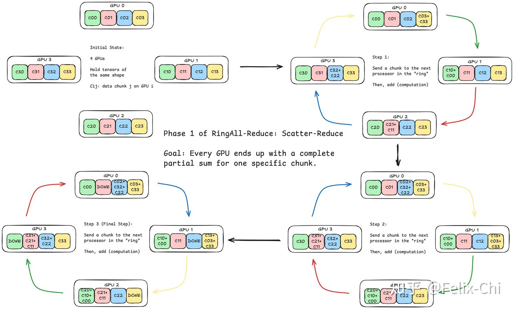
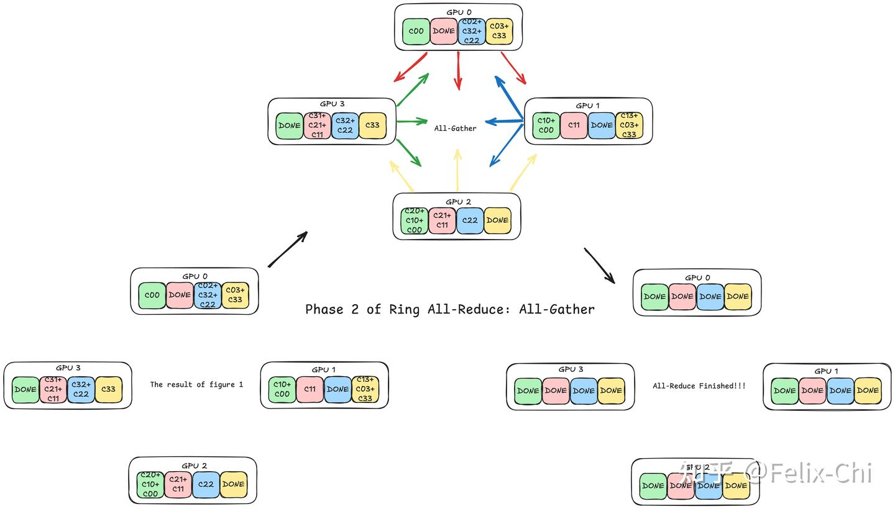
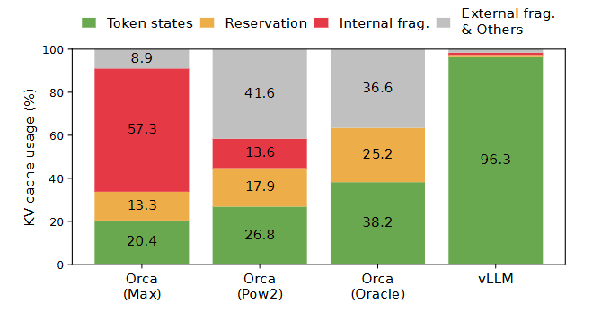

# Nano-vLLM 技术问答

## 目录

- [Q1: 如何理解 apply_chat_template 这段代码？](#q1-如何理解-apply_chat_template-这段代码)
- [Q2: Tokenize 是一个什么过程？](#q2-tokenize-是一个什么过程)
- [Q3: 词表是怎么生成的？](#q3-词表是怎么生成的)
- [Q4: 为什么 max_num_batched_tokens = 16384？](#q4-为什么-max_num_batched_tokens--16384)
- [Q5: BlockManager.allocate 的逻辑](#q5-blockmanagerallocate-的逻辑)
- [Q6: MHA 和 GQA 各阶段的 Tensor Size 对比](#q6-mha-和-gqa-各阶段的-tensor-size-对比)
- [Q7: 如何理解 block_bytes 的计算？](#q7-如何理解-block_bytes-的计算)
- [Q8: dist.init_process_group 和 torch.cuda.set_device 的作用](#q8-distinit_process_group-和-torchcudaset_device-的作用)
- [Q9: dist.all_reduce 和 dist.gather 详解](#q9-distall_reduce-和-distgather-详解)
- [Q10: RowParallelLinear 和 ParallelLMHead 的具体例子](#q10-rowparallellinear-和-parallellmhead-的具体例子)
- [Q11: Qwen3-0.6B 单层架构图及各组件作用与多卡执行方式](#q11-qwen3-06b-单层架构图及各组件作用与多卡执行方式)
- [Q12: RMSNorm 的公式、实现及与其他 Norm 的对比](#q12-rmsnorm-的公式实现及与其他-norm-的对比)
- [Q13: Pre-Norm vs Post-Norm](#q13-pre-norm-vs-post-norm--为什么-residual-在-rmsnorm-之前)
- [Q14: Weight Tying — Embedding 和 LM Head 的权重共享](#q14-weight-tying--embedding-和-lm-head-的权重共享)
- [Q15: VocabParallelEmbedding 的完整工作流程](#q15-vocabparallelembedding-的完整工作流程)
- [Q16: 分布式训练的权重保存与推理加载的完整流程](#q16-分布式训练的权重保存与推理加载的完整流程)
- [Q17: weight_loader 的逐行解析及参数为什么已经是分片大小](#q17-weight_loader-的逐行解析及参数为什么已经是分片大小)
- [Q18: attention.py 详解 — KV Cache 写入与 Flash Attention 推理](#q18-attentionpy-详解--kv-cache-写入与-flash-attention-推理)
- [Q19: CUDA Graph 详解 — run_model 与 capture_cudagraph](#q19-cuda-graph-详解--run_model-与-capture_cudagraph)
- [Q20: nano-vllm 如何处理不同序列长度不一致的问题](#q20-nano-vllm-如何处理不同序列长度不一致的问题)
- [Q21: LLM 推理时何时做 Causal Masking](#q21-llm-推理时何时做-causal-masking)
- [Q22: vLLM 中 LoRA 多租户服务的调度限制](#q22-vllm-中-lora-多租户服务的调度限制)
- [Q23: FSM 约束 JSON 格式输出](#q23-fsm-约束-json-格式输出)
- [Q24: PagedAttention 的显存利用率优势](#q24-pagedattention-的显存利用率优势)
- [Q25: LLM 推理框架对比 — vLLM / TensorRT-LLM / SGLang](#q25-llm-推理框架对比--vllm--tensorrt-llm--sglang)
- [Q26: Multi-Head Attention (MHA) 从零实现](#q26-multi-head-attention-mha-从零实现)
- [Q27: LLM 推理除了 TPOT、TTFT 还有什么指标？](#q27-llm-推理除了-tpotttft-还有什么指标)
- [Q28: LLM 解码过程为什么受制于访存带宽](#q28-llm-解码过程为什么受制于访存带宽)
- [Q29: BlockManager.deallocate 的逻辑 — 是否真正释放 GPU 显存](#q29-blockmanagerdeallocate-的逻辑--是否真正释放-gpu-显存)
- [Q30: block_table 与 kv_cache 的关系](#q30-block_table-与-kv_cache-的关系)
- [Q31: slot_mapping 的用途 — 与 block_table 的粒度区别](#q31-slot_mapping-的用途--与-block_table-的粒度区别)
- [Q32: KV Cache 的物理存储结构 — K/V 分开还是在一起？block_id 和 layer_id 的关系](#q32-kv-cache-的物理存储结构--kv-分开还是在一起block_id-和-layer_id-的关系)
- [Q33: TP 多卡时 seq 是怎么发到每个 GPU 上的](#q33-tp-多卡时-seq-是怎么发到每个-gpu-上的)
- [Q34: 交叉熵 / Cross Entropy / KL 的原理](#q34-交叉熵--cross-entropy--kl-的原理)
- [Q35: Transformer 训练会用到 KV Cache 吗？](#q35-transformer-训练会用到-kv-cache-吗)
- [Q36: Temperature 会影响 Speculative Decoding 的接受率吗？](#q36-temperature-会影响-speculative-decoding-的接受率吗)
- [Q37: Instruct 模型是什么意思？](#q37-instruct-模型是什么意思)
- [Q38: 为什么长上下文下普通 drafter 更容易失配？](#q38-为什么长上下文下普通-drafter-更容易失配)
- [Q39: RoPE 的核心思想，用语言怎么表达？](#q39-rope-的核心思想用语言怎么表达)
- [Q40: 为什么 MoE 模型上的投机解码效果通常不如 dense 模型明显？](#q40-为什么-moe-模型上的投机解码效果通常不如-dense-模型明显)

---

## Q1: 如何理解 `apply_chat_template` 这段代码？

```python
prompts = [
    tokenizer.apply_chat_template(
        [{"role": "user", "content": prompt}],
        tokenize=False,
        add_generation_prompt=True,
    )
    for prompt in prompts
]
```

### 本质

这段代码将原始文本包装成模型期望的**对话格式**。大模型训练时使用了特定的对话模板（chat template），推理时也必须用同样的格式，否则模型"听不懂"。

### 逐步拆解

以 `prompt = "introduce yourself"` 为例：

**输入**：
```python
[{"role": "user", "content": "introduce yourself"}]
```

**`apply_chat_template` 做的事**：按照 Qwen3 的 jinja 模板，将这个消息列表转换为带特殊标记的字符串：

```
<|im_start|>user
introduce yourself<|im_end|>
<|im_start|>assistant
```

**两个关键参数**：
- `tokenize=False` — 返回字符串，不返回 token ids（tokenize 交给后面的 LLMEngine 做）
- `add_generation_prompt=True` — 末尾追加 `<|im_start|>assistant\n`，告诉模型"现在该你回答了"

### 为什么需要这一步

如果直接把 `"introduce yourself"` 喂给模型，模型会把它当作**续写任务**（接着写下去），而不是**回答用户问题**。加上对话模板后，模型知道这是用户的提问，需要以 assistant 身份回复。

简单说：**裸文本 → 模型训练时见过的对话格式**，这就是这段代码的全部作用。

---

## Q2: Tokenize 是一个什么过程？

Tokenize 是把**人类可读的文本**转换为**模型可处理的整数序列**的过程。

### 核心步骤

以 `"Hello, world"` 为例（Qwen3 使用 BPE 分词）：

```
"Hello, world"
  ↓ 分词（BPE 算法拆分）
["Hello", ",", " world"]
  ↓ 查词表（每个 token 对应一个 ID）
[9707, 11, 1879]
```

### 为什么需要

神经网络只能处理数字，不能直接处理文字。Tokenize 就是文本到数字的映射。

### 在本项目中的位置

`llm_engine.py:48`：

```python
if isinstance(prompt, str):
    prompt = self.tokenizer.encode(prompt)  # 从词表中得到 id
```

`apply_chat_template` 里 `tokenize=False` 就是告诉它只做模板拼接、不做这一步，把 tokenize 留给后面的 `encode()` 统一处理。

---

## Q3: 词表是怎么生成的？

词表是在**模型训练之前**，通过对大规模语料进行统计学习生成的。Qwen3 使用的是 **BPE（Byte Pair Encoding）** 算法。

### BPE 生成词表的过程

以语料 `"low lower lowest"` 为简化示例：

**第 1 步：初始化** — 把所有文本拆成单个字符，这就是初始词表：

```
{'l', 'o', 'w', 'e', 'r', 's', 't', ' '}
```

**第 2 步：统计相邻字符对出现的频率**：

```
('l', 'o') → 3次
('o', 'w') → 3次
('e', 'r') → 1次
('e', 's') → 1次
...
```

**第 3 步：合并频率最高的字符对** — 把 `('l', 'o')` 合并为新 token `lo`，加入词表

**第 4 步：重复第 2-3 步**，不断合并，直到词表大小达到预设值（Qwen3 的词表约 151k）

最终词表从单字符逐步积累出常见子词：

```
字符 → 子词 → 常见词
'l','o','w' → 'lo','ow' → 'low' → 'lower' → ...
```

### 关键特性

- **高频词**（如 "the"）会作为整词进入词表
- **低频词**（如 "vLLM"）会被拆成子词（如 `["v", "LL", "M"]`）
- **任何文本都能编码** — 最坏情况退化为逐字符编码，不会出现 OOV（未登录词）

### 词表在项目中的位置

词表文件随模型一起发布，存储在模型目录下（如 `Qwen3-0.6B/tokenizer.json`），`AutoTokenizer.from_pretrained()` 加载它。词表本身不在 nano-vllm 的代码里，它是模型的一部分。

### Qwen3-0.6B 的 Tokenizer 文件详解

模型目录 `Qwen3-0.6B/` 下有三个与 tokenizer 相关的文件：

#### 1. `vocab.json` — 词表（token → ID 的映射）

一个巨大的 JSON 字典，共 **151,643** 个条目。格式为 `{"token": id}`：

```json
{"!": 0, "\"": 1, "#": 2, ..., "a": 64, "b": 65, ...}
```

- ID 0~255：基础字符（ASCII、字节）
- ID 256~151642：BPE 合并产生的子词（如 `"the"`, `"Ġfunction"` 等，`Ġ` 代表前导空格）

#### 2. `merges.txt` — BPE 合并规则（共 151,387 条）

记录了 BPE 训练过程中每一步的合并操作，**顺序就是合并的优先级**：

```
Ġ Ġ          ← 第1条：两个空格合并为双空格
ĠĠ ĠĠ        ← 第2条：双空格再合并为四空格
i n           ← 第3条：'i' + 'n' 合并为 'in'
Ġ t           ← 第4条：空格 + 't' 合并为 'Ġt'
e r           ← 第5条：'e' + 'r' 合并为 'er'
Ġth e         ← 后续：'Ġth' + 'e' 合并为 'Ġthe'
...
```

Tokenize 时，BPE 算法按照 merges.txt 的顺序，从高优先级到低优先级依次尝试合并字符对，直到无法继续合并为止。

#### 3. `tokenizer_config.json` — Tokenizer 的配置

关键字段：

| 字段 | 值 | 说明 |
|------|-----|------|
| `tokenizer_class` | `"Qwen2Tokenizer"` | 使用的 tokenizer 类 |
| `model_max_length` | `131072` | 模型支持的最大 token 长度（128K） |
| `eos_token` | `"<\|im_end\|>"` | 结束符，对应 ID 151645 |
| `pad_token` | `"<\|endoftext\|>"` | 填充符，对应 ID 151643 |
| `chat_template` | Jinja2 模板 | `apply_chat_template()` 使用的对话格式模板 |
| `added_tokens_decoder` | 26 个特殊 token | 如 `<\|im_start\|>`、`<think>`、`<tool_call>` 等 |

其中 `added_tokens_decoder` 定义了 ID 151643~151668 的特殊 token，这些不是 BPE 学出来的，而是手动添加的控制符号：

```
151643: <|endoftext|>    ← 文本结束
151644: <|im_start|>     ← 对话角色开始
151645: <|im_end|>       ← 对话角色结束（也是 EOS）
151657: <tool_call>      ← 工具调用
151667: <think>          ← 思考开始（CoT）
151668: </think>         ← 思考结束
```

#### 完整的 tokenize 流程

```
"Hello world" 
  ↓ vocab.json + merges.txt
  ↓ 按 BPE 规则合并字符 → 得到子词序列 → 查 vocab.json 得到 ID
[9707, 1879]

apply_chat_template 后的完整输入：
"<|im_start|>user\nHello world<|im_end|>\n<|im_start|>assistant\n"
  ↓ tokenize
[151644, 872, 198, 9707, 1879, 151645, 198, 151644, 17847, 198]
```

#### 三个文件的关系

```
tokenizer_config.json  →  配置：用什么类、特殊 token 是什么、对话模板长什么样
        ↓
vocab.json             →  字典：token 文本 ↔ 整数 ID 的映射
        ↓
merges.txt             →  规则：tokenize 时如何将字符合并成子词
```

`AutoTokenizer.from_pretrained()` 会同时加载这三个文件，构建出完整的 tokenizer。

---

## Q4: 为什么 `max_num_batched_tokens = 16384`？

这是一个在**显存占用**和**计算效率**之间的工程经验值，和 vLLM 的默认值一致。

### 1. GPU 计算效率的需要

GPU 擅长大矩阵运算。Prefill 阶段的核心操作是矩阵乘法 `[num_tokens, hidden_size] × [hidden_size, ...]`，`num_tokens` 越大，GPU 利用率越高。16384 足够让 GPU 的 Tensor Core 跑满。

### 2. 显存的限制

Prefill 阶段所有 token 需要同时计算 attention，显存占用与 `num_tokens` 成正比。太大会 OOM。16384 对于主流消费级/数据中心 GPU（8GB~80GB）是一个安全的上限。

### 3. 与 max_model_len 的配合

```python
# config.py:29
assert self.max_num_batched_tokens >= self.max_model_len  # 4096
```

16384 = 4 × 4096，意味着 prefill 阶段最多可以同时处理 **4 个最长序列**（4096 tokens），或者更多的短序列。这在 `warmup_model` 中也体现了：

```python
# model_runner.py:96
num_seqs = min(max_num_batched_tokens // max_model_len, self.config.max_num_seqs)
# min(16384 // 4096, 512) = min(4, 512) = 4
```

### 4. 2 的幂次

16384 = 2^14，对 GPU 的内存对齐和 kernel 调度友好。

### 一句话总结

16384 是 vLLM 社区实践出的经验默认值：**足够大能喂饱 GPU，又不至于 OOM**。实际使用中可以根据 GPU 显存大小调整。

### 补充：max_model_len 有什么作用？

`max_model_len` 限制的是**单个序列的最大 token 长度**（prompt + 生成的 completion 合计），默认值为 4096。

#### 在代码中的作用

**1. 从模型配置推导，取较小值**

```python
# config.py:28
self.max_model_len = min(self.max_model_len, self.hf_config.max_position_embeddings)
```

Qwen3-0.6B 的 `max_position_embeddings = 40960`，与默认值 4096 取 min，最终 `max_model_len = 4096`。这是因为 RoPE 位置编码的 cos/sin 表是按 `max_position_embeddings` 预计算的，超过这个长度位置编码就失效了。配置一个更小的值是为了节省显存。

**2. 决定 warmup 时的模拟输入大小**

```python
# model_runner.py:95-97
num_seqs = min(max_num_batched_tokens // max_model_len, self.config.max_num_seqs)  # 4
seqs = [Sequence([0] * max_model_len) for _ in range(num_seqs)]
```

用 4 个长度为 4096 的序列跑一次 prefill，模拟最极端的显存使用情况，以此估算 KV cache 可用空间。

**3. 决定 CUDA Graph 的 block_tables 大小**

```python
# model_runner.py:241
max_num_blocks = (config.max_model_len + self.block_size - 1) // self.block_size
# (4096 + 256 - 1) // 256 = 16 个 block
```

每个序列最多需要 16 个 KV cache block，这决定了 `block_tables` 张量的第二维大小。

**4. 与 max_num_batched_tokens 的约束**

```python
# config.py:29
assert self.max_num_batched_tokens >= self.max_model_len
```

保证至少能容纳一个最长序列做 prefill，否则这个序列永远无法被调度。

#### 一句话总结

`max_model_len` 是整个系统的**序列长度上限**，它影响 warmup 模拟、KV cache 块数、CUDA Graph 形状，以及与 `max_num_batched_tokens` 的配合关系。设小了省显存但限制输入长度，设大了支持长文本但占更多资源。

---

## Q5: BlockManager.allocate 的逻辑

`allocate` 在 **prefill 阶段**为一个 Sequence 分配所有 KV cache block，核心逻辑是**逐 block 检查是否命中 prefix cache，命中则复用，未命中则分配新块**。

### 逐行拆解

```python
def allocate(self, seq: Sequence):
    assert not seq.block_table          # 1. 确保是全新的 seq，还没分配过 block
    h = -1                              # 2. 前一个 block 的 hash，用于链式哈希
    cache_miss = False                  # 3. 一旦 miss，后续所有 block 都不可能再命中
```

#### 核心循环：逐 block 处理

```python
    for i in range(seq.num_blocks):     # 遍历该 seq 需要的每一个 block
        token_ids = seq.block(i)        # 取第 i 个 block 的 token 内容

        # --- 计算 hash ---
        # 只有满块才算 hash（最后一个块可能不满）
        h = self.compute_hash(token_ids, h) if len(token_ids) == self.block_size else -1

        # --- 查 prefix cache ---
        block_id = self.hash_to_block_id.get(h, -1)
        if block_id == -1 or self.blocks[block_id].token_ids != token_ids:
            cache_miss = True           # hash 没命中，或者 hash 碰撞（内容不一致）
```

这里有一个关键设计：**`cache_miss` 一旦为 True 就不会再变回 False**。因为 hash 是链式的（每个 block 的 hash 依赖前一个 block 的 hash），前面的 block miss 了，后面的 hash 值就不对了，不可能再命中。

#### 分支：miss vs hit

```python
        if cache_miss:
            # ---- Cache Miss：分配新块 ----
            block_id = self.free_block_ids[0]
            block = self._allocate_block(block_id)  # ref_count=1, 从 free 移到 used
        else:
            # ---- Cache Hit：复用已有块 ----
            seq.num_cached_tokens += self.block_size  # 这些 token 不需要重新计算
            if block_id in self.used_block_ids:
                block = self.blocks[block_id]
                block.ref_count += 1                  # 已在使用中，增加引用计数
            else:
                block = self._allocate_block(block_id)  # 在 free 列表中，重新激活
```

#### 更新 hash 映射 & 构建 block_table

```python
        if h != -1:                     # 满块才注册 hash
            block.update(h, token_ids)  # 记录 hash 和内容，用于将来的 prefix 匹配
            self.hash_to_block_id[h] = block_id
        seq.block_table.append(block_id)  # 记录 "第 i 个 block 在 KV cache 中的物理位置"
```

### 用一个例子说明

假设 `block_size=256`，一个 seq 有 700 个 token，需要 3 个 block：

```
Block 0: token[0:256]   → 满块，算 hash
Block 1: token[256:512] → 满块，算 hash（依赖 Block 0 的 hash）
Block 2: token[512:700] → 不满，hash = -1
```

**场景 A：全新 prompt，无缓存**
```
Block 0: hash 查不到 → miss → 分配新块 #7  → block_table = [7]
Block 1: miss（传染）→ 分配新块 #12        → block_table = [7, 12]
Block 2: miss        → 分配新块 #3         → block_table = [7, 12, 3]
num_cached_tokens = 0（全部需要计算）
```

**场景 B：与之前的请求共享前 512 个 token**
```
Block 0: hash 命中块 #7，内容一致 → hit → ref_count++ → block_table = [7]
Block 1: hash 命中块 #12，内容一致 → hit → ref_count++ → block_table = [7, 12]
Block 2: miss（内容不同）→ 分配新块 #5    → block_table = [7, 12, 5]
num_cached_tokens = 512（前 512 个 token 直接复用 KV cache，不需要重新计算）
```

这就是 **Prefix Caching** 的核心：相同前缀的请求共享 KV cache block，prefill 时只需要计算未缓存的部分。

### 链式 hash 的设计

```python
@classmethod
def compute_hash(cls, token_ids, prefix=-1):
    h = xxhash.xxh64()
    if prefix != -1:
        h.update(prefix.to_bytes(8, "little"))  # 把前一个 block 的 hash 也混入
    h.update(np.array(token_ids).tobytes())
    return h.intdigest()
```

这保证了：**只有从第 0 个 block 到第 i 个 block 内容完全一致时，第 i 个 block 的 hash 才会匹配**。不可能出现"中间某个 block 不同但后面又匹配上"的情况。

---

## Q6: MHA 和 GQA 各阶段的 Tensor Size 对比

以 **Qwen3-0.6B** 的实际参数为例（hidden_size=1024, num_heads=16, head_dim=128, 序列长度 S=1024）。

**MHA**：H_kv = H = 16（每个 Q 头有独立的 K/V 头）
**GQA**：H_kv = 8，每 2 个 Q 头共享 1 组 K/V（Qwen3-0.6B 的实际配置）

### 1. QKV 投影权重

| | MHA (H_kv=16) | GQA (H_kv=8) | 节省 |
|---|---|---|---|
| W_q | [1024, 16×128] = [1024, 2048] | [1024, 16×128] = [1024, 2048] | 不变 |
| W_k | [1024, **16**×128] = [1024, **2048**] | [1024, **8**×128] = [1024, **1024**] | **50%** |
| W_v | [1024, **16**×128] = [1024, **2048**] | [1024, **8**×128] = [1024, **1024**] | **50%** |
| **合计** | 1024 × **6144** | 1024 × **4096** | **33%** |

对应代码（`qwen3.py:47`）：
```python
self.qkv_proj = QKVParallelLinear(hidden_size, head_dim, total_num_heads, total_num_kv_heads)
# output_size = (16 + 2×8) × 128 = 4096  （GQA）
# 如果是 MHA: (16 + 2×16) × 128 = 6144
```

### 2. QKV 投影输出（每个 token）

| | MHA | GQA | 节省 |
|---|---|---|---|
| Q | [S, **16**, 128] | [S, **16**, 128] | 不变 |
| K | [S, **16**, 128] | [S, **8**, 128] | **50%** |
| V | [S, **16**, 128] | [S, **8**, 128] | **50%** |

对应代码（`qwen3.py:82-85`）：
```python
q, k, v = qkv.split([self.q_size, self.kv_size, self.kv_size], dim=-1)
q = q.view(-1, self.num_heads, self.head_dim)      # [S, 16, 128]
k = k.view(-1, self.num_kv_heads, self.head_dim)    # [S, 8, 128]  (GQA)
v = v.view(-1, self.num_kv_heads, self.head_dim)    # [S, 8, 128]  (GQA)
```

### 3. KV Cache（每层每个序列，最关键的差异）

| | MHA | GQA | 节省 |
|---|---|---|---|
| K cache | [S, **16**, 128] | [S, **8**, 128] | **50%** |
| V cache | [S, **16**, 128] | [S, **8**, 128] | **50%** |
| **单层 KV** | S × **4096** | S × **2048** | **50%** |
| **28 层总计** | S × **114,688** | S × **57,344** | **50%** |

对应代码（`model_runner.py:108-113`）：
```python
num_kv_heads = hf_config.num_key_value_heads // self.world_size  # 8
head_dim = 128
block_bytes = 2 * num_hidden_layers * block_size * num_kv_heads * head_dim * dtype_size
#           = 2 * 28            * 256        * 8             * 128      * 2
#           = 29,360,128 bytes ≈ 28 MB/block (GQA)
# 如果是 MHA: = 2 * 28 * 256 * 16 * 128 * 2 ≈ 56 MB/block
```

### 4. Attention Score 计算

| | MHA | GQA |
|---|---|---|
| Q × K^T | [**16**, S, 128] × [**16**, 128, S] = [**16**, S, S] | Q 的 16 头广播到 K 的 8 头 |
| Score | [**16**, S, S] | [**16**, S, S]（Flash Attention 内部处理广播） |
| Score × V | [**16**, S, S] × [**16**, S, 128] = [**16**, S, 128] | 同样广播 |

Attention score 的大小不变，仍然是 [16, S, S]。GQA 通过让每 2 个 Q 头共享同一组 K/V 来计算，最终输出仍然是 16 头。

**GQA 的广播是 Flash Attention 内部自动处理的**，代码中直接传入不同数量的 Q 头和 KV 头即可（`attention.py:93-96`）：

```python
# q: [S, 16, 128], k: [S, 8, 128], v: [S, 8, 128]
o = flash_attn_varlen_func(q, k, v, ...)
```

Flash Attention 的 CUDA kernel 内部通过整除确定映射关系：

```c
// Flash Attention 内部伪代码
int kv_head_idx = q_head_idx / (num_heads_q / num_heads_k);
// q_head_idx=0,1 → kv_head_idx=0   （Q头0,1 共享 KV头0）
// q_head_idx=2,3 → kv_head_idx=1   （Q头2,3 共享 KV头1）
// ...
// q_head_idx=14,15 → kv_head_idx=7 （Q头14,15 共享 KV头7）
```

不需要手动 repeat 或 expand K/V 张量，Flash Attention 原生支持 GQA。

### 5. O 投影

| | MHA | GQA |
|---|---|---|
| 输入 | [S, 16×128] = [S, 2048] | [S, 16×128] = [S, 2048] |
| W_o | [2048, 1024] | [2048, 1024] |
| 输出 | [S, 1024] | [S, 1024] |

**不变**，因为 attention 输出仍然是 16 个头拼接。

### 总结图

```
                    MHA (H_kv=16)              GQA (H_kv=8)
                    ─────────────              ─────────────
Input:              [S, 1024]                  [S, 1024]            ← 相同
                        │                          │
QKV Proj Weight:    [1024, 6144]               [1024, 4096]         ← GQA 省 33%
                        │                          │
Q:                  [S, 16, 128]               [S, 16, 128]         ← 相同
K:                  [S, 16, 128]               [S,  8, 128]         ← GQA 省 50%
V:                  [S, 16, 128]               [S,  8, 128]         ← GQA 省 50%
                        │                          │
KV Cache (28层):    S × 114,688                S × 57,344           ← GQA 省 50% ★最大收益
                        │                          │
Attn Score:         [16, S, S]                 [16, S, S]           ← 相同
Attn Output:        [S, 16, 128]               [S, 16, 128]        ← 相同
                        │                          │
O Proj:             [S, 1024]                  [S, 1024]            ← 相同
```
6144 = 3 × 2048 = 3 × hidden_size  
28层 × 2(K+V) × 16头 × 128维 = 28 × 2 × 16 × 128 = 114,688

**GQA 的核心收益在 KV Cache**：推理时 KV cache 随序列长度线性增长，减少 50% 的 KV 头直接减少 50% 的 KV cache 显存，意味着同样的 GPU 显存可以处理更多并发请求或更长的序列。计算量上的节省（QKV 投影减少 33%）反而是次要的。

---

## Q7: 如何理解 `block_bytes` 的计算？

```python
block_bytes = 2 * hf_config.num_hidden_layers * self.block_size * num_kv_heads * head_dim * hf_config.torch_dtype.itemsize
```

这行计算的是**一个 KV cache block 占用的总字节数**。逐项拆解：

| 因子 | 值 (Qwen3-0.6B) | 含义 |
|------|---------|------|
| `2` | 2 | K 和 V 两份缓存 |
| `num_hidden_layers` | 28 | 每一层 Transformer 都有独立的 KV cache |
| `block_size` | 256 | 一个 block 存 256 个 token 的 KV |
| `num_kv_heads` | 8 | GQA 的 KV 头数 |
| `head_dim` | 128 | 每个头的维度 |
| `torch_dtype.itemsize` | 2 | bfloat16 每个元素占 2 字节 |

### 从内到外展开

```
单个标量:                                          1 × 2 bytes
一个头的一个 token:          head_dim = 128       → 128 × 2 bytes
所有 KV 头的一个 token:      × num_kv_heads = 8   → 1,024 × 2 bytes
一个 block (256 tokens):    × block_size = 256    → 262,144 × 2 bytes
所有层:                     × 28 layers           → 7,340,032 × 2 bytes
K 和 V 两份:                × 2                   → 14,680,064 × 2 bytes
                                                  = 29,360,128 bytes ≈ 28 MB
```

**一个 block ≈ 28 MB**。

### 为什么是"一个 block 跨所有层"

一个 Block 不是某一层的缓存，而是**所有 28 层中对应那 256 个 token 位置的 KV 缓存的集合**。这样设计的好处是：分配和释放以 block 为单位，一次操作覆盖所有层，管理简单。

对应 KV cache 的实际分配（`model_runner.py:123`）：

```python
self.kv_cache = torch.empty(2, num_hidden_layers, num_kvcache_blocks, block_size, num_kv_heads, head_dim)
#                           K/V    28层          N个block          256token   8头        128维
```

这个张量的总大小 = `num_kvcache_blocks × block_bytes`。

---

## Q8: `dist.init_process_group` 和 `torch.cuda.set_device` 的作用

```python
dist.init_process_group("nccl", "tcp://localhost:2333", world_size=self.world_size, rank=rank)
torch.cuda.set_device(rank)
```

`dist.init_process_group` 初始化**多 GPU 通信**，`torch.cuda.set_device` 指定**当前进程用哪张 GPU**。

### dist.init_process_group

| 参数 | 值 | 含义 |
|------|-----|------|
| `"nccl"` | 通信后端 | NVIDIA 的 GPU 间通信库，专门优化了 all_reduce、gather 等集合操作 |
| `"tcp://localhost:2333"` | rendezvous 地址 | 各进程通过这个地址"握手"，互相发现对方。单机多卡所以是 localhost |
| `world_size` | tensor_parallel_size | 总共有几个进程参与（即几张 GPU） |
| `rank` | 0, 1, 2... | 当前进程的编号，rank=0 是主进程 |

调用后，所有进程之间建立了 NCCL 通信通道，后续代码中的 `dist.all_reduce()` 和 `dist.gather()` 才能工作。

**即使 `tensor_parallel_size=1`（单卡），也必须调用**，因为后续代码中 `dist.get_rank()` 和 `dist.get_world_size()` 依赖它初始化。

### torch.cuda.set_device

把当前进程绑定到第 `rank` 号 GPU。之后该进程中所有 `torch.tensor(..., device="cuda")` 都会自动分配到这张卡上。

- rank=0 的进程 → GPU 0
- rank=1 的进程 → GPU 1

### 在本项目中的调用时机

```python
# llm_engine.py:24-30
for i in range(1, config.tensor_parallel_size):   # rank 1, 2, ... 作为子进程启动
    process = ctx.Process(target=ModelRunner, args=(config, i, event))
    process.start()
self.model_runner = ModelRunner(config, 0, self.events)  # rank 0 在主进程
```

每个 `ModelRunner.__init__` 里都会执行这两行，各进程各自初始化通信并绑定到自己的 GPU。

---

## Q9: dist.all_reduce 和 dist.gather 详解

### dist.all_reduce

**所有 GPU 上的张量求和，结果广播回每个 GPU**。

```
GPU 0:  [1, 2, 3]  ──┐
                      ├──  SUM  ──→  每个 GPU 都得到 [5, 7, 9]
GPU 1:  [4, 5, 6]  ──┘
```

#### Ring AllReduce 底层实现

NCCL 的 `all_reduce` 底层默认用 Ring AllReduce 算法，分两个阶段：

**Phase 1: Scatter-Reduce（环形传递，边传边加）**



4 张 GPU，每张上的数据被分成 4 个 chunk（Cij 表示 GPU i 上的第 j 个 chunk）。每一步，每个 GPU 把自己的一个 chunk 发给环上的下一个 GPU，接收方累加。经过 N-1=3 步后，每个 GPU 持有完整结果的 1/4（一个 chunk 的全局求和）。

**Phase 2: All-Gather（环形传递，广播结果）**



再转 N-1=3 圈，每个 GPU 把自己持有的完整 chunk 传给邻居。最终每个 GPU 都拿到所有 chunk 的完整结果（图中全部变为 DONE）。

**通信开销对比（数据大小 D，N 张 GPU，带宽 B）：**

朴素方案（全发给 GPU 0 求和再广播回去）：
- GPU 0 收：(N-1) × D
- GPU 0 发：(N-1) × D
- GPU 0 总负载：2(N-1) × D
- 总时间：2(N-1) × D / B

Ring AllReduce：
- 每个 GPU 每阶段收发：(N-1)/N × D
- 两阶段总计每个 GPU：2(N-1)/N × D ≈ 2D（当 N 大时）
- 总时间：2(N-1)/N × D / B ≈ 2D / B

| | 朴素方案（全发给 GPU 0） | Ring |
|---|---|---|
| 瓶颈节点通信量 | 2(N-1) × D | 2(N-1)/N × D ≈ 2D |
| N=8 时 | 14D | 1.75D（差 **8 倍**） |
| 瓶颈 | GPU 0 网卡打满 | 每个 GPU 均匀收发，无瓶颈 |
| 扩展性 | GPU 越多中心越慢 | GPU 越多只是多转几圈，带宽恒定 |

代码里只写 `dist.all_reduce(y)`，具体用哪种算法是 NCCL 根据硬件拓扑自动决定的（同机 NVLink 可能用 Tree，跨机用 Ring），对用户透明。

在本项目中用于 **RowParallelLinear**（`linear.py:162`）：

```python
def forward(self, x):
    y = F.linear(x, self.weight, ...)   # 每个 GPU 算局部结果（输入维度被切分了）
    if self.tp_size > 1:
        dist.all_reduce(y)              # 把各 GPU 的局部结果加起来 = 完整结果
    return y
```

为什么要加？因为 Row Parallel 是把权重按输入维度切分的，每个 GPU 只算了部分内积，加起来才是完整的矩阵乘法结果。

同样用于 **VocabParallelEmbedding**（`embed_head.py:44`）：每个 GPU 只存部分词表的 embedding，不属于自己范围的 token 输出全零，all_reduce 后拼出完整结果。

### dist.gather

**各 GPU 的张量收集到指定的 GPU 上拼接，其他 GPU 不拿结果**。

```
GPU 0:  [logits_part0]  ──┐
                           ├──  只有 GPU 0 得到 [logits_part0, logits_part1]
GPU 1:  [logits_part1]  ──┘    GPU 1 得到 None
```

在本项目中用于 **ParallelLMHead**（`embed_head.py:77`）：

```python
def forward(self, x):
    logits = F.linear(x, self.weight)    # 每个 GPU 算出部分词表的 logits
    if self.tp_size > 1:
        all_logits = [...] if self.tp_rank == 0 else None
        dist.gather(logits, all_logits, 0)   # 收集到 rank 0
        logits = torch.cat(all_logits, -1) if self.tp_rank == 0 else None
    return logits
```

### 为什么 LM Head 用 gather 而不是 all_reduce？

| 层 | 并行方式 | 各 GPU 的输出含义 | 合并方式 |
|---|---|---|---|
| RowParallelLinear | 按输入切分 | **不完整的特征**（部分内积） | **加起来** → all_reduce |
| ParallelLMHead | 按输出切分（Column） | **部分词的完整 logits** | **拼起来** → gather |

all_reduce 是求和，gather 是拼接，取决于并行切分的维度不同。

而且 logits 只在 rank 0 上做采样（`model_runner.py:232`），其他 GPU 不需要完整的 logits，所以用 gather 到 rank 0 就够了，不需要 all_gather（全员拼接）。

---

## Q10: RowParallelLinear 和 ParallelLMHead 的具体例子

### RowParallelLinear 例子

假设完整的线性层是 `y = x × W^T`，其中 `W = [4, 6]`（4 输出，6 输入），2 张 GPU：

```
完整权重 W:
┌                   ┐
│ 1  2  3  4  5  6  │  → 输出维度 0
│ 7  8  9 10 11 12  │  → 输出维度 1
│ 1  3  5  7  9 11  │  → 输出维度 2
│ 2  4  6  8 10 12  │  → 输出维度 3
└                   ┘
    ──── 输入维度 ────
```

**Row Parallel 按输入维度（列）切分**：

```
GPU 0 的 W0: [4, 3]          GPU 1 的 W1: [4, 3]
┌          ┐                 ┌            ┐
│ 1  2  3  │                 │ 4   5   6  │
│ 7  8  9  │                 │ 10  11  12 │
│ 1  3  5  │                 │ 7   9   11 │
│ 2  4  6  │                 │ 8   10  12 │
└          ┘                 └            ┘
```

输入 `x = [1, 2, 3, 4, 5, 6]`，同样按输入维度切分：

```
GPU 0: x0 = [1, 2, 3]              GPU 1: x1 = [4, 5, 6]

y0 = x0 × W0^T                     y1 = x1 × W1^T
   = [1×1+2×2+3×3,                    = [4×4+5×5+6×6,
      1×7+2×8+3×9,                       4×10+5×11+6×12,
      1×1+2×3+3×5,                       4×7+5×9+6×11,
      1×2+2×4+3×6]                       4×8+5×10+6×12]
   = [14, 50, 22, 28]                 = [77, 167, 139, 154]
         ↓                                  ↓
         └──────── all_reduce (求和) ────────┘
                         ↓
              y = [91, 217, 161, 182]   ← 每个 GPU 都拿到完整结果
```

验证：`x × W^T = [1,2,3,4,5,6] × W^T = [91, 217, 161, 182]` ✓

### ParallelLMHead 例子

假设词表大小 = 8，hidden_size = 3，2 张 GPU。LM Head 本质是 `logits = hidden × W^T`。

**Column Parallel 按输出维度（行）切分**：

```
完整权重 W: [8, 3]（8个词，3维特征）

GPU 0 的 W0: [4, 3]（词 0~3）    GPU 1 的 W1: [4, 3]（词 4~7）
┌          ┐                     ┌          ┐
│ 词0 的 emb │                     │ 词4 的 emb │
│ 词1 的 emb │                     │ 词5 的 emb │
│ 词2 的 emb │                     │ 词6 的 emb │
│ 词3 的 emb │                     │ 词7 的 emb │
└          ┘                     └          ┘
```

输入 `hidden = [0.5, 0.3, 0.8]`（最后一个 token 的隐藏状态），**每个 GPU 拿到完整输入**：

```
GPU 0:                              GPU 1:
logits0 = hidden × W0^T            logits1 = hidden × W1^T
        = [s0, s1, s2, s3]                 = [s4, s5, s6, s7]
  (词 0~3 的分数)                      (词 4~7 的分数)
         ↓                                  ↓
         └──────── gather 到 GPU 0 ──────────┘
                         ↓
GPU 0: logits = [s0, s1, s2, s3, s4, s5, s6, s7]  ← 完整 8 个词的分数
GPU 1: None（不需要，不参与采样）
```

### 对比总结

```
RowParallelLinear:
  输入被切分，各 GPU 算的是"不完整的结果" → 需要 SUM → all_reduce

  GPU 0: x_left  × W_left  = 部分和 ─┐
                                      ├─ all_reduce(SUM) → 完整结果（每个GPU都有）
  GPU 1: x_right × W_right = 部分和 ─┘


ParallelLMHead:
  输入完整，各 GPU 算的是"部分词的完整分数" → 需要拼接 → gather

  GPU 0: hidden × W_词0~3 = 词0~3的分数 ─┐
                                          ├─ gather → 拼接（只给GPU 0）
  GPU 1: hidden × W_词4~7 = 词4~7的分数 ─┘
```

---

## Q11: Qwen3-0.6B 单层架构图及各组件作用与多卡执行方式

### 架构图（含 tensor shape）

```
输入: hidden_states [S, 1024]    residual [S, 1024] (第一层为 None)
  │                                │
  ▼                                ▼
┌─────────────────────────────────────────────┐
│           input_layernorm (RMSNorm)         │
│         hidden + residual → norm + skip     │
│  hidden_states = RMSNorm(hidden + residual) │
│  residual = hidden + residual               │
└─────────────────────────────────────────────┘
  │ [S, 1024]                      │ residual [S, 1024]
  ▼                                │
┌─────────────────────────────────────────┐
│          Qwen3Attention                 │
│                                         │
│  ┌───────────────────────────────────┐  │
│  │  qkv_proj (QKVParallelLinear)     │  │
│  │  [S, 1024] → [S, 4096]           │  │
│  │  W: [4096, 1024]  (无 bias)       │  │
│  └───────────────────────────────────┘  │
│    │                                    │
│    ▼  split → Q [S, 2048]              │
│    │           K [S, 1024]              │
│    │           V [S, 1024]              │
│    ▼  reshape                           │
│    Q [S, 16, 128]                       │
│    K [S,  8, 128]                       │
│    V [S,  8, 128]                       │
│    │                                    │
│  ┌───────────────────────────────────┐  │
│  │  q_norm / k_norm (RMSNorm)        │  │
│  │  Q [S, 16, 128] → [S, 16, 128]   │  │
│  │  K [S,  8, 128] → [S,  8, 128]   │  │
│  └───────────────────────────────────┘  │
│    │                                    │
│  ┌───────────────────────────────────┐  │
│  │  rotary_emb (RoPE)                │  │
│  │  Q, K × cos/sin 位置编码           │  │
│  │  查预计算表 cos_sin_cache[pos]     │  │
│  └───────────────────────────────────┘  │
│    │                                    │
│  ┌───────────────────────────────────┐  │
│  │  attn (Flash Attention)           │  │
│  │                                   │  │
│  │  Prefill:                         │  │
│  │    ① store K,V → KV Cache         │  │
│  │    ② flash_attn_varlen_func       │  │
│  │       Q[S,16,128] × K × V        │  │
│  │       → O [S, 16, 128]           │  │
│  │                                   │  │
│  │  Decode:                          │  │
│  │    ① store K,V → KV Cache         │  │
│  │    ② flash_attn_with_kvcache      │  │
│  │       Q[1,16,128] × KCache×VCache │  │
│  │       → O [1, 16, 128]           │  │
│  └───────────────────────────────────┘  │
│    │                                    │
│    ▼  flatten → [S, 2048]               │
│  ┌───────────────────────────────────┐  │
│  │  o_proj (RowParallelLinear)       │  │
│  │  [S, 2048] → [S, 1024]           │  │
│  │  W: [1024, 2048]  (无 bias)       │  │
│  │  多卡时: all_reduce               │  │
│  └───────────────────────────────────┘  │
└─────────────────────────────────────────┘
  │ [S, 1024]                      │ residual [S, 1024]
  ▼                                ▼
┌─────────────────────────────────────────────┐
│       post_attention_layernorm (RMSNorm)    │
│         hidden + residual → norm + skip     │
│  hidden_states = RMSNorm(hidden + residual) │
│  residual = hidden + residual               │
└─────────────────────────────────────────────┘
  │ [S, 1024]                      │ residual [S, 1024]
  ▼                                │
┌─────────────────────────────────────────┐
│              Qwen3MLP                   │
│                                         │
│  ┌───────────────────────────────────┐  │
│  │  gate_up_proj                     │  │
│  │  (MergedColumnParallelLinear)     │  │
│  │  [S, 1024] → [S, 6144]           │  │
│  │  W: [6144, 1024]  (无 bias)       │  │
│  │  包含 gate 和 up 两个投影的合并    │  │
│  └───────────────────────────────────┘  │
│    │                                    │
│    ▼  [S, 6144]                         │
│  ┌───────────────────────────────────┐  │
│  │  act_fn (SiluAndMul)              │  │
│  │  chunk → gate [S, 3072]           │  │
│  │          up   [S, 3072]           │  │
│  │  output = SiLU(gate) × up         │  │
│  │  → [S, 3072]                      │  │
│  └───────────────────────────────────┘  │
│    │                                    │
│    ▼  [S, 3072]                         │
│  ┌───────────────────────────────────┐  │
│  │  down_proj (RowParallelLinear)    │  │
│  │  [S, 3072] → [S, 1024]           │  │
│  │  W: [1024, 3072]  (无 bias)       │  │
│  │  多卡时: all_reduce               │  │
│  └───────────────────────────────────┘  │
└─────────────────────────────────────────┘
  │ [S, 1024]                      │ residual [S, 1024]
  ▼                                ▼
输出: hidden_states [S, 1024]    residual [S, 1024]
      → 传入下一层
```

### 为什么 MLP 用 SwiGLU（gate 机制）而不是传统 MLP

Qwen3 的 MLP 用的是 **SwiGLU**（SiLU-Gated Linear Unit）结构，而不是传统的两层 MLP。

**传统 MLP**（GPT-2）：
```
x → Linear_up(1024→3072) → ReLU → Linear_down(3072→1024)
```
所有神经元都无条件激活，靠 ReLU 粗暴截断（<0 的全部置零）。

**SwiGLU**（Qwen3，`qwen3.py:117-120`）：
```
x → gate_up_proj(1024→6144) → split → gate[3072], up[3072]
                                         ↓           ↓
                                      SiLU(gate)  ×  up
                                         ↓
                                   down_proj(3072→1024)
```

gate 和 up 是**两个独立的线性投影**，看到的是同样的输入，但学到不同的东西：
- **gate**：学习"这个特征重不重要"，过 SiLU 后输出 0~正值的权重
- **up**：学习"特征变换后的值"

两者逐元素相乘 `SiLU(gate) × up`，相当于 gate 控制 up 的每一维是否放行。网络可以根据输入内容**动态决定**每一维特征的通过比例（0%~100%），而不是像 ReLU 那样只有"全通过"或"全截断"。

**代价**：参数量多了 50%（3 个权重矩阵 vs 2 个），但 `intermediate_size` 会相应调小（Qwen3 用 3072 而不是 4×1024=4096），总参数量增加有限，效果提升显著。这是 Google 论文 *"GLU Variants Improve Transformer"*（2020）的结论，现在几乎所有主流 LLM（LLaMA、Qwen、Mistral）都采用了这个设计。

### 为什么是 Attention 之后接 MLP

Attention 和 MLP 各自负责不同的能力：

- **Attention —— "从哪里取信息"**：让每个 token 看到序列中的其他 token，完成**信息聚合**。它解决的是"这个位置应该关注哪些上下文"。但 Attention 本身是线性操作（加权求和），没有非线性变换能力，不能对聚合来的信息做复杂加工。

- **MLP —— "怎么处理信息"**：对每个 token **独立**做非线性变换（SiLU 激活），完成**特征加工**。它解决的是"拿到信息后怎么理解和转化"。先升维到更高维空间（1024→3072），在那里做非线性筛选（哪些特征该保留、哪些该抑制），再压缩回来（3072→1024）。

为什么必须先 Attention 后 MLP？以 `"我 喜欢 吃 苹果"` 为例：Attention 之后，"苹果"这个 token 已经融合了"吃"的上下文，知道自己是水果而不是手机；MLP 再对这个带上下文的表示做非线性加工，提取更高级的语义特征。如果反过来，MLP 先处理的是没有上下文的孤立 token，加工就没有意义了。

**一句话：Attention 负责"看"（跨 token 聚合信息），MLP 负责"想"（单 token 非线性加工）。先看再想，顺序不能反。**

### Residual 的流转

residual 变量始终保存**"加完之后、norm 之前"的值**，在子模块之间传递，形成贯穿所有层的信息高速公路。

```python
# qwen3.py:150-164
def forward(self, positions, hidden_states, residual):
    if residual is None:  # 第一层
        hidden_states, residual = self.input_layernorm(hidden_states), hidden_states
    else:                 # 第二层及之后
        hidden_states, residual = self.input_layernorm(hidden_states, residual)
    hidden_states = self.self_attn(positions, hidden_states)
    hidden_states, residual = self.post_attention_layernorm(hidden_states, residual)
    hidden_states = self.mlp(hidden_states)
    return hidden_states, residual
```

跨层流转图：

```
Embedding 输出: h₀
     │
     ▼
Layer 1:
     │
     ├─────────────────────────────┐
     ▼                             │ residual = h₀
  RMSNorm(h₀)                     │
     │                             │
  Attention → h₁                   │
     │                             │
     ▼                             ▼
  h₁ + h₀ = r₁  ──────────────────┐  ← 第一次残差连接
     │                             │ residual = r₁
  RMSNorm(r₁)                     │
     │                             │
  MLP → h₂                        │
     │                             │
     ▼                             ▼
Layer 2:
  h₂ + r₁ = r₂  ──────────────────┐  ← 第二次残差连接
     │                             │ residual = r₂
  RMSNorm(r₂)                     │
     │                             │
  Attention → h₃                   │
     │                             │
     ▼                             ▼
  h₃ + r₂ = r₃  ──────────────────┐  ← 第三次残差连接
     ...                           ...
```

每次 `add_rms_forward` 做两件事：
1. **残差连接**：`x = hidden_states + residual`（子模块输出 + 跳跃连接）
2. **归一化**：`RMSNorm(x)` 送入下一个子模块

这种 Pre-Norm + fused residual 的写法，让 `add + norm` 被 `@torch.compile` 融合成一个 CUDA kernel，减少显存读写次数。与传统 Post-Norm（`x = x + Attention(LayerNorm(x))`）数学上完全等价，但执行效率更高。

### 各组件作用与多卡执行方式

#### 1. input_layernorm (RMSNorm)

**作用**：对输入做归一化，稳定训练/推理时的数值范围。同时处理残差连接 —— 将上一层的 hidden_states 和 residual 相加后，一份做 norm 送入 Attention，一份作为新的 residual 留着。

**多卡**：每个 GPU 独立计算，无通信。因为每个 GPU 上的 hidden_states 是完整的（不是切分的），norm 只在最后一个维度操作。权重 `[1024]` 每个 GPU 各存一份完整拷贝。

#### 2. qkv_proj (QKVParallelLinear)

**作用**：一次矩阵乘法同时算出 Q、K、V 三个投影，比分三次算更高效（一次大矩阵乘 > 三次小矩阵乘）。

**多卡**：**Column Parallel**，按输出维度切分。

```
单卡: [S, 1024] × [1024, 4096]^T → [S, 4096]  (Q:2048 + K:1024 + V:1024)

2卡:  每个 GPU 各存一半的 heads
  GPU 0: [S, 1024] × [1024, 2048]^T → [S, 2048]  (Q: 8头 + K: 4头 + V: 4头)
  GPU 1: [S, 1024] × [1024, 2048]^T → [S, 2048]  (Q: 8头 + K: 4头 + V: 4头)
  无需通信 —— 每个 GPU 独立算自己负责的那些头
```

#### 3. q_norm / k_norm (RMSNorm) —— QK-Norm

**作用**：Qwen3 设置了 `attention_bias=false`（去掉 bias 减参数量），但没有 bias 后 Q、K 的数值范围不受控，点积结果容易爆炸性增长（尤其长序列）。QK-Norm 是去掉 bias 后的**补偿措施**，在点积之前把 Q 和 K 逐头归一化，确保每个头的向量模长一致。

对应代码（`qwen3.py:72-74, 86-88`）：

```python
# 初始化：只在没有 bias 时创建
if not self.qkv_bias:
    self.q_norm = RMSNorm(self.head_dim, eps=rms_norm_eps)  # 权重 [128]
    self.k_norm = RMSNorm(self.head_dim, eps=rms_norm_eps)

# 前向：在 RoPE 之前做 norm
if not self.qkv_bias:
    q = self.q_norm(q)  # [S, 16, 128] → 对最后一维(128)做 RMSNorm
    k = self.k_norm(k)  # [S,  8, 128] → 对最后一维(128)做 RMSNorm
q, k = self.rotary_emb(positions, q, k)  # 先 norm，再加位置编码
```

**为什么是 per-head**：`RMSNorm(head_dim=128)` 作用在每个头的 128 维上，不同头有各自的可学习缩放参数 γ，保持了多头之间的多样性。

**为什么在 RoPE 之前**：RoPE 是旋转操作，不改变向量模长。先 norm 再旋转，归一化效果不被破坏。反过来的话，RoPE 后模长可能已经变了，norm 就打折扣。

**一句话：`if not self.qkv_bias` = "既然没有 bias 来稳定数值，就用 RMSNorm 代替这个角色"。**

**多卡**：每个 GPU 只 norm 自己那些头，独立计算，无通信。权重 `[128]`（head_dim）每个 GPU 各存一份。

#### 4. rotary_emb (RoPE)

**作用**：给 Q 和 K 注入位置信息。

**与传统位置编码的区别**：传统做法（GPT-2、BERT）在 Embedding 层就把位置加上（`hidden = token_emb + pos_emb`），而 RoPE 是在**每层 Attention 的 Q、K 线性投影之后**才注入，且**只对 Q 和 K，不对 V**：

```python
# qwen3.py:81-89
qkv = self.qkv_proj(hidden_states)       # 先做线性投影
q, k, v = qkv.split(...)                  # 拆出 Q, K, V
q = self.q_norm(q)                         # norm
k = self.k_norm(k)
q, k = self.rotary_emb(positions, q, k)   # ← 只对 Q 和 K 加位置编码，V 不加
```

**为什么 V 不加**：位置信息只需要影响"谁和谁相关"（Q×K^T 的 attention score），不需要影响"取出什么值"（V）。

**为什么必须在投影之后加**：RoPE 的数学性质是，对 Q 和 K 分别旋转后，它们的点积**自然包含相对位置信息**：

```
RoPE(q, pos_m)^T × RoPE(k, pos_n) = f(q, k, m-n)
```

结果只依赖**位置差 m-n**，而不是绝对位置。这个性质要求旋转作用在投影后的 Q、K 上才成立。如果在 Embedding 层加，经过线性变换后旋转关系就被破坏了。

**频率设计**：每一对维度用不同频率的 sin/cos，`θ_i = 1 / (base^(2i/d))`（Qwen3-0.6B 的 base=1000000，从 `config.json` 的 `rope_theta` 读取，`qwen3.py` 函数签名的默认值 10000 不会被使用，d=128）。低维振荡快（区分相邻 token），高维振荡慢（编码远距离关系），类似钟表的秒针和时针。base 越大，所有维度的周期都越长，模型能编码的最大序列长度也越长，这也是现代 LLM 使用大 base 的原因。

**`@lru_cache(1)` 单例共享**：28 层都调用 `get_rope(128, 128, 40960, 1000000, None)`，参数相同。`@lru_cache(1)` 让第 1 次创建 `RotaryEmbedding`，后 27 次直接返回同一个对象，28 层共享一份 cos/sin 表，不重复分配内存。

**初始化——预计算 cos/sin 查找表**（`rotary_embedding.py:27-36`）：

```python
# 64 个频率
inv_freq = 1.0 / (base ** (torch.arange(0, 128, 2) / 128))
# inv_freq[0] = 1.0（最快），inv_freq[63] ≈ 0.0000001（最慢）

# 位置 × 频率 的外积 → 每个位置在每个频率上的旋转角度
t = torch.arange(40960)                        # [40960]
freqs = torch.einsum("i,j -> ij", t, inv_freq) # [40960, 64]

# 取 cos/sin，拼接，插入 head 维度用于广播
cos_sin_cache = cat(cos(freqs), sin(freqs))    # [40960, 128]（前64列cos，后64列sin）
cos_sin_cache.unsqueeze_(1)                     # [40960, 1, 128]（1 会广播到所有头）
```

40960 来自 `config.json` 的 `max_position_embeddings`，表示模型最多支持 40960 个 token 位置。虽然 `max_model_len` 通过 `min(4096, 40960)` 限制了实际序列长度（`config.py:28`），但 cos/sin 表仍按 40960 预计算，实际推理只查前 4096 行。`register_buffer(..., persistent=False)` 注册为 buffer（不参与梯度），不保存到 state_dict（可随时重算），但会随 `.cuda()` 自动搬到 GPU。

**前向——查表 + 旋转**（`rotary_embedding.py:38-49`）：

```python
@torch.compile
def forward(self, positions, query, key):
    cos_sin = self.cos_sin_cache[positions]   # [S, 1, 128] ← 按位置查表
    cos, sin = cos_sin.chunk(2, dim=-1)       # cos [S, 1, 64], sin [S, 1, 64]
    query = apply_rotary_emb(query, cos, sin) # 旋转 Q
    key = apply_rotary_emb(key, cos, sin)     # 旋转 K
    return query, key
```

`apply_rotary_emb` 把每个头的 128 维拆成两个 64 维，做二维旋转：

```python
def apply_rotary_emb(x, cos, sin):
    x1, x2 = x.chunk(2, dim=-1)     # [S, 16, 64] 各两半
    y1 = x1 * cos - x2 * sin        # cos [S, 1, 64] 广播到 16 个头
    y2 = x2 * cos + x1 * sin
    return cat(y1, y2)               # [S, 16, 128]
```

这就是旋转矩阵的展开形式：`[y1, y2] = [[cos, -sin], [sin, cos]] × [x1, x2]`。每一对 `(x1[i], x2[i])` 按角度 `freqs[pos][i]` 旋转，cos/sin 通过 `unsqueeze` 的维度 1 广播到所有头。

**多卡**：每个 GPU 独立计算，无通信。cos/sin 表每个 GPU 各存一份完整拷贝。

#### 5. attn (Flash Attention + KV Cache)

**作用**：执行注意力计算的核心。分两步：
1. **Store KV Cache**：用 Triton kernel 将当前 K、V 写入分页 KV cache 的对应 slot
2. **计算 Attention**：
   - Prefill：`flash_attn_varlen_func` —— 多序列变长 attention，支持 prefix cache
   - Decode：`flash_attn_with_kvcache` —— 每个序列只有 1 个新 token 的 Q，与整个 KV cache 做 attention

**多卡**：每个 GPU 只计算自己负责的那些 attention 头，无通信。KV cache 也是按头切分的：

```
单卡 KV cache: [2, 28层, N_blocks, 256, 8头, 128维]
2卡:
  GPU 0 KV cache: [2, 28层, N_blocks, 256, 4头, 128维]
  GPU 1 KV cache: [2, 28层, N_blocks, 256, 4头, 128维]
```

#### 6. o_proj (RowParallelLinear)

**作用**：将多头 attention 的输出（16 个头拼接后 2048 维）投影回 hidden_size（1024 维）。

**多卡**：**Row Parallel**，按输入维度切分 + all_reduce。

```
单卡: [S, 2048] × [2048, 1024]^T → [S, 1024]

2卡:  每个 GPU 的输入天然就是切分好的（因为各自只有一半的头）
  GPU 0: [S, 1024] × [1024, 1024]^T → [S, 1024]  (部分和)
  GPU 1: [S, 1024] × [1024, 1024]^T → [S, 1024]  (部分和)
         └──────── all_reduce (SUM) ────────┘
                        ↓
              每个 GPU 得到完整的 [S, 1024]
```

**这是 Attention 块中唯一需要通信的地方。**

**详细推导：为什么 o_proj 需要 all_reduce**

关键在于理解上游发生了什么。qkv_proj (Column Parallel) 按头切分了输出：

```
GPU 0: 负责 head 0-7  → attention 输出 [S, 1024]  (8个头 × 128维)
GPU 1: 负责 head 8-15 → attention 输出 [S, 1024]  (8个头 × 128维)
```

每个 GPU 只有**一半头的 attention 结果**，不是完整的 2048 维。

o_proj 的任务是把 2048 维投影回 1024 维。标准写法是 `o = x @ W^T`，其中 x: [S, 2048]，W: [1024, 2048]。但现在 x 被天然切成两半了：

```
x = [x_0 | x_1]           ← 2048 维 = 左1024 + 右1024
W = [W_0 | W_1]           ← 对应切分权重

o = x @ W^T
  = [x_0 | x_1] @ [W_0 | W_1]^T
  = x_0 @ W_0^T  +  x_1 @ W_1^T
    ├─ GPU 0 算 ─┤  ├─ GPU 1 算 ─┤
```

**矩阵乘法按输入维度切分后，结果是部分和**（partial sum）。每个 GPU 各自算出一个 [S, 1024]，但它只是最终结果的一部分。all_reduce (SUM) 把两个部分和加起来：

```
GPU 0: partial_0 = x_0 @ W_0^T  →  [S, 1024]
GPU 1: partial_1 = x_1 @ W_1^T  →  [S, 1024]

all_reduce(SUM):
  GPU 0 得到: partial_0 + partial_1 = 完整的 o  [S, 1024]
  GPU 1 得到: partial_0 + partial_1 = 完整的 o  [S, 1024]
```

如果不做 all_reduce，每个 GPU 拿到的 o_proj 输出是残缺的，后面的 LayerNorm 和残差连接会算错。这就是为什么 Column + Row 必须**成对出现**：Column 欠下的"通信债"，由 Row 的 all_reduce 来还。

#### 7. post_attention_layernorm (RMSNorm)

**作用**：与 input_layernorm 相同 —— 归一化 + 残差连接。Attention 的输出和 residual 相加后，一份做 norm 送入 MLP，一份留作新的 residual。

**多卡**：独立计算，无通信。

#### 8. gate_up_proj (MergedColumnParallelLinear)

**作用**：一次矩阵乘法同时算出 gate 和 up 两个投影（与 qkv_proj 同理，合并计算更高效）。gate 用于控制信息流，up 用于升维。

**多卡**：**Column Parallel**，按输出维度切分。

```
单卡: [S, 1024] × [1024, 6144]^T → [S, 6144]  (gate:3072 + up:3072)

2卡:
  GPU 0: [S, 1024] × [1024, 3072]^T → [S, 3072]  (gate:1536 + up:1536)
  GPU 1: [S, 1024] × [1024, 3072]^T → [S, 3072]  (gate:1536 + up:1536)
  无需通信
```

**gate 和 up 没有先后顺序**：两者合并在一次矩阵乘法中同时算出，到 act_fn (SiluAndMul) 时才拆开分别使用：

```
gate_up_proj: [S, 1024] × [6144, 1024]^T → [S, 6144]
                                             前3072是gate，后3072是up

act_fn 拆开使用：
  output[:, :3072]  → gate部分 → 过 SiLU
  output[:, 3072:]  → up部分

  最终 = SiLU(gate) × up  → [S, 3072]
```

合并计算比分两次矩阵乘法更高效（一次访存搞定）。

#### 9. act_fn (SiluAndMul)

**作用**：将 gate_up_proj 的输出拆成两半，gate 部分过 SiLU 激活函数后与 up 部分逐元素相乘。SiLU(x) = x × sigmoid(x)，是一种平滑的非线性激活。这种 gated 结构让网络学习"哪些特征该放行、哪些该抑制"。

**多卡**：每个 GPU 独立计算自己那一半，无通信。

```
2卡:
  GPU 0: SiLU(gate_half[S, 1536]) × up_half[S, 1536] → [S, 1536]
  GPU 1: SiLU(gate_half[S, 1536]) × up_half[S, 1536] → [S, 1536]
```

#### 10. down_proj (RowParallelLinear)

**作用**：将 MLP 的中间表示（3072 维）投影回 hidden_size（1024 维），降维。

**多卡**：**Row Parallel**，与 o_proj 完全相同的模式。

```
单卡: [S, 3072] × [3072, 1024]^T → [S, 1024]

2卡:
  GPU 0: [S, 1536] × [1536, 1024]^T → [S, 1024]  (部分和)
  GPU 1: [S, 1536] × [1536, 1024]^T → [S, 1024]  (部分和)
         └──────── all_reduce (SUM) ────────┘
                        ↓
              每个 GPU 得到完整的 [S, 1024]
```

**这是 MLP 块中唯一需要通信的地方。**

### 多卡通信总结

一层 Transformer 中只有 **2 次 all_reduce**：

```
输入 [S, 1024]  ← 完整，每个 GPU 都有
     │
  qkv_proj (Column Parallel)  ← 无通信，输出按头切分
     │
  QK Norm + RoPE + Attention   ← 无通信，各自算各自的头
     │
  o_proj (Row Parallel)        ← ★ all_reduce #1
     │
  LayerNorm + 残差             ← 无通信
     │
  gate_up_proj (Column Parallel) ← 无通信，输出按维度切分
     │
  SiLU × gate                  ← 无通信
     │
  down_proj (Row Parallel)      ← ★ all_reduce #2
     │
输出 [S, 1024]  ← 完整，每个 GPU 都有
```

设计原则：**Column Parallel 后接 Row Parallel**，形成一对。Column 切分输出不通信，Row 通过 all_reduce 汇合。这样每个子模块（Attention / MLP）只需要一次通信，通信开销最小化。

### 参数统计（单层）

| 组件 | 权重形状 | 参数量 |
|------|---------|--------|
| qkv_proj | [4096, 1024] | 4,194,304 |
| q_norm | [128] | 128 |
| k_norm | [128] | 128 |
| o_proj | [1024, 2048] | 2,097,152 |
| gate_up_proj | [6144, 1024] | 6,291,456 |
| down_proj | [1024, 3072] | 3,145,728 |
| input_layernorm | [1024] | 1,024 |
| post_attn_layernorm | [1024] | 1,024 |
| **单层合计** | | **15,730,944** |
| **28 层合计** | | **440,466,432 ≈ 440M** |

加上 Embedding（151936×1024 ≈ 155M）和 final RMSNorm（1024），总参数约 **596M ≈ 0.6B**。

---

## Q12: RMSNorm 的公式、实现及与其他 Norm 的对比

### RMSNorm 公式

```
RMSNorm(x) = x / sqrt(mean(x²) + ε) × γ
```

其中：
- x 是输入向量（单个 token 的 hidden_states，维度 d=1024）
- ε = 1e-6，防止除零
- γ 是可学习的缩放权重（`self.weight`，维度 [d]）

### 对应代码实现

`layernorm.py:21-31`：

```python
@torch.compile
def rms_forward(self, x):
    orig_dtype = x.dtype
    x = x.float()                                    # 转 float32 保精度
    var = x.pow(2).mean(dim=-1, keepdim=True)        # (1/d) × Σ(x_i²)
    x.mul_(torch.rsqrt(var + self.eps))              # x / sqrt(var + ε)
    x = x.to(orig_dtype).mul_(self.weight)           # × γ，转回 bfloat16
    return x
```

还有一个 fused 版本，把**残差加法和 norm 融合**（`layernorm.py:33-46`）：

```python
@torch.compile
def add_rms_forward(self, x, residual):
    orig_dtype = x.dtype
    x = x.float().add_(residual.float())   # 先做残差相加：x = x + residual
    residual = x.to(orig_dtype)            # 保存新的 residual（给下一个 norm 用）
    var = x.pow(2).mean(dim=-1, keepdim=True)
    x.mul_(torch.rsqrt(var + self.eps))
    x = x.to(orig_dtype).mul_(self.weight)
    return x, residual                     # 返回 norm 后的 x 和新的 residual
```

融合的好处：少一次显存读写，`@torch.compile` 会进一步把所有操作合成一个 CUDA kernel。

### 与其他 Norm 的对比

#### LayerNorm（标准版）

```
LayerNorm(x) = (x - μ) / sqrt(σ² + ε) × γ + β

μ = x.mean(dim=-1)           # 要算均值
σ² = x.var(dim=-1)           # 要算方差
x = (x - μ) / sqrt(σ² + ε)  # 要减均值（中心化）
x = x * γ + β               # 有 bias β
```

#### 对比表

| | LayerNorm | RMSNorm | BatchNorm |
|---|---|---|---|
| **归一化维度** | 最后一维（特征维度） | 最后一维（特征维度） | batch 维度 |
| **中心化（减均值）** | 是 | **否** | 是 |
| **可学习参数** | γ (scale) + β (bias) | γ (scale) 只有 | γ + β |
| **计算量** | 算均值 + 方差 | **只算平方均值** | 算均值 + 方差 |
| **推理时行为** | 与训练相同 | 与训练相同 | 需要维护 running mean/var |
| **适用场景** | BERT, GPT-2 等早期模型 | **LLaMA, Qwen, 现代 LLM** | CNN（ResNet 等） |
| **依赖 batch** | 否 | 否 | **是**（小 batch 不稳定） |

#### 为什么现代 LLM 选 RMSNorm

**1. 更快** — 省掉均值计算和减法操作，减少约 15-30% 的 norm 计算量。在 28 层 × 2 个 norm/层 = 56 次 norm 调用的情况下，累积收益可观。

**2. 效果几乎不损失** — 论文（Zhang & Sennrich, 2019）证明 LayerNorm 的成功主要归功于缩放不变性（除以 RMS），而不是中心化（减均值）。去掉均值计算不影响模型质量。

**3. 无 bias** — 少一组参数（β），与现代 LLM "去 bias" 的趋势一致（Qwen3 的 attention 也是 `attention_bias=false`）。

### RMSNorm 与 LayerNorm 的关系

**RMSNorm 不是 LayerNorm 的一种实现，而是一种独立的简化变体。** 它们是同一层级的不同方法：

```
Normalization 技术
├── BatchNorm     (跨 batch 维度)
├── LayerNorm     (跨特征维度，完整版)
│     = 中心化 + 缩放 + 可学习 γ, β
└── RMSNorm       (跨特征维度，简化版)
      = 只缩放 + 可学习 γ
```

#### 为什么不是"实现"关系

如果 RMSNorm 是 LayerNorm 的实现，那它们的数学行为应该等价。但实际上：

```python
x = [3.0, -1.0, 2.0]

# LayerNorm:
μ = (3 - 1 + 2) / 3 = 1.333
σ² = ((3-1.333)² + (-1-1.333)² + (2-1.333)²) / 3 = 2.889
LayerNorm(x) = (x - 1.333) / sqrt(2.889 + ε) × γ + β
             = [0.981, -1.373, 0.392] × γ + β

# RMSNorm:
rms = sqrt((9 + 1 + 4) / 3) = sqrt(4.667) = 2.160
RMSNorm(x) = x / 2.160 × γ
           = [1.389, -0.463, 0.926] × γ
```

**输出完全不同**。LayerNorm 的输出均值为 0（因为减了均值），RMSNorm 的输出均值不为 0。

#### 数学关系

```
LayerNorm(x) = γ × (x - μ) / σ + β
             = γ × center(x) / σ + β
                    ↑ 中心化      ↑ 缩放

RMSNorm(x)   = γ × x / RMS(x)
                    ↑ 没有中心化，直接缩放
```

RMSNorm 是 LayerNorm **去掉中心化和 bias 后的产物**。论文的核心发现是：LayerNorm 中真正起作用的是缩放（re-scaling），而不是中心化（re-centering），所以可以安全地去掉。

#### 正确的描述方式

- "RMSNorm 是 LayerNorm 的简化变体" ✓
- "RMSNorm 是受 LayerNorm 启发的独立方法" ✓
- "RMSNorm 是 LayerNorm 的一种实现" ✗（数学行为不等价）

---

## Q13: Pre-Norm vs Post-Norm —— 为什么 residual 在 RMSNorm 之前？

在 Q11 的架构图中，第一层的 `residual = h₀` 发生在 RMSNorm 之前。这是 **Pre-Norm** 架构的核心设计，与 Post-Norm 有本质区别。

### Post-Norm（GPT-2、BERT）

```
        x
        │
        ├───────────────────┐
        │                   │
        ▼                   │
   ┌──────────┐             │
   │ Attention │             │
   └──────────┘             │
        │                   │
        │    output         │  x (原始)
        │                   │
        ▼                   ▼
      ┌───────────────────────┐
      │    Add: output + x    │
      └───────────────────────┘
                │
                ▼
          ┌───────────┐
          │ LayerNorm │
          └───────────┘
                │
                ▼
            下一层的 x'    ← 这个值已经被 norm 处理过了
```

**特点**：norm 在残差加法之后，主路上每层都经过一次 norm。

### Pre-Norm（Qwen3、LLaMA）

```
        x
        │
        ├───────────────────┐
        │                   │
        ▼                   │
   ┌───────────┐            │
   │  RMSNorm  │            │
   └───────────┘            │
        │                   │
        ▼                   │
   ┌──────────┐             │
   │ Attention │             │
   └──────────┘             │
        │                   │
        │    output         │  x (原始，未经 norm)
        │                   │
        ▼                   ▼
      ┌───────────────────────┐
      │    Add: output + x    │
      └───────────────────────┘
                │
                ▼
            下一层的 x'    ← 这个值没有被 norm 过，是"干净"的
```

**特点**：norm 在子模块入口（岔道上），主路上没有 norm。


### 一句话总结

Pre-Norm 把 norm 放在"岔道口"，主路完全畅通。所以 Qwen3 的代码里 `residual = h₀` 在 RMSNorm 之前 —— 就是为了保住这条干净的残差主路。这也是现代 LLM 普遍选择 Pre-Norm 的原因：训练更稳定，不需要精心调学习率 warmup。

---

## Q14: Weight Tying —— Embedding 和 LM Head 的权重共享

### LM 是什么

LM = **Language Model**（语言模型）。LM Head = Language Model Head，即语言模型的"输出头"，负责把隐藏状态映射为词表上的概率分布，预测下一个 token。

### 对应代码

```python
# qwen3.py
if config.tie_word_embeddings:
    self.lm_head.weight.data = self.model.embed_tokens.weight.data
```

### 含义

Embedding 层把 token ID → 向量（查表），LM Head 把向量 → token 概率（矩阵乘法）。这两个操作是**互逆的**，所以可以共用同一个权重矩阵：

```
Embedding:  token_id → 查 W[token_id] → 向量 [1024]
LM Head:    向量 [1024] → × W^T → logits [151936]
            用的是同一个 W [151936, 1024]
```

### 为什么能共享

Embedding 的每一行是一个词的"语义向量"。LM Head 做的是"当前隐藏状态和哪个词的语义向量最接近"（内积），所以用同一套向量是自然的。

### 好处

- **省显存**：Embedding 权重 151936 × 1024 × 2 bytes ≈ **297 MB**，共享后只存一份
- **效果更好**：输入和输出的语义空间对齐，小模型上效果提升明显

### `weight.data =` 而不是 `weight =`

直接赋值 `.data`，让两个 `nn.Parameter` **指向同一块内存**，而不是复制。修改任意一方，另一方也会变。

### Qwen3-0.6B 的配置

`config.json` 中 `"tie_word_embeddings": true`，所以 Qwen3-0.6B 用了这个优化。更大的模型（如 70B）通常设为 false，因为 Embedding 和 LM Head 的能力需要分开学习。

---

## Q15: VocabParallelEmbedding 的完整工作流程

### 输入与输出

- 输入 `x`：token IDs，shape `[S]`（一维整数数组，如 `[100, 80000, 3521, 42, ...]`）
- 输出 `y`：embedding 向量，shape `[S, 1024]`

`F.embedding(x, self.weight)` 的本质就是**按索引取行**，没有矩阵乘法：

### Embedding 权重如何训练得到

Embedding 的 weight 和模型一起端到端训练，不是单独训练的：

1. 初始化时 weight 是随机的（每个词的向量毫无意义）
2. 训练时模型做 next token prediction，loss 反向传播梯度到所有参数，包括 embedding weight
3. 某个 token ID 被输入 → 查到对应行 → 这行参与了 forward → 产生 loss → 梯度回传更新这一行
4. 训练几十亿 token 后，语义相近的词自然聚到向量空间中相近的位置

关键点：
- 每次训练只更新**被查到的那些行**（出现在 batch 中的 token），没出现的行梯度为 0 不更新
- 高频词被更新很多次 → 向量质量高
- 低频词更新少 → 向量可能不够好（这也是为什么 BPE 把低频词拆成子词，让子词也能被充分训练）

### F.embedding 的本质

```
self.weight: [151936, 1024]   ← 词表，每行是一个词的向量

x = [100, 80000, 3521]       ← token IDs

y = [weight[100],             ← 取第 100 行，得到 [1024]
     weight[80000],           ← 取第 80000 行，得到 [1024]
     weight[3521]]            ← 取第 3521 行，得到 [1024]

y shape: [3, 1024]
```

GPU 上所有 token 同时并行查表，一次 kernel 搞定。

### 类的职责

`VocabParallelEmbedding` 是词表并行的 Embedding 层，将词表按行切分到多个 GPU 上，每个 GPU 只存部分词的嵌入向量。

### 初始化（`__init__`）

```python
self.weight = nn.Parameter(torch.empty(self.num_embeddings_per_partition, embedding_dim))
self.weight.weight_loader = self.weight_loader
```

以 Qwen3-0.6B（`num_embeddings=151936, embedding_dim=1024`）、`tp_size=2` 为例：

| | GPU 0 (rank=0) | GPU 1 (rank=1) |
|---|---|---|
| `num_embeddings_per_partition` | 75968 | 75968 |
| `vocab_start_idx` | 0 | 75968 |
| `vocab_end_idx` | 75968 | 151936 |
| `param.data` shape | [75968, 1024] | [75968, 1024] |

### 权重加载（`weight_loader`）

从磁盘上的 safetensors 文件读取完整权重 `[151936, 1024]`，用 `narrow` 按 rank 切出对应分片：

```
GPU 0: loaded_weight.narrow(0, 0, 75968)      → [75968, 1024] → copy 到 param
GPU 1: loaded_weight.narrow(0, 75968, 75968)   → [75968, 1024] → copy 到 param
```

`self.weight.weight_loader = self.weight_loader` 给参数挂上自定义加载函数，`utils/loader.py` 加载时检测到它，就调用它做 TP 切分，而不是直接赋值。

### 前向传播（`forward`）

```python
def forward(self, x: torch.Tensor):
    if self.tp_size > 1:
        mask = (x >= self.vocab_start_idx) & (x < self.vocab_end_idx)
        x = mask * (x - self.vocab_start_idx)
    y = F.embedding(x, self.weight)
    if self.tp_size > 1:
        y = mask.unsqueeze(1) * y
        dist.all_reduce(y)
    return y
```

以 token ids `x = [100, 80000]` 为例（2 个 token，id 分别为 100 和 80000）：

#### 第一步：全局 id → 局部索引 + mask

```
GPU 0（负责词 [0, 75968)）:
  mask = [True, False]           ← 80000 >= 75968，不属于 GPU 0
  x = mask * (x - 0) = [100, 0]  ← 80000 被置 0（避免越界）

GPU 1（负责词 [75968, 151936)）:
  mask = [False, True]            ← 100 < 75968，不属于 GPU 1
  x = mask * (x - 75968) = [0, 4032]  ← 100 被置 0
```

不属于本 GPU 的 token 被置 0，查 `weight[0]` 不会越界，后面会被清零。

#### 第二步：查表

```
GPU 0: y = [emb(100), emb(0)]       ← emb(0) 是垃圾值（不是真正要查的）
GPU 1: y = [emb(0), emb(4032)]      ← emb(0) 是垃圾值
```

`y` 的 shape 是 `[2, 1024]`。

#### 第三步：mask 清零 + all_reduce

`mask.unsqueeze(1)` 把 mask 从 `[2]` 变为 `[2, 1]`，广播后与 `[2, 1024]` 的 y 逐行相乘：

```
GPU 0: y = [emb(100), 0]        ← 垃圾值被清零
GPU 1: y = [0, emb(4032)]       ← 垃圾值被清零

all_reduce (SUM):
y = [emb(100) + 0, 0 + emb(4032)]
  = [emb(100), emb(4032)]       ← 每个 GPU 都得到完整结果
```

**为什么 all_reduce 之后每个 GPU 都有完整结果：** `all_reduce` 的定义就是"所有 GPU 求和，结果广播回每个 GPU"。这和 `reduce`（结果只在一个 GPU 上）不同。所以做完 `dist.all_reduce(y)` 后，每个 GPU 自然就都持有完整的 `[S, 1024]` embedding 输出，直接进入下一层 Transformer 即可，不需要额外 broadcast。

**本项目中"只给一个 GPU"的例子：** `ParallelLMHead`（`embed_head.py:77`）用了 `dist.gather`，只有 rank 0 拿到完整的 logits（拼接后的全词表分数），其他 GPU 拿到 `None`。因为采样只需要在 rank 0 上做（选 next token 不需要多卡并行），给其他 GPU 完整 logits 是浪费通信带宽。

| 位置 | 操作 | 原因 |
|---|---|---|
| Embedding | `all_reduce`（每个 GPU 都拿到结果） | 下一层需要每个 GPU 都有完整输入 |
| LM Head | `gather` 到 rank 0（只有 rank 0 拿到） | 只有 rank 0 做采样，其他 GPU 不需要 |

### 设计要点

1. **为什么置 0 而不是别的值**：0 是合法索引不会越界，且被 mask 清零后在 all_reduce 求和时贡献 0，不污染结果
2. **为什么需要 `unsqueeze(1)`**：mask 是 `[S]`，y 是 `[S, 1024]`，unsqueeze 后变 `[S, 1]` 才能广播对齐
3. **单卡时（tp_size=1）**：跳过 mask 和 all_reduce，直接 `F.embedding(x, self.weight)` 查完整词表

---

## Q16: 分布式训练的权重保存与推理加载的完整流程

### 前置知识：模型目录的文件结构

HuggingFace 发布的模型是一个目录，核心文件各有分工：

```
Qwen3-0.6B/
├── config.json              ← 模型的"图纸"：超参数（hidden_size、num_layers 等标量）
├── model.safetensors        ← 模型的"砖头"：训练好的权重张量（Linear 的 weight 矩阵等）
├── tokenizer.json           ← 词表
├── tokenizer_config.json    ← tokenizer 配置
└── generation_config.json   ← 采样参数默认值
```

**config.json 和 model.safetensors 的关系**：

| | config.json | model.safetensors |
|---|---|---|
| 存什么 | 超参数（标量） | 张量（矩阵） |
| 例子 | `"hidden_size": 2560` | `fc.weight` 的 `[2560, 7680]` 实际数值 |
| 作用 | 告诉代码创建多大的**空壳模型** | 告诉代码往空壳里**填什么权重** |
| 读取方式 | `AutoConfig.from_pretrained()` | `safetensors.safe_open()` |

加载模型就是两步：

```python
# 第 1 步: 读 config.json → 创建空壳模型（权重随机）
config = AutoConfig.from_pretrained("Qwen3-0.6B")   # 读 config.json
model = Qwen3ForCausalLM(config)
# → 根据 hidden_size=1024 等参数，创建正确大小的 Linear、RMSNorm 等

# 第 2 步: 读 model.safetensors → 把训练好的权重填进去
load_model(model, "Qwen3-0.6B")
# → 用 safe_open 读出每个张量，copy_ 到对应的 parameter 里
```

如果只有 config 没有 safetensors → 模型结构对了但权重是随机的，输出是垃圾。
如果只有 safetensors 没有 config → 不知道该创建多大的模型，张量无处可放。

**safetensors 中可以存两种东西**：
- **parameters**（`nn.Parameter`）— 模型权重，如 `fc.weight`，参与训练梯度更新
- **buffers**（`register_buffer`）— 非训练张量，如 EAGLE3 的 `d2t` 映射表，不参与梯度但需要随模型保存

```python
# 查看 safetensors 里有什么
from safetensors import safe_open
with safe_open("model.safetensors", "pt", "cpu") as f:
    for name in f.keys():
        t = f.get_tensor(name)
        print(f"{name}  shape={list(t.shape)}  dtype={t.dtype}")
```

### 一、分布式训练时权重如何保存

训练时权重分散在多个 GPU 上，保存有两种方式：

#### 方式 1：all-gather 后保存完整权重（发布用）

保存前把各 GPU 上的分片拼回完整权重，只由 rank 0 写入：

```python
from safetensors.torch import save_file

full_state_dict = {}
for name, param in model.named_parameters():
    full_tensor = all_gather(param)  # 从所有 GPU 收集拼回完整 tensor
    if rank == 0:
        full_state_dict[name] = full_tensor

if rank == 0:
    save_file(full_state_dict, "model.safetensors")
```

HuggingFace Trainer、DeepSpeed（`stage3_gather_16bit_weights_on_model_save=True`）默认走这个路径。好处是保存出来的就是完整权重，任何框架都能直接加载。

#### 方式 2：每个 rank 单独保存分片（checkpoint 用）

每个 GPU 各存自己那份：

```
rank0 → model-00001-of-00004.safetensors
rank1 → model-00002-of-00004.safetensors
...
```

FSDP、Megatron-LM、DeepSpeed ZeRO-3 的 checkpoint 默认是这种。加载时要用对应的分布式加载逻辑还原。

发布到 HuggingFace Hub 的模型都是方式 1 的产物——完整权重，和 TP 无关。

### 二、本项目的推理加载流程

#### 1. 模型初始化（分配空参数）

每个 GPU 进程各自创建模型，参数按 TP 分片大小分配，此时权重全是空的：

```python
# 例如 ColumnParallelLinear，linear.py
# 原始 output_size=4096, tp_size=2 → 每个 GPU 分配 2048
self.weight = nn.Parameter(torch.empty(output_size // tp_size, input_size))
self.weight.weight_loader = self.weight_loader  # 挂载自定义加载函数
```

#### 2. 打开 safetensors 文件（`loader.py:17-18`）

```python
for file in glob(os.path.join(path, "*.safetensors")):
    with safe_open(file, "pt", "cpu") as f:
```

遍历所有 `.safetensors` 文件，`safe_open` 以零拷贝方式打开，按需读取。

#### 3. 逐个 tensor 匹配参数

对每个 `weight_name`（如 `model.layers.0.mlp.gate_proj.weight`），分两种情况：

**情况 A：需要合并的参数（`packed_modules_mapping`）**

```python
# loader.py:21-38
# gate_proj 和 up_proj 要合并成 gate_up_proj
# mapping: {"gate_proj": ("gate_up_proj", 0), "up_proj": ("gate_up_proj", 1)}
param_name = weight_name.replace("gate_proj", "gate_up_proj")
param = model.get_parameter(param_name)
weight_loader(param, loaded_weight, shard_id=0)  # shard_id 区分放哪个位置
```

**情况 B：普通参数**

```python
# loader.py:41-43
param = model.get_parameter(weight_name)  # 名字直接对应
weight_loader(param, loaded_weight)
```

#### 4. weight_loader 切片写入

```python
shard_size = param_data.size(self.tp_dim)       # 本 GPU 的分片大小
start_idx = self.tp_rank * shard_size            # 本 rank 的起始偏移
loaded_weight = loaded_weight.narrow(tp_dim, start_idx, shard_size)  # 切出分片
param_data.copy_(loaded_weight)                  # 写入空参数
```

### 三、全流程图

```
训练阶段（分布式）:
  GPU 0: W_shard_0 ──┐
  GPU 1: W_shard_1 ──┼── all_gather → 完整 W → save_file() → .safetensors
  GPU 2: W_shard_2 ──┤
  GPU 3: W_shard_3 ──┘

推理加载阶段（本项目）:
  .safetensors 文件（完整权重）
      ↓ safe_open + get_tensor
  loaded_weight（完整 tensor, CPU）
      ↓ 名字匹配（直接 / packed 映射）
  找到对应的 param
      ↓ weight_loader
  narrow 按 tp_rank 切片 → copy_ 写入 param_data
      ↓
  每个 GPU 持有自己那份分片，推理就绪
```

---

## Q17: weight_loader 的逐行解析及参数为什么已经是分片大小

### weight_loader 代码

```python
def weight_loader(self, param: nn.Parameter, loaded_weight: torch.Tensor):
    param_data = param.data
    shard_size = param_data.size(self.tp_dim)
    start_idx = self.tp_rank * shard_size
    loaded_weight = loaded_weight.narrow(self.tp_dim, start_idx, shard_size)
    param_data.copy_(loaded_weight)
```

### 逐行解释

1. **`param_data = param.data`** — 取出参数的底层 tensor（绕过 `nn.Parameter` 的梯度追踪），直接操作原始数据。

2. **`shard_size = param_data.size(self.tp_dim)`** — 获取本 GPU 参数在 TP 切分维度上的大小。`param` 在模型初始化时已经按 `tp_size` 缩小了（见下文），所以这个 size 就是每个 GPU 应分到的大小。

3. **`start_idx = self.tp_rank * shard_size`** — 计算当前 rank 在完整权重中的起始偏移。例如 2 卡时：rank 0 → 0，rank 1 → 2048。

4. **`loaded_weight = loaded_weight.narrow(self.tp_dim, start_idx, shard_size)`** — 从完整权重中切出本 rank 的那一段。`narrow` 是零拷贝的，返回原 tensor 的 view，不分配新内存。

5. **`param_data.copy_(loaded_weight)`** — 将切好的分片原地复制到参数中。`copy_` 是 inplace 操作，直接写入已分配好的内存。

### 图示

```
loaded_weight [4096, 1024]  （从 safetensors 读取的完整权重）
         ┌────────────┐
rank 0 → │ 0 ~ 2047   │ ← narrow(0, 0, 2048)
         ├────────────┤
rank 1 → │ 2048~4095  │ ← narrow(0, 2048, 2048)
         └────────────┘
              │ copy_
              ▼
param_data [2048, 1024]  （模型参数，就绪）
```

### param 为什么已经是分片大小

参数在构造函数中创建时就已经除以了 `tp_size`：

**ColumnParallelLinear**（`linear.py:66`）— output 维度缩小：

```python
super().__init__(input_size, divide(output_size, tp_size), bias, 0)
#                            ^^^^^^^^^^^^^^^^^^^^^^^^^^^^^^^^
#                            output_size // tp_size
```

**RowParallelLinear**（`linear.py:151`）— input 维度缩小：

```python
super().__init__(divide(input_size, tp_size), output_size, bias, 1)
#               ^^^^^^^^^^^^^^^^^^^^^^^^^^^^^^^^
#               input_size // tp_size
```

然后 `LinearBase.__init__`（`linear.py:26`）用缩小后的值创建参数：

```python
self.weight = nn.Parameter(torch.empty(output_size, input_size))
```

所以 `param_data` 从一开始就是分片大小。以 2 卡为例：

| 层类型 | 完整权重 | 每个 GPU 的 param | 切分维度 (tp_dim) |
|--------|---------|------------------|-----------------|
| ColumnParallel | `[4096, 1024]` | `[2048, 1024]` ← output 除以 2 | 0 |
| RowParallel | `[1024, 2048]` | `[1024, 1024]` ← input 除以 2 | 1 |

这个设计让 `weight_loader` 可以统一处理：不管哪种并行方式，都是通过 `param_data.size(tp_dim)` 得到分片大小，再从完整权重中 `narrow` 出对应部分。

### MergedColumnParallelLinear 的 weight_loader

gate_proj 和 up_proj 是两个独立权重，但在模型中被合并成一个参数 `gate_up_proj`。这个 weight_loader 要解决的问题是：**把两个独立权重分别写入合并参数的正确位置**。

```python
def weight_loader(self, param: nn.Parameter, loaded_weight: torch.Tensor, loaded_shard_id: int):
    param_data = param.data
    shard_offset = sum(self.output_sizes[:loaded_shard_id]) // self.tp_size
    shard_size = self.output_sizes[loaded_shard_id] // self.tp_size
    param_data = param_data.narrow(self.tp_dim, shard_offset, shard_size)
    loaded_weight = loaded_weight.chunk(self.tp_size, self.tp_dim)[self.tp_rank]
    param_data.copy_(loaded_weight)
```

以 Qwen3-0.6B、2 卡为例：`output_sizes = [3072, 3072]`，`tp_size = 2`，`param_data` shape = `[3072, 1024]`（完整 6144 已除以 2）。

#### 逐行解释

1. **`shard_offset`** — 在合并参数中，当前 shard 的起始偏移：
   - `loaded_shard_id=0`（gate）：`sum([]) // 2 = 0`
   - `loaded_shard_id=1`（up）：`sum([3072]) // 2 = 1536`

2. **`shard_size`** — 当前 shard 的大小：`3072 // 2 = 1536`

3. **`param_data.narrow(...)`** — 从合并参数中定位要写入的区域（view）：
   ```
   param_data [3072, 1024]
   ┌──────────────┐
   │ gate 区域     │ ← narrow(0, 0, 1536)    当 shard_id=0
   ├──────────────┤
   │ up 区域       │ ← narrow(0, 1536, 1536) 当 shard_id=1
   └──────────────┘
   ```

4. **`loaded_weight.chunk(...)[self.tp_rank]`** — 把磁盘上的完整权重按 TP 均分，取当前 rank 的那份：
   ```
   loaded_weight [3072, 1024]（完整的 gate_proj 权重）
         ↓ chunk(2, dim=0)
   [chunk0: [1536, 1024], chunk1: [1536, 1024]]
         ↓ [self.tp_rank]
   rank 0 取 chunk0, rank 1 取 chunk1
   ```

5. **`param_data.copy_(loaded_weight)`** — 写入。因为 `param_data` 是 narrow 出来的 view，写入的是原参数的对应区域。

#### 完整流程图

`weight_loader` 会被调用**两次**（gate 一次，up 一次）：

```
第1次调用: loaded_shard_id=0, loaded_weight = gate_proj [3072, 1024]

param_data [3072, 1024]          gate_proj [3072, 1024]
┌──────────────┐                 ┌──────────────┐
│  gate 写入   │ ◄────copy_───── │  rank0 半     │ ← chunk[0]
│ [1536,1024]  │                 │  [1536,1024]  │
├──────────────┤                 └──────────────┘
│  (空)        │
└──────────────┘

第2次调用: loaded_shard_id=1, loaded_weight = up_proj [3072, 1024]

param_data [3072, 1024]          up_proj [3072, 1024]
┌──────────────┐                 ┌──────────────┐
│  gate (已填) │                 │  rank0 半     │ ← chunk[0]
├──────────────┤                 │  [1536,1024]  │
│  up 写入     │ ◄────copy_───── └──────────────┘
└──────────────┘

最终 param_data:
┌──────────────┐
│ gate rank0   │ [1536, 1024]
├──────────────┤
│ up rank0     │ [1536, 1024]
└──────────────┘  共 [3072, 1024]
```

### 三种 weight_loader 对比

| | ColumnParallelLinear | RowParallelLinear | MergedColumnParallelLinear |
|---|---|---|---|
| 调用次数 | 1 次 | 1 次 | 2 次（gate + up） |
| 磁盘权重 | 1 个完整 tensor | 1 个完整 tensor | 2 个独立 tensor |
| 参数内定位 | 直接 narrow by rank | 直接 narrow by rank | 先 narrow by shard_id，再 chunk by rank |
| 额外参数 | 无 | 无 | `loaded_shard_id` |
| 本质 | 按 rank 切 | 按 rank 切 | 先定位"放哪"，再按 rank "取哪块" |

---

## Q18: attention.py 详解 —— KV Cache 写入与 Flash Attention 推理

### 一、store_kvcache —— Triton kernel 写入分页 KV cache

#### 为什么需要自定义 kernel

KV cache 是分页的（PagedAttention），逻辑上连续的 token 在物理内存中不连续（像操作系统的虚拟内存）。不能直接 `cache[pos] = k`，需要通过 `slot_mapping` 做间接寻址。逐个 token 用 Python 循环太慢，所以用 Triton 写了并行 kernel。

#### 等价的 Python 实现（`store_kvcache_simplified`）

先看纯 Python 版本理解逻辑：

```python
def store_kvcache_simplified(key, value, k_cache, v_cache, slot_mapping):
    N = key.shape[0]
    flat_key = key.view(N, -1)          # [N, 8, 128] → [N, 1024] 展平
    flat_value = value.view(N, -1)
    for i in range(N):                  # 逐个 token
        slot = slot_mapping[i].item()   # 查物理位置
        k_cache[slot] = flat_key[i]     # 写入 cache
        v_cache[slot] = flat_value[i]
```

虽然 `k_cache` 在 GPU 显存上，但 for 循环在 CPU 上跑，每次 `k_cache[slot] = ...` 都触发一次 GPU kernel launch，N 个 token 就有 N 次，串行且慢。

#### Triton kernel 实现（`store_kvcache_kernel`）

做的事完全一样，但把 for 循环变成 N 个线程块并行执行，只需 1 次 kernel launch：

```python
@triton.jit
def store_kvcache_kernel(key_ptr, key_stride, value_ptr, value_stride,
                          k_cache_ptr, v_cache_ptr, slot_mapping_ptr, D):
    idx = tl.program_id(0)                          # "我是第几号线程块" → 处理第几个 token
    slot = tl.load(slot_mapping_ptr + idx)           # 查该 token 存到 cache 的哪个 slot
    if slot == -1: return                            # -1 = prefix cache 命中，跳过
    key_offsets = idx * key_stride + tl.arange(0, D) # 计算输入 key 的偏移
    key = tl.load(key_ptr + key_offsets)             # 读取当前 token 的 key 向量（D 个元素）
    value_offsets = idx * value_stride + tl.arange(0, D)
    value = tl.load(value_ptr + value_offsets)
    cache_offsets = slot * D + tl.arange(0, D)       # 计算 cache 中的目标偏移
    tl.store(k_cache_ptr + cache_offsets, key)       # 写入 cache
    tl.store(v_cache_ptr + cache_offsets, value)
```

D = num_heads × head_dim = 8 × 128 = 1024（展平后的维度）。

#### Triton 基础概念

Triton 让你用 Python 写 GPU 并行程序。核心思想是把 for 循环拆成 N 个线程块并行执行：

| API | 作用 | 类比 |
|-----|------|------|
| `@triton.jit` | 标记为 GPU kernel | CUDA 的 `__global__` |
| `tl.program_id(0)` | 当前线程块编号 | for 循环的 `i` |
| `tl.load(ptr + offsets)` | 从显存读数据 | `data[offsets]` |
| `tl.store(ptr + offsets, val)` | 往显存写数据 | `data[offsets] = val` |
| `tl.arange(0, D)` | 生成 `[0, 1, ..., D-1]` | `range(D)` |

#### 逐行地址计算详解

**`key_offsets = idx * key_stride + tl.arange(0, D)`**

key 在显存中展平排列，`key_stride = key.stride(0) = 1024`（一个 token 到下一个跳 1024 个元素）：

```
显存:  [0 ~ 1023] [1024 ~ 2047] [2048 ~ 3071] ...
       token 0      token 1       token 2

idx=0: 0*1024 + [0..1023] = [0, 1, ..., 1023]      → 读 token 0
idx=1: 1*1024 + [0..1023] = [1024, 1025, ..., 2047] → 读 token 1
idx=2: 2*1024 + [0..1023] = [2048, 2049, ..., 3071] → 读 token 2
```

前提：`assert key.stride(-1) == 1`，确保最后一维连续，这样 `tl.arange(0, D)` 才能正确寻址。

**`cache_offsets = slot * D + tl.arange(0, D)`**

同理，定位 KV cache 中第 `slot` 行的 1024 个元素：

```
slot=3075: 3075*1024 + [0..1023] = [3148800, ..., 3149823] → 写到这里
```

**`key_offsets` 是"从哪读"，`cache_offsets` 是"往哪写"，`slot_mapping` 就是这两者的映射关系。**

#### 启动调用

```python
store_kvcache_kernel[(N,)](key, key.stride(0), value, value.stride(0),
                            k_cache, v_cache, slot_mapping, D)
#                    ↑
#                 启动 N 个线程块，并行处理 N 个 token
```

#### Python for 循环 vs Triton kernel

```
Python for 循环:                    Triton kernel:
┌─────────────┐                    ┌─────────────┐
│ CPU: i=0    │→ GPU 写入 → 等待   │ GPU 线程块0  │──→ 写入
│ CPU: i=1    │→ GPU 写入 → 等待   │ GPU 线程块1  │──→ 写入   同时执行！
│ CPU: i=2    │→ GPU 写入 → 等待   │ GPU 线程块2  │──→ 写入
│ ...         │                    │ ...          │
└─────────────┘                    └─────────────┘
  N 次 kernel launch，串行           1 次 kernel launch，并行
```

#### slot_mapping 的计算（`model_runner.py:166-172`）

```python
for i in range(seq.num_cached_blocks, seq.num_blocks):   # 只遍历未缓存的 block
    start = seq.block_table[i] * self.block_size          # 物理 block 起始 slot
    if i != seq.num_blocks - 1:
        end = start + self.block_size                     # 满块
    else:
        end = start + seq.last_block_num_tokens           # 最后一个 block 可能不满
    slot_mapping.extend(list(range(start, end)))
```

以 `block_size=256`，seq 有 700 个 token，前 256 已缓存，`block_table=[7, 12, 3]` 为例：

```
block 7  (i=0): 已缓存，跳过
block 12 (i=1): start=12*256=3072, end=3072+256=3328 → slot [3072..3327]（满块）
block 3  (i=2): start=3*256=768,   end=768+188=956   → slot [768..955]（最后一块不满）

slot_mapping = [3072, 3073, ..., 3327, 768, 769, ..., 955]
                     256 个                  188 个
```

最后一个 block 特殊处理是因为可能没填满，如果也用 `block_size` 会多出无效 slot。

图示：

```
KV cache 物理内存:
block 7:  [slot 1792 ~ 2047]  ← 已缓存，跳过
block 12: [slot 3072 ~ 3327]  ← 未缓存，写入 slot_mapping
block 3:  [slot  768 ~  955]  ← 未缓存，写入 slot_mapping
```

这些 slot 和 `input_ids` 一一对应：`input_ids[i]` 的 K/V 被 Triton kernel 写入 `slot_mapping[i]`。

### 二、KV cache 的分配与绑定

Attention 初始化时 cache 为空：

```python
self.k_cache = self.v_cache = torch.tensor([])  # numel() = 0
```

`ModelRunner.allocate_kv_cache()`（`model_runner.py:123-128`）分配并绑定：

```python
# 1. 分配整个 KV cache（一个大 tensor）
self.kv_cache = torch.empty(2, num_layers, num_blocks, block_size, num_kv_heads, head_dim)
#                           ↑      ↑          ↑         ↑          ↑          ↑
#                          K/V    28层      N个block   256token    8头       128维

# 2. 把每层的切片绑定到对应 Attention 模块
for module in model.modules():
    if hasattr(module, "k_cache") and hasattr(module, "v_cache"):
        module.k_cache = self.kv_cache[0, layer_id]  # shape [num_blocks, 256, 8, 128]
        module.v_cache = self.kv_cache[1, layer_id]
        layer_id += 1
```

赋值后 `numel() > 0`，forward 中的 `if k_cache.numel()` 条件成立，开始写入。warmup 阶段 cache 还没分配，跳过写入。

### 三、Attention.forward —— 两条路径

#### 第一步：写入 KV cache

```python
if k_cache.numel() and v_cache.numel():
    store_kvcache(k, v, k_cache, v_cache, context.slot_mapping)
```

#### 第二步：计算 Attention

**Prefill 路径**（处理完整 prompt）：

```python
if context.is_prefill:
    if context.block_tables is not None:    # 有 prefix cache
        k, v = k_cache, v_cache             # 用 cache 中的完整 K/V（包含缓存部分）
    o = flash_attn_varlen_func(q, k, v,
        max_seqlen_q=..., cu_seqlens_q=..., # 各序列的累积长度边界
        max_seqlen_k=..., cu_seqlens_k=...,
        softmax_scale=self.scale,
        causal=True,                         # causal mask：每个 token 只能看到之前的
        block_table=context.block_tables)    # 分页 KV cache 的块表
```

- `flash_attn_varlen_func`：支持变长多序列的 Flash Attention，用 `cu_seqlens` 标记序列边界，避免 padding 浪费
- 有 prefix cache 时：`k, v` 换成 `k_cache, v_cache`，attention 能看到缓存的历史 K/V
- 无 prefix cache 时：直接用刚算出来的 `k, v`

#### seqlen_q 和 seqlen_k 为什么不同

有 prefix cache 时，Q 只包含未缓存的 token，K 包含所有 token（缓存 + 新的）：

```python
# model_runner.py:155-158
input_ids.extend(seq[seq.num_cached_tokens:])   # 只取未缓存的 token
positions.extend(range(seq.num_cached_tokens, seqlen))
seqlen_q = seqlen - seq.num_cached_tokens       # Q 只有未缓存的
seqlen_k = seqlen                                # K 是完整长度（KV cache 里有）
```

例如 prompt 10 个 token，前 5 个命中 prefix cache：
- Q 只有后 5 个（缓存的不需要重新算）
- K 有 10 个（来自 KV cache，因为每个新 Q 都需要看到完整上下文）
- `causal=True` 再在 K 的范围内施加 causal mask，每个 Q 只看到自己位置及之前的 K

`cu_seqlens_q` 和 `cu_seqlens_k` 把这些信息传给 Flash Attention，同时也标记了展平后各序列的边界，防止跨序列 attention。

**Decode 路径**（逐 token 生成）：

```python
else:
    o = flash_attn_with_kvcache(
        q.unsqueeze(1),                      # 加 seqlen=1 维度
        k_cache, v_cache,
        cache_seqlens=context.context_lens,  # 每个序列的有效长度
        block_table=context.block_tables,
        softmax_scale=self.scale, causal=True)
```

- `flash_attn_with_kvcache`：专门为 decode 优化，每个序列只有 1 个新 Q token，与 KV cache 中所有历史 token 做 attention
- `cache_seqlens`：告诉函数每个序列的 KV cache 中有多少个有效 token

### Prefill vs Decode 对比

| | Prefill | Decode |
|---|---|---|
| Q 的数量 | S 个（整个 prompt） | 1 个（当前生成的 token） |
| K/V 来源 | 刚计算的 / prefix cache | KV cache（所有历史） |
| Flash Attention 函数 | `flash_attn_varlen_func` | `flash_attn_with_kvcache` |
| 计算量 | 大（O(S²)） | 小（O(S)） |

### 全流程图

```
Q [S, 16, 128]    K [S, 8, 128]    V [S, 8, 128]
                       │                  │
                       ▼                  ▼
              store_kvcache (Triton kernel)
              按 slot_mapping 写入分页 KV cache
                       │
                       ▼
            ┌─── is_prefill? ───┐
            │                   │
         Prefill              Decode
            │                   │
   flash_attn_varlen_func    flash_attn_with_kvcache
   (多序列变长 attention)     (单Q token × 全部KV cache)
            │                   │
            └───────┬───────────┘
                    ▼
              O [S, 16, 128]  → flatten → o_proj
```

---

## Q19: CUDA Graph 详解 —— run_model 与 capture_cudagraph

### 一、什么是 CUDA Graph

普通执行（Eager）时，CPU 每次 forward 都要逐个发送 GPU 指令：

```
CPU: 发送 kernel 1 → 发送 kernel 2 → 发送 kernel 3 → ... → 发送 kernel 100
GPU:    等待→执行1     等待→执行2     等待→执行3           等待→执行100
```

每次发送都有开销（几微秒）。Decode 阶段每个 token 计算量很小（每个序列只有 1 个 Q），kernel 本身可能只跑几微秒，launch 开销和计算时间差不多，一半时间浪费在等 CPU。

CUDA Graph 的做法：**录制一次，反复重放**。

```
录制阶段（一次）:
  CPU: 发送 kernel 1 → kernel 2 → ... → kernel 100 → GPU 记录整个序列

重放阶段（每次 decode）:
  CPU: graph.replay()  ← 一个调用
  GPU: 自动执行 kernel 1 → 2 → ... → 100（不等 CPU）
```

类比：Eager = 你一步步口头指挥厨师；CUDA Graph = 你写了一张菜谱，厨师照着自己做。

#### kernel 具体是什么

以 Qwen3 decode 一次为例，每一步 GPU 操作就是一个 kernel：

```
kernel 1:   Embedding 查表
kernel 2:   Layer 0 - RMSNorm
kernel 3:   Layer 0 - QKV 矩阵乘法
kernel 4:   Layer 0 - Q/K Norm
kernel 5:   Layer 0 - RoPE
kernel 6:   Layer 0 - store_kvcache (Triton)
kernel 7:   Layer 0 - Flash Attention
kernel 8:   Layer 0 - O 矩阵乘法
kernel 9:   Layer 0 - all_reduce
kernel 10:  Layer 0 - RMSNorm
kernel 11:  Layer 0 - gate_up 矩阵乘法
kernel 12:  Layer 0 - SiLU × gate
kernel 13:  Layer 0 - down 矩阵乘法
kernel 14:  Layer 0 - all_reduce
... Layer 1 ~ 27 重复 ...
kernel ~:   final RMSNorm
kernel ~:   LM Head
```

一次 forward 几百个 kernel。Eager 模式 CPU 发几百次指令，CUDA Graph 只需 `replay()` 一次。

### 二、run_model —— 两条执行路径（`model_runner.py:208-226`）

```python
@torch.inference_mode()
def run_model(self, input_ids, positions, is_prefill):
    if is_prefill or self.enforce_eager or input_ids.size(0) > 512:
        return self.model.compute_logits(self.model(input_ids, positions))
    else:
        bs = input_ids.size(0)
        graph = self.graphs[next(x for x in self.graph_bs if x >= bs)]
        # ... 填充输入 ...
        graph.replay()
        return self.model.compute_logits(graph_vars["outputs"][:bs])
```

**Prefill / eager / bs>512**：直接跑模型 forward，因为输入长度不固定，无法用 CUDA Graph。

**Decode**：用 CUDA Graph 重放。

#### 为什么 Prefill 不能用 CUDA Graph

CUDA Graph 要求每次 replay 的**操作序列和 tensor shape 完全相同**。Prefill 的输入长度每次不同（不同 prompt 长度不同），操作序列也不同。Decode 每次都是 bs 个 token（每个序列生成 1 个），shape 固定，适合录制。

### 三、capture_cudagraph —— 录制过程（`model_runner.py:236-271`）

```python
def capture_cudagraph(self):
    max_bs = min(self.config.max_num_seqs, 512)
    # 预分配固定 tensor
    input_ids = torch.zeros(max_bs, dtype=torch.int64)
    positions = torch.zeros(max_bs, dtype=torch.int64)
    slot_mapping = torch.zeros(max_bs, dtype=torch.int32)
    context_lens = torch.zeros(max_bs, dtype=torch.int32)
    block_tables = torch.zeros(max_bs, max_num_blocks, dtype=torch.int32)
    outputs = torch.zeros(max_bs, hf_config.hidden_size)

    self.graph_bs = [1, 2, 4, 8] + list(range(16, max_bs + 1, 16))
    # = [1, 2, 4, 8, 16, 32, 48, ..., 512]

    for bs in reversed(self.graph_bs):
        graph = torch.cuda.CUDAGraph()
        set_context(False, slot_mapping=slot_mapping[:bs], ...)
        outputs[:bs] = self.model(input_ids[:bs], positions[:bs])    # warmup
        with torch.cuda.graph(graph, self.graph_pool):
            outputs[:bs] = self.model(input_ids[:bs], positions[:bs])  # capture
        if self.graph_pool is None:
            self.graph_pool = graph.pool()
        self.graphs[bs] = graph
        torch.cuda.synchronize()
```

#### `self.graph_bs` 的设计

```
小 bs（1,2,4,8）：粒度细。bs=1 用 bs=2 的 Graph 浪费 50% 计算，延迟翻倍
大 bs（16,32,...512）：每隔 16 一个。bs=100 用 112，只多算 12 个，占比小
```

#### 为什么 `reversed`（从大到小录制）

因为 `self.graph_pool`（显存池）。先录最大的 bs=512，创建最大的显存池。之后小 bs 复用同一个池子，不需要额外分配。如果从小到大，每次都要扩展池子。

#### `graph.pool()` 是什么

CUDA Graph 执行时的中间张量（每层的 hidden_states、qkv 等）需要显存。`pool()` 就是这些中间张量的显存池。所有 Graph 共享同一个 pool，避免每个 Graph 独立分配。

#### capture 后 pool 里的东西还需要吗

要区分 **数值** 和 **显存地址**：

- **录制当时中间张量的具体数值不需要保留**。下次 replay 会重新计算，并覆盖这些位置上的旧值。
- **但这块显存空间本身必须保留**。因为 CUDA Graph 录下来的不仅是操作顺序，还隐含绑定了这些临时张量使用的内存地址；replay 时仍要在同一批地址上读写。

可以理解成：

- capture：把 forward 用到的“工作台位置”固定下来
- replay：每次都回到这些固定工作台上干活

所以是 **旧值可以不要，地址不能丢**。只有 Graph 和 pool 一起销毁时，这块显存才能真正释放。

#### `torch.cuda.synchronize()`

等待 GPU 上所有操作完成。因为 GPU 操作是异步的，不等的话可能上一个 Graph 没录完就开始录下一个，多个 Graph 共用 pool 会互相干扰。

### 四、Decode 时的输入填充（`run_model`）

CUDA Graph 要求使用**同一块内存地址**，所以不能传新 tensor，只能往预分配的 `graph_vars` 里写：

```python
graph_vars["input_ids"][:bs] = input_ids
graph_vars["positions"][:bs] = positions
graph_vars["slot_mapping"].fill_(-1)               # 先全填 -1
graph_vars["slot_mapping"][:bs] = context.slot_mapping
graph_vars["context_lens"].zero_()                  # 先清零
graph_vars["context_lens"][:bs] = context.context_lens
graph_vars["block_tables"][:bs, :context.block_tables.size(1)] = context.block_tables
graph.replay()
return self.model.compute_logits(graph_vars["outputs"][:bs])
```

#### 为什么 slot_mapping 要 fill_(-1)，context_lens 要 zero_()

假设上次 bs=8 这次 bs=5，位置 5~7 残留上次的数据：
- `slot_mapping` 残留旧 slot → Triton kernel 会往错误位置写 KV cache。fill_(-1) 后 kernel 遇到 -1 跳过
- `context_lens` 残留旧长度 → Flash Attention 会读到无效 KV cache。zero_() 后有效长度为 0，不会读到错误数据

#### 为什么 input_ids 和 positions 不需要清理

它们只被 Embedding 层按前 bs 个读取，残留值不会被使用。而 slot_mapping 和 context_lens 会被 kernel/Flash Attention 按录制时的固定大小读取，残留值会导致错误。

### 五、CUDA Graph 与 KV cache 显存的关系

CUDA Graph 的 pool 和 KV cache 是**独立的两块显存**：

```
GPU 显存:
┌──────────────────────────┐
│ 模型权重（固定）            │
├──────────────────────────┤
│ KV cache（固定，提前分配）  │  ← store_kvcache 写这里
├──────────────────────────┤
│ graph_pool（中间张量）      │  ← forward 的临时结果
└──────────────────────────┘
```

初始化顺序（`model_runner.py:34-37`）：

```python
self.warmup_model()        # 1. 跑最大 prefill，测显存峰值 peak
self.allocate_kv_cache()   # 2. 用剩余显存分配 KV cache（已预留 peak 给临时张量）
self.capture_cudagraph()   # 3. 录制 CUDA Graph（临时张量 < peak，够用）
```

`allocate_kv_cache()` 计算可用显存时用 `peak`（warmup 的峰值）预留了临时张量的空间。warmup 跑的是最大 prefill（比 decode 大得多），所以预留量足够 CUDA Graph 使用，不会挤占 KV cache。

### 六、max_bs = 512 的限制

```python
max_bs = min(self.config.max_num_seqs, 512)
```

512 是 CUDA Graph 的实用上限。每种 bs 都要录制一个 Graph 并占用 pool 显存，bs 越大占用越多。超过 512 走 eager 模式，此时 bs 很大计算本身是瓶颈，kernel launch 开销占比很小。

### 七、CUDA Graph 只能用在推理吗

不是"只能"，但**实际主要用在推理**。

**推理适合**：Decode 阶段 shape 固定（每次 bs 个 token），没有反向传播，操作序列完全确定。bs 较小时 kernel 计算量小，launch 开销占比大，CUDA Graph 收益最大。

**训练难用**：每次 forward 的计算图可能变（dynamic shape、dropout 随机性），需要反向传播使操作序列更复杂且不固定，训练的 batch size 通常很大使 launch 开销占比小。

**权重更新不影响 CUDA Graph**：Graph 录制的是操作序列和内存地址（"从地址 0xAAA 读数据，和地址 0xBBB 做矩阵乘法，写到 0xCCC"），不关心内存里的值。训练时权重值变了（梯度更新）没问题，只要地址不变、shape 不变就行。训练难用不是因为权重更新，而是因为动态 shape 和 dropout 等随机操作会改变操作序列本身。

### 八、为什么 CUDA Graph 需要 pool，Eager 不需要

Eager 模式下 PyTorch 自动管理显存：每次 forward 动态分配中间张量，用完回收，地址可能每次不同。这没问题，因为每次都重新分配。

CUDA Graph 要求每次 replay 用**同一个内存地址**。如果让 PyTorch 动态管理，录完后那块显存可能被回收并被其他 tensor 占用：

```
没有 pool:
  录制时: hidden 分配在 0xAAA → 记录操作 "读 0xAAA"
  录完后: PyTorch 回收 0xAAA → 被其他 tensor 占用
  replay: 去读 0xAAA → 读到别人的数据 → 错误！

有 pool:
  录制时: hidden 从 pool 分配在 0xAAA → 记录操作 "读 0xAAA"
  录完后: pool 保护 0xAAA 不被回收
  replay: 去读 0xAAA → 还是那块显存 → 正确 ✓
```

**pool 的本质就是"把这些显存锁住，不让 PyTorch 回收"。** Eager 模式不需要锁，因为每次都重新分配，地址变了也无所谓。

---

## Q20: nano-vllm 如何处理不同序列长度不一致的问题

推理时多个请求组成一个 batch，但各请求长度不同。nano-vllm 在 Prefill 和 Decode 阶段用不同策略处理。

### Prefill：展平 + cu_seqlens

不做 padding，而是把所有 seq 的 token 直接拼成一个一维数组，用 `cu_seqlens`（cumulative sequence lengths）记录边界：

```
seq0: [a, b, c]        长度 3
seq1: [d, e]            长度 2
seq2: [f, g, h, i]      长度 4

展平后 input_ids: [a, b, c, d, e, f, g, h, i]
cu_seqlens_q:     [0, 3, 5, 9]   ← 累加边界
```

对应代码（`model_runner.py:155-161`）：

```python
input_ids.extend(seq[seq.num_cached_tokens:])   # 展平
cu_seqlens_q.append(cu_seqlens_q[-1] + seqlen_q)  # 记录边界
```

然后传给 `flash_attn_varlen_func`，它根据 `cu_seqlens` 知道哪些 token 属于同一个 seq，各 seq 的 attention 互不干扰：

```python
# attention.py:93-96
o = flash_attn_varlen_func(q, k, v,
    max_seqlen_q=context.max_seqlen_q, cu_seqlens_q=context.cu_seqlens_q,
    max_seqlen_k=context.max_seqlen_k, cu_seqlens_k=context.cu_seqlens_k,
    softmax_scale=self.scale, causal=True, block_table=context.block_tables)
```

Flash Attention 内部根据边界隔离各 seq：

```
seq0: q=[a,b,c] attend to k=[a,b,c]     ← 只看自己的 token
seq1: q=[d,e]   attend to k=[d,e]        ← 不会跨 seq
seq2: q=[f,g,h,i] attend to k=[f,g,h,i]
```

零 padding，零浪费。

### Decode：天然对齐

每个 seq 只取 1 个 token（`model_runner.py:189`）：

```python
input_ids.append(seq.last_token)
```

天然长度一致，直接 stack 成 `(batch_size,)` 即可。

Decode 用 `flash_attn_with_kvcache`，通过 `block_tables` 和 `context_lens` 定位每个 seq 在 KV Cache 中的历史 KV，各 seq 历史长度不同也没问题：

```python
# attention.py:98-100
o = flash_attn_with_kvcache(q.unsqueeze(1), k_cache, v_cache,
    cache_seqlens=context.context_lens, block_table=context.block_tables,
    softmax_scale=self.scale, causal=True)
```

### 对比

| | Padding 方案 | nano-vllm 方案 |
|---|---|---|
| 做法 | 短 seq 补 0 到最长 | 展平 + cu_seqlens 记录边界 |
| 浪费 | 补的 0 白算了 | 零浪费 |
| 依赖 | 标准 attention | Flash Attention varlen |

---

## Q21: LLM 推理时何时做 Causal Masking

### 什么是 Causal Masking

自回归模型要求每个 token 只能看到自己和之前的 token，不能看到未来。Causal masking 在 attention score 计算后、softmax 之前，把未来位置的 score 设为 `-inf`，softmax 后变成 0，等于完全忽略：

```
         K0    K1    K2    K3
Q0 [   s00  -inf  -inf  -inf ]  ← 只能看自己
Q1 [   s10   s11  -inf  -inf ]  ← 只能看 0,1
Q2 [   s20   s21   s22  -inf ]  ← 只能看 0,1,2
Q3 [   s30   s31   s32   s33 ]  ← 看所有
```

### 代码中的体现

nano-vllm 通过 Flash Attention 的 `causal=True` 参数实现，Prefill 和 Decode 统一传入：

```python
# attention.py:96 (Prefill)
o = flash_attn_varlen_func(q, k, v, ..., causal=True)

# attention.py:98-100 (Decode)
o = flash_attn_with_kvcache(q.unsqueeze(1), k_cache, v_cache, ..., causal=True)
```

Flash Attention 内部不需要显式构造 S×S 的 mask 矩阵，在 tiling 遍历时根据 Q 和 K 的位置关系直接判断，在 SRAM 中完成，不占额外显存。

### Prefill：真正需要 masking

Prefill 一次处理整个 prompt 的所有 token，Q 和 K 同时包含位置 0~n。如果不 mask，位置 0 的 token 就能看到位置 n 的信息，破坏自回归的因果性——模型训练时从来没见过"未来"信息，推理时也不能给。

### Decode：masking 无实际效果

Decode 时每个 seq 只有 1 个 Q token（当前位置 t），KV Cache 中都是位置 ≤ t 的历史 token，全部满足 causal 条件，没有需要屏蔽的未来 token。`causal=True` 检查一圈发现没有 `q_pos < k_pos` 的情况，等于没做任何事。传 `causal=False` 结果也完全一样，代码统一传 `causal=True` 只是为了简洁不做区分。

### 总结

| | Prefill | Decode |
|---|---|---|
| Q token 数 | 整个 prompt（多个） | 1 个 |
| K 的范围 | 和 Q 相同（包含未来位置） | KV Cache（全是历史） |
| 需要 mask | **是**（阻止看到未来 token） | **否**（天然无未来 token） |
| `causal=True` 效果 | 实际屏蔽未来位置 | 无实际效果（统一传参） |

---

## Q22: vLLM 中 LoRA 多租户服务的调度限制

**Q: vLLM 怎么同时服务多个 LoRA adapter？调度上有什么限制？**

### LoRA 是什么

LoRA (Low-Rank Adaptation) 是一种轻量级微调方法，不改原始模型权重，给某些层加一个小旁路：

```
原始：Y = X @ W              (W: [4096, 4096])
LoRA：Y = X @ W + X @ A @ B  (A: [4096, 16], B: [16, 4096])
```

- W 冻结不动，只训练 A 和 B
- 参数量极小（rank=16 时只有原来的 0.4%）
- 一个 LoRA adapter 就是一组训练好的 A、B 矩阵，代表一种特定任务的微调

### vLLM 多 LoRA 服务

一个基座模型同时挂多个 adapter，不同请求指定不同的 adapter：

```bash
vllm serve base-model \
    --lora-modules customer-service=/path/to/lora1 \
                   code-gen=/path/to/lora2 \
    --max-loras 4  # 单 batch 最多同时激活 4 个
```

请求时通过 API 指定：

```python
response = client.completions.create(
    model="base-model",
    prompt="...",
    extra_body={"lora_name": "customer-service"}
)
```

### 调度限制

一个 batch 中能同时激活的 LoRA 数量有上限（显存限制）。如果当前 batch 已经用了 N 个不同的 LoRA，再来一个用第 N+1 个 LoRA 的请求，就得跳过：

```python
# 伪逻辑
skipped_reqs = []
for req in running:
    if batch_lora_count >= max_loras:
        skipped_reqs.append(req)
        continue

# 跳过的请求塞回 waiting 队头，下次优先重试
waiting = skipped_reqs + waiting
```

塞回队头是因为下一个 iteration 情况可能变了（某个序列 EOS 退出，LoRA 数量减少），可以重试。

### LoRA vs MoE

| | LoRA | MoE |
|---|---|---|
| 层面 | 部署后附加的微调 | 模型架构的一部分 |
| 路由决策 | 请求级别，用户指定 | token 级别，learned router 自动选 |
| 何时确定 | 部署后随时加 | 预训练时确定 |
| 目的 | 低成本定制化 | 扩大模型容量，控制计算量 |

两者可以组合：MoE 基座 + LoRA 微调。

---

## Q23: FSM 约束 JSON 格式输出

**Q: vLLM 怎么约束模型输出必须符合 JSON schema？**

通过 **FSM（有限状态机）** 在每一步限制可选 token 的范围。

### 流程

1. **Schema -> 正则表达式**：把 JSON schema 转成正则
2. **正则 -> FSM**：编译成有限状态机，每个状态对应 JSON 语法中的一个位置
3. **推理时**：每步根据当前 FSM 状态，生成 token mask

### 核心机制 — logits masking

在 sampling 之前把不合法 token 的 logits 设成负无穷，softmax 后概率为 0：

```python
# 模型输出 logits，形状 [vocab_size]，比如 vocab_size=152064
logits = model(input_ids)

# FSM 说当前状态只允许 token 3, 7, 42
allowed_tokens = fsm.get_allowed(state)

# 把不合法 token 的 logits 设成负无穷
logits[~allowed_tokens] = -inf

# softmax 后不合法 token 概率为 0，永远不会被采样到
probs = softmax(logits)
# probs[3] = 0.3, probs[7] = 0.5, probs[42] = 0.2, 其他全是 0

next_token = sample(probs)

# FSM 状态转移
state = fsm.advance(state, next_token)
```

本质：**不改模型**，只在模型输出之后、采样之前加一层 mask。

### 为什么需要异步编译

复杂 JSON schema 编译成 FSM 可能耗时几百毫秒到几秒。vLLM 异步编译，没编译好的请求先跳过（skipped_reqs），塞回 waiting 队头下次重试。

### 谁触发 FSM

不是模型"解析语义后决定用 FSM"，而是**调用方**在 API 请求里显式指定：

```python
client.chat.completions.create(
    model="qwen3",
    messages=[...],
    response_format={
        "type": "json_schema",
        "json_schema": {
            "name": "user_info",
            "schema": {
                "type": "object",
                "properties": {
                    "name": {"type": "string"},
                    "age": {"type": "integer"}
                }
            }
        }
    }
)
```

链路：
```
调用方: response_format 参数 → vLLM 引擎: 编译 FSM → 每步 decode: mask logits
模型本身完全不知道 FSM 存在，照常跑 forward
```

### FSM 是否必须

| | 不用 FSM | 用 FSM |
|---|---|---|
| 做法 | prompt 里说"输出 JSON" | API 参数 `response_format` |
| 正确率 | 99%+（大模型基本能做对） | 100%（物理上不可能格式出错） |
| 适用场景 | 容错能力强，或加个 retry | 下游直接 `json.parse()`，零容错的生产 pipeline |

大部分场景靠 prompt 就够了。FSM 是给零容错场景的兜底。

### FSM vs Tool Use（Function Calling）

| | FSM 格式约束 | Tool use |
|---|---|---|
| 谁决定 | 调用方预先指定 | **模型自己判断**要不要调用 |
| 模型参与 | 不知情 | 主动决策（理解语义 → 输出 tool call） |
| 怎么实现 | 引擎后处理 | 模型训练时学会的能力（见过大量 tool call 样本） |
| 可叠加 | — | 模型决定调 tool，FSM 保证输出的 JSON 格式合法 |

Tool use 不需要额外小模型，是大模型自身的能力——训练数据里包含"什么时候该调工具、调哪个、传什么参数"的样本，模型在 next token prediction 中自然学会了这个判断。

### 相关工具

- **outlines**：最早做这个的库
- **lm-format-enforcer**
- vLLM 内置 guided decoding 支持

---

## Q24: PagedAttention 的显存利用率优势

**Q: 为什么 PagedAttention 的 KV cache 显存利用率远高于传统方案？**



### 四种颜色含义

| 颜色 | 含义 | 说明 |
|------|------|------|
| 绿色 Token states | 实际存储了有效 KV 的显存 | 真正有用的部分 |
| 黄色 Reservation | 预留但未使用的显存 | 为未来生成的 token 预占的空间 |
| 红色 Internal frag. | 内部碎片 | 分配块内未填满的浪费 |
| 灰色 External frag. & Others | 外部碎片 | 不连续空闲块无法使用的浪费 |

### 四种方案对比

**Orca (Max)** — 按 `max_tokens` 预分配连续空间：
- 绿色只有 20.4%，57.3% 是外部碎片
- 每个序列预留最大长度的连续空间，大部分序列早早 EOS，预留全浪费
- 连续分配导致外部碎片严重

**Orca (Pow2)** — 按 2 的幂次分配（64, 128, 256, 512...）：
- 比 Max 好一些（绿色 26.8%），但内部碎片 13.6%（分配 512 实际只用 300）
- 不够时 realloc 翻倍，需要拷贝 KV cache，开销大

**Orca (Oracle)** — 假设已知每个序列最终长度（理想情况）：
- 绿色 38.2%，没有预留浪费
- 但仍有 25.2% 内部碎片 + 36.6% 外部碎片（连续分配的固有问题）

**vLLM (PagedAttention)** — 分页管理：
- **96.3% 都是有效数据**
- 几乎没有预留（按需一个 block 一个 block 分配）
- 几乎没有外部碎片（不要求连续，任何空闲 block 都能用）
- 极少内部碎片（只有最后一个 block 可能没填满）

### External Fragmentation 详解

连续分配时，序列结束释放后留下的空洞不连续，加起来够用但没法分配：

```
初始: |  A: 512  |  B: 256  |  C: 1024  |  D: 128  |  E: 512  |

B、D 结束释放:
      |  A: 512  | 空闲:256 |  C: 1024  | 空闲:128 |  E: 512  |

新请求需要 300 连续空间:
  空闲 256 → 不够
  空闲 128 → 不够
  总共 384 → 够，但不连续 → 分配失败！
```

随着序列不断到来和结束，显存变成"瑞士奶酪"——总空闲可能 40%，但最大连续块只有 5%。

### Internal Fragmentation 详解

分配的块比实际需要大，内部有浪费：

```
Orca (Pow2): 序列需要 300 token → 分配 512 → 浪费 212
vLLM:        序列需要 300 token, block_size=256 → 2 个 block → 浪费 212（最后一个 block 没填满）
```

看起来类似，但关键区别：vLLM 的浪费最多一个 block（256 token），而 Pow2 可能浪费接近一半。

### PagedAttention 为什么没有这些问题

```
传统（连续分配）:
  seq 的 KV 起始地址: 0x1000
  第 i 个 token: 0x1000 + i * stride  ← 必须连续

PagedAttention（分页）:
  seq 的 block_table = [block#5, block#23, block#7]  ← 物理不连续
  attention kernel 按 block_table 跳着读
  任何空闲 block 都能用，不管在哪
```

类比操作系统虚拟内存：程序看到的是连续地址空间，实际物理内存是分页离散存放的。

### 核心结论

同样的 GPU 显存，vLLM 能同时服务 **3-5 倍**的并发请求，因为显存利用率从 20-38% 提升到 96%。

---

## Q25: LLM 推理框架对比 — vLLM / TensorRT-LLM / SGLang

**Q: 主流 LLM 推理框架有什么区别？**

### 三者对比

| | vLLM | TensorRT-LLM | SGLang |
|---|---|---|---|
| 出品 | UC Berkeley | NVIDIA | UC Berkeley |
| 语言 | Python + Triton | C++ + CUDA | Python + Triton |
| 核心优势 | 生态广、模型多 | 极致性能 | Prefix 复用 + 编程模型 |
| 适合场景 | 通用 serving | 追求极致吞吐 | 多轮/agent/复杂 pipeline |
| 上手难度 | 低 | 高 | 低 |

### TensorRT-LLM

NVIDIA 的推理优化引擎，专门把训练好的模型加速到生产级推理速度。主要优化手段：

- **层融合 (Layer Fusion)**：多个 op 合成一个 kernel，减少 kernel launch 和显存读写
- **量化 (Quantization)**：FP32 → FP16/INT8，计算更快显存更省
- **Kernel 自动调优**：针对具体 GPU 型号选最快的 kernel 实现

### SGLang

侧重高效编程接口 + 推理加速，核心优化：

- **RadixAttention**：用 radix tree 管理所有请求的 KV cache，自动发现和复用共享前缀（比 vLLM 的 prefix cache 更细粒度、更自动）
- **结构化生成加速**：对多轮生成（agent 场景）提供原生 DSL 支持
- **重叠调度**：CPU 数据准备和 GPU 计算重叠执行

### 共同点

三者在调度层面的核心思想一致：continuous batching、PagedAttention、chunked prefill。区别主要在底层 kernel 实现、prefix 复用策略和编程接口。

---

## Q26: Multi-Head Attention (MHA) 从零实现

**Q: MHA 的完整计算过程是怎样的？**

### Demo 代码

```python
import torch
import torch.nn as nn
import torch.nn.functional as F
import math


class MultiHeadAttention(nn.Module):
    """
    最简单的 MHA 实现，不含 KV cache、mask 优化等，纯教学用途。
    """

    def __init__(self, hidden_size: int, num_heads: int):
        super().__init__()
        self.hidden_size = hidden_size      # 例如 1024
        self.num_heads = num_heads          # 例如 16
        self.head_dim = hidden_size // num_heads  # 例如 64

        # QKV 投影：一次矩阵乘法算出 Q、K、V
        self.qkv_proj = nn.Linear(hidden_size, 3 * hidden_size, bias=False)
        # 输出投影
        self.o_proj = nn.Linear(hidden_size, hidden_size, bias=False)

    def forward(self, x: torch.Tensor) -> torch.Tensor:
        """
        x: [batch_size, seq_len, hidden_size]
        返回: [batch_size, seq_len, hidden_size]
        """
        B, S, D = x.shape

        # ========== 1. QKV 投影 ==========
        # [B, S, D] → [B, S, 3*D]
        qkv = self.qkv_proj(x)
        # 拆成 Q, K, V 各 [B, S, D]
        q, k, v = qkv.chunk(3, dim=-1)

        # ========== 2. 拆成多头 ==========
        # [B, S, D] → [B, S, num_heads, head_dim] → [B, num_heads, S, head_dim]
        q = q.view(B, S, self.num_heads, self.head_dim).transpose(1, 2)
        k = k.view(B, S, self.num_heads, self.head_dim).transpose(1, 2)
        v = v.view(B, S, self.num_heads, self.head_dim).transpose(1, 2)

        # ========== 3. 计算 Attention Score ==========
        # Q × K^T → [B, num_heads, S, S]
        scale = math.sqrt(self.head_dim)
        attn_scores = torch.matmul(q, k.transpose(-2, -1)) / scale

        # ========== 4. Causal Mask(prefill的时候需要) ==========
        # 下三角为 True，上三角为 False(tril: triangle lower)
        causal_mask = torch.tril(torch.ones(S, S, device=x.device, dtype=torch.bool))
        attn_scores = attn_scores.masked_fill(~causal_mask, float('-inf'))

        # ========== 5. Softmax ==========
        # [B, num_heads, S, S] 最后一维归一化
        attn_weights = F.softmax(attn_scores, dim=-1)

        # ========== 6. 加权求和 ==========
        # [B, num_heads, S, S] × [B, num_heads, S, head_dim] → [B, num_heads, S, head_dim]
        attn_output = torch.matmul(attn_weights, v)

        # ========== 7. 合并多头 ==========
        # [B, num_heads, S, head_dim] → [B, S, num_heads, head_dim] → [B, S, D]
        #transpose 改的是"怎么看数据"，contiguous() 是"真的把数据重新排一遍"，让内存布局和逻辑顺序一致。
        attn_output = attn_output.transpose(1, 2).contiguous().view(B, S, D)

        # ========== 8. 输出投影 ==========
        # [B, S, D] → [B, S, D]
        output = self.o_proj(attn_output)

        return output


# ========== 使用示例 ==========
if __name__ == "__main__":
    torch.manual_seed(42)

    batch_size = 2
    seq_len = 10
    hidden_size = 1024
    num_heads = 16

    mha = MultiHeadAttention(hidden_size, num_heads)
    x = torch.randn(batch_size, seq_len, hidden_size)
    output = mha(x)

    print(f"输入:  {x.shape}")       # [2, 10, 1024]
    print(f"输出:  {output.shape}")  # [2, 10, 1024]
    print(f"参数量: {sum(p.numel() for p in mha.parameters()):,}")  # 4,194,304
```

### 逐步 Tensor Shape 变化

以 `batch_size=2, seq_len=10, hidden_size=1024, num_heads=16, head_dim=64` 为例：

```
输入 x:                [2, 10, 1024]
    │
    ▼ qkv_proj (Linear: [1024, 3072])
qkv:                   [2, 10, 3072]
    │
    ▼ chunk(3)
q, k, v:               [2, 10, 1024] 各一份
    │
    ▼ view + transpose
q, k, v:               [2, 16, 10, 64]    (B, num_heads, S, head_dim)
    │
    ▼ q @ k^T / sqrt(64)
attn_scores:           [2, 16, 10, 10]    (每个头一个 S×S 矩阵)
    │
    ▼ causal mask + softmax
attn_weights:          [2, 16, 10, 10]    (每行和为 1)
    │
    ▼ attn_weights @ v
attn_output:           [2, 16, 10, 64]
    │
    ▼ transpose + view (合并多头)
attn_output:           [2, 10, 1024]
    │
    ▼ o_proj (Linear: [1024, 1024])
output:                [2, 10, 1024]
```

### 与 nano-vllm 实现的区别

| | 本 Demo | nano-vllm |
|---|---|---|
| Attention 计算 | 手动 matmul + softmax（O(S²) 显存） | Flash Attention（O(S) 显存） |
| KV Cache | 无 | PagedAttention 分页存储 |
| 多序列处理 | padding 到等长 | 展平 + cu_seqlens（零 padding） |
| 位置编码 | 无 | RoPE |
| QK Norm | 无 | 有（Qwen3 特有） |
| 多头类型 | MHA（Q/K/V 头数相同） | GQA（K/V 头数更少） |

### 为什么实际不用手动 matmul

手动实现的 `attn_scores = q @ k^T` 会生成完整的 [S, S] 矩阵存在显存中：
- seq_len=4096 时：4096² × num_heads × batch_size × 4 bytes = 几 GB
- Flash Attention 通过 tiling 技术，在 SRAM 中分块计算，不需要存完整的 S×S 矩阵，显存从 O(S²) 降到 O(S)

### Chunked Prefill 时的 Causal Mask

上面 demo 用 `torch.tril` 生成下三角 mask，但这只适用于 **Q 和 K 等长**的情况（普通 prefill）。

在 **chunked prefill** 场景中，Q 是当前 chunk，K 是所有历史 KV cache，两者长度不同，不能用 `tril`：

```python
# 普通 prefill: Q 和 K 等长，tril 可用
Q: [0, 1, 2, 3, 4]    K: [0, 1, 2, 3, 4]    → 5×5 下三角 ✓

# Chunked prefill: Q 是 chunk，K 是所有历史
Q: [3, 4, 5]           K: [0, 1, 2, 3, 4, 5]  → 3×6 矩阵，tril 不适用 ✗
```

需要用**绝对位置比较**构建 mask：

```python
# Q 的绝对位置
q_positions = torch.arange(chunk_len) + chunk_start  # [3, 4, 5]
# K 的绝对位置
kv_positions = torch.arange(total_kv_len)            # [0, 1, 2, 3, 4, 5]

# Q 只能看到位置 <= 自己的 K
mask = q_positions.unsqueeze(1) >= kv_positions.unsqueeze(0)

# 结果 (3×6):
#      K0  K1  K2  K3  K4  K5
# Q3 [  T   T   T   T   F   F ]  ← 3>=0,1,2,3 但 3<4,5
# Q4 [  T   T   T   T   T   F ]  ← 4>=0,1,2,3,4 但 4<5
# Q5 [  T   T   T   T   T   T ]  ← 5>=所有
```

**本质是同一个规则**（每个 Q 只能看到位置 ≤ 自己的 K），`tril` 是 Q/K 等长时的特例，位置比较是通用做法。

---

## Q27: LLM 推理除了 TPOT、TTFT 还有什么指标？

**Q: LLM 推理除了 TPOT、TTFT 还有什么指标？**

| 类别 | 指标 | 含义 |
|------|------|------|
| 延迟 | TTFT | 首 token 延迟（prefill） |
| 延迟 | TPOT | 每个输出 token 耗时（decode） |
| 延迟 | ITL | 相邻 token 间延迟（关注波动/P99） |
| 延迟 | E2E Latency | 端到端总延迟 |
| 吞吐 | Throughput (tokens/s) | 系统每秒总 token 数 |
| 吞吐 | QPS | 每秒请求数 |
| 效率 | Token Throughput per GPU | 单卡吞吐 |
| SLA | P50/P95/P99 | 百分位延迟 |
| SLA | Goodput | 满足 SLA 的有效吞吐 |

核心关系：`E2E Latency ≈ TTFT + TPOT × output_token_count`

---

## Q28: LLM 解码过程为什么受制于访存带宽

**Q: 为什么说 LLM 自回归解码是 memory-bound 的？**

### 核心原因

解码阶段每生成一个 token 只做一次前向传播，batch size 通常很小，计算量（FLOPs）相对于需要从 HBM 加载的模型权重量来说微不足道。瓶颈不在计算，而在**数据搬运**。

### 三个关键瓶颈

**1. 每步都要加载全部权重**

生成一个 token 就需要把整个模型的权重从显存（HBM）搬到计算单元（SM/Tensor Core）。以 7B 模型、FP16 为例：

```
每步加载量 = 7B × 2 bytes = 14 GB
A100 HBM 带宽 = 2 TB/s
纯搬运时间 = 14 GB / 2 TB/s = 7 ms

实际计算量（bs=1）:
  FLOPs ≈ 2 × 7B = 14 GFLOPs
  A100 算力 = 312 TFLOPS
  纯计算时间 = 14G / 312T = 0.045 ms  ← 比搬运快 150 倍
```

算术强度（operational intensity）= FLOPs / Bytes = 14G / 14G = **1 FLOP/Byte**，远低于 A100 的平衡点（~156 FLOP/Byte），GPU 算力严重空转。

**2. KV Cache 读取**

随序列变长，attention 阶段需要读取的 KV cache 线性增长。以 Qwen3-0.6B、序列长度 2048 为例：

```
KV cache 读取 = 2 × 28层 × 2048 × 8头 × 128维 × 2 bytes ≈ 234 MB/step
```

序列越长，这部分开销越大。

**3. GPU 算力空转**

Decode 时 batch 中每个序列只有 1 个 token，矩阵乘法退化为**矩阵-向量乘法**（GEMV），无法发挥 Tensor Core 的大矩阵并行优势。GPU 大部分时间在等数据从 HBM 搬到 SRAM。

### 针对这个瓶颈的优化

| 优化方向 | 手段 | 原理 |
|----------|------|------|
| 减少权重搬运量 | **量化**（W4A16、W8A8 等） | 权重从 FP16→INT4，搬运量直接减半/减 75% |
| 提高算术强度 | **Batching / Continuous batching** | 一次权重加载服务多个请求，GEMV → GEMM |
| 减少 KV cache 访存 | **MQA / GQA** | 减少 KV head 数量，KV cache 体积缩小 |
| 优化 KV cache 管理 | **PagedAttention** | 减少显存浪费，支持更大 batch |
| 摊薄每 token 访存成本 | **Speculative decoding** | 小模型草拟多 token，大模型一次验证 |

### 一句话总结

Decode 阶段每生成一个 token 就要把整个模型权重搬一遍，但只做极少量计算。**GPU 不是算不过来，是数据喂不饱**——这就是 memory-bound 的本质。Batching 是最直接的缓解手段：batch 越大，一次搬运服务越多请求，算术强度越高，GPU 利用率越高。

---

## Q29: BlockManager.deallocate 的逻辑 — 是否真正释放 GPU 显存

**Q: `self.block_manager.deallocate(seq)` 是在哪真正释放 GPU 显存？**

### 答案：不释放 GPU 显存

`deallocate` 是**逻辑回收**，不是物理释放。GPU 上的 KV cache 是启动时一次性预分配的大 tensor，之后从不 `torch.cuda.free`。

### deallocate 做了什么

```python
def deallocate(self, seq: Sequence):
    for block_id in reversed(seq.block_table):
        block = self.blocks[block_id]
        block.ref_count -= 1
        if block.ref_count == 0:
            self._deallocate_block(block_id)
    seq.num_cached_tokens = 0
    seq.block_table.clear()
```

`_deallocate_block` 只是把 block_id 还回 free 列表：

```python
def _deallocate_block(self, block_id):
    self.used_block_ids.remove(block_id)
    self.free_block_ids.append(block_id)  # 标记为"可复用"
```

### GPU 显存的真正分配

KV cache 在 `model_runner.py:123` 一次性预分配：

```python
self.kv_cache = torch.empty(2, num_hidden_layers, num_kvcache_blocks, block_size, num_kv_heads, head_dim)
```

这块 tensor 永远存在。BlockManager 只管理哪些 block 逻辑上"空闲"、可以被新 sequence 覆盖写入。

### 三层对应关系

| 层面 | 发生了什么 |
|------|-----------|
| `deallocate` | 逻辑回收：block_id 放回 free 池，下次可被覆盖 |
| GPU 显存 | **不释放**，预分配的大 tensor 一直存在 |
| "释放"的效果 | 新 sequence 可以写入这些 block 的位置（覆盖旧 KV） |

### allocate 从哪拿 block

`allocate` 从 `free_block_ids` 的**头部**取：

```python
block_id = self.free_block_ids[0]
block = self._allocate_block(block_id)
```

`deallocate` 还回**尾部**：

```python
self.free_block_ids.append(block_id)
```

`free_block_ids` 是 `deque`，头取尾还形成 FIFO。这样刚释放的 block 不会立即被复用，有利于 prefix caching —— 被释放的 block 如果 hash 还在 `hash_to_block_id` 里，后续新 sequence 前缀匹配时还能命中缓存。

### 多卡时 BlockManager 为什么只需要一份

TP 下每张卡持有模型权重和 KV cache 的一部分（按 head 切分），但所有卡的 block 布局完全一致：

```
GPU 0: kv_cache shape = [num_blocks, block_size, 4 heads, 128 dim]
GPU 1: kv_cache shape = [num_blocks, block_size, 4 heads, 128 dim]

block_table = [2, 5, 7] 对两张卡含义相同：
  GPU 0: 去 block 2,5,7 读 head 0-3 的 KV
  GPU 1: 去 block 2,5,7 读 head 4-7 的 KV
```

BlockManager 只需在 scheduler 单进程中运行一份，所有卡共用同一套 block_table 映射。

### 本质类比

这就是 vLLM 的 **PagedAttention** 设计 —— 像操作系统的虚拟内存页一样管理 KV cache：物理内存（GPU 显存）常驻，只做逻辑分配/回收。

---

## Q30: block_table 与 kv_cache 的关系

**Q: block_table 是怎么和 model_runner 的 `self.kv_cache` 联系起来的？**

### block_table 是索引，kv_cache 是数据

```
block_table:  纯整数列表，告诉 attention kernel "去 kv_cache 的哪些 block 读数据"
kv_cache:     GPU 上的大 tensor，存实际的 K/V 向量
```

### 具体流程

```
BlockManager (CPU, 逻辑层)
  seq.block_table = [2, 5, 7]     ← 纯整数列表

        ↓ prepare_block_tables() 转成 GPU tensor

model_runner (传给 GPU)
  block_tables = torch.tensor([[2, 5, 7], ...])   ← 传给 attention kernel

        ↓ kernel 用 block_table 当索引

Attention kernel (GPU)
  flash_attn_with_kvcache(... k_cache, v_cache, block_table=block_tables ...)
  → 读 k_cache[block_2], k_cache[block_5], k_cache[block_7] 的数据
```

### prepare_block_tables 代码（`model_runner.py:131-135`）

```python
def prepare_block_tables(self, seqs: list[Sequence]):
    max_len = max(len(seq.block_table) for seq in seqs)
    block_tables = [seq.block_table + [-1] * (max_len - len(seq.block_table)) for seq in seqs]
    block_tables = torch.tensor(block_tables, dtype=torch.int32, pin_memory=True).cuda(non_blocking=True)
    return block_tables
```

把各 seq 的 block_table pad 到等长后拼成一个 2D tensor，传给 GPU。

### 写入时用 slot_mapping，读取时用 block_table

```
写入: store_kvcache(k, v, k_cache, v_cache, slot_mapping)
      → slot = block_id * block_size + offset_in_block
      → k_cache[slot] = k    精确定位每个 token

读取: flash_attn_with_kvcache(... block_table=block_tables ...)
      → kernel 按 block_table 遍历所有 block，内部自己算 offset
```

---

## Q31: slot_mapping 的用途 — 与 block_table 的粒度区别

**Q: slot_mapping 有什么用？和 block_table 什么关系？**

### slot_mapping：token 到 kv_cache 物理位置的映射

```
slot_mapping[i] = 第 i 个 token 的 KV 应该写到 kv_cache 的第几行
```

### 计算方式

```python
slot = block_id * block_size + offset_in_block
```

例子（`block_size=256`，`block_table=[2, 5, 7]`）：

```
token 0~255   → block 2 → slot = 2*256+0, 2*256+1, ..., 2*256+255
token 256~511 → block 5 → slot = 5*256+0, 5*256+1, ..., 5*256+255
token 512~767 → block 7 → slot = 7*256+0, 7*256+1, ...
```

### block_table 展开就是 slot_mapping

```
block_table:   [2,    5,    7   ]       ← 3 个 block
slot_mapping:  [512, 513, ..., 767,     ← block 2 的 256 个 slot
               1280, 1281, ..., 1535,   ← block 5 的 256 个 slot
               1792, 1793, ...]         ← block 7 的 slot
```

**同一份信息的两种表达方式**，选哪种取决于 kernel 的接口设计。

### 为什么读写用不同粒度

**写入**（store_kvcache）：prefill 时一次来一批 token，每个 token 要精确知道自己写到哪一行 → 需要 token 级的 slot_mapping。

**读取**（flash_attn）：attention 要读整个序列的 KV，flash_attn kernel 内部自己按 block_size 步进遍历，只需知道有哪些 block → block 级的 block_table 就够了，kernel 内部自己算 offset。

### 对比

| | slot_mapping | block_table |
|---|---|---|
| 粒度 | 每个 token 一个 slot | 每个 block 一个条目 |
| 用途 | **写** KV 到 cache | **读** KV from cache |
| 谁用 | store_kvcache (Triton kernel) | flash_attn kernel |
| 形状 | `[num_tokens]` | `[num_seqs, max_blocks]` |
| 信息量 | 更细（token 级） | 更粗（block 级） |

### 为什么 kv_cache 物理布局不连续

block 不是连续分配的（block 2、5、7 分散在 kv_cache 的不同区域）。不能直接用 token 的序列位置当索引，需要 slot_mapping 做**逻辑位置 → 物理位置**的翻译。这就是 PagedAttention "分页"的含义。

---

## Q32: KV Cache 的生命周期 — 从空 tensor 到正式推理

**Q: Attention 里 k_cache/v_cache 初始化是空的，什么时候变成真正的 cache？block_id 和 layer_id 是什么关系？**

### 完整时间线

```
阶段 1: 加载模型
  Attention.__init__():
    self.k_cache = self.v_cache = torch.tensor([])     ← 空的，numel() == 0

阶段 2: warmup（试跑一次，测峰值显存）
  model_runner.warmup_model():
    self.run(seqs, [])                                  ← 跑一次 forward
    → Attention.forward() 中 k_cache.numel() == 0      ← 跳过 store_kvcache
  torch.cuda.empty_cache()                              ← 清掉临时张量，记住峰值

阶段 3: 分配 KV cache（用剩余显存）
  model_runner.allocate_kv_cache():
    self.kv_cache = torch.empty(2, num_layers, num_blocks, block_size, num_kv_heads, head_dim)
    #                            ↑      ↑
    #                          K/V    28层     ← 每层各有独立的 block 空间

    layer_id = 0
    for module in self.model.modules():                 ← 遍历所有 Attention 层
        module.k_cache = self.kv_cache[0, layer_id]     ← 替换空 tensor 为真实切片
        module.v_cache = self.kv_cache[1, layer_id]
        layer_id += 1

    # 之后第 5 层 Attention 的 self.k_cache 就指向 kv_cache[0, 5]
    # 是一个 view，shape: (num_blocks, block_size, num_kv_heads, head_dim)

阶段 4: 正式推理
  Attention.forward():
    k_cache.numel() > 0                                 ← 条件成立，正常读写
    store_kvcache(k, v, k_cache, v_cache, slot_mapping) ← 写入
    flash_attn_with_kvcache(q, k_cache, v_cache, ...)   ← 读取
```

**为什么必须这个顺序**：分配 cache 需要知道剩余显存，而剩余显存 = 总显存 - 模型权重 - warmup 峰值临时张量。不 warmup 就不知道能分多少 block。

### block_id 和 layer_id 的关系

block_id **跨层共享**，layer_id 只在阶段 3 用一次：

```
block_table = [3, 7, 5]   ← BlockManager 管理，所有层共用同一套 block_id

同一个 block_id=3，在每层指向同一组 token，但存的值不同：
  kv_cache[0, 0, 3] → 第 0 层的 K，token 0~255
  kv_cache[0, 1, 3] → 第 1 层的 K，token 0~255（值不同，因为每层权重不同）
  ...
```

运行时每层 Attention 直接用 `self.k_cache`（已绑定到自己那层的切片），不需要再传 layer_id。

---

## Q33: TP 多卡时 seq 是怎么发到每个 GPU 上的

**Q: 从 VocabParallelEmbedding 就开始 TP 了，那每张卡的 input_ids 是怎么拿到的？**

### 机制：共享内存（SharedMemory）+ Event 通知

不是用 `dist.broadcast`，而是通过操作系统级的共享内存传递。

### 进程模型

```
llm_engine.py 启动时:
  rank 1, 2, ... → 各自 fork 成独立进程，进入 loop() 死循环等待指令
  rank 0         → 主进程，负责调度 + 下发指令
```

对应代码（`llm_engine.py:22-30`）：

```python
self.events = []
ctx = mp.get_context("spawn")
for i in range(1, config.tensor_parallel_size):
    event = ctx.Event()
    process = ctx.Process(target=ModelRunner, args=(config, i, event))
    process.start()
    self.events.append(event)
self.model_runner = ModelRunner(config, 0, self.events)  # rank 0 在主进程
```

### rank 0 写入共享内存（`model_runner.py:76-83`）

```python
def write_shm(self, method_name, *args):
    data = pickle.dumps([method_name, *args])  # 序列化方法名 + seqs 等参数
    n = len(data)
    self.shm.buf[0:4] = n.to_bytes(4, "little")
    self.shm.buf[4:n+4] = data
    for event in self.event:
        event.set()  # 唤醒所有 worker
```

### worker 进程读取并执行（`model_runner.py:61-73`）

```python
def loop(self):
    while True:
        method_name, args = self.read_shm()  # 阻塞等待 rank 0 的指令
        self.call(method_name, *args)         # 执行同样的方法
        if method_name == "exit":
            break

def read_shm(self):
    self.event.wait()       # 阻塞，直到 rank 0 event.set()
    n = int.from_bytes(self.shm.buf[0:4], "little")
    method_name, *args = pickle.loads(self.shm.buf[4:n+4])
    self.event.clear()
    return method_name, args
```

### rank 0 调用时自动广播（`model_runner.py:85-89`）

```python
def call(self, method_name, *args):
    if self.world_size > 1 and self.rank == 0:
        self.write_shm(method_name, *args)   # 广播给其他 GPU
    method = getattr(self, method_name, None)
    return method(*args)                      # 自己也执行
```

### 完整流程

```
rank 0 调用 self.call("run", seqs, is_prefill)
    │
    ├── write_shm: pickle.dumps(["run", seqs, is_prefill]) → 共享内存
    │   event.set() 唤醒所有 worker
    │
    ├── rank 0 自己执行 run(seqs, is_prefill)
    │     → prepare_prefill(seqs) → input_ids tensor → .cuda() → GPU 0
    │
    └── rank 1 被唤醒，read_shm 拿到同样的 seqs
          → prepare_prefill(seqs) → input_ids tensor → .cuda() → GPU 1
```

**每张卡拿到同样的 seqs，各自独立构建同样的 `input_ids`，各自 `.cuda()` 到自己的 GPU 上。** 然后各卡执行同样的 forward，只是权重和 KV cache 是各自的切片。

### 为什么不用 dist.broadcast

共享内存比 NCCL broadcast 更适合这个场景：
- `input_ids` 很小（几 KB），不值得走 GPU 通信
- 共享内存是 CPU 端零拷贝，比 pickle → broadcast → unpickle 更简单
- 同时还能传方法名、控制信号（如 "exit"），不只是 tensor

---

## Q34: 交叉熵 / Cross Entropy / KL 的原理

### 一句话理解

- **交叉熵（Cross Entropy）**：真实分布 $p$ 下，用模型分布 $q$ 来解释数据有多“意外”。越小越好。
- **KL 散度（KL Divergence）**：两个分布的差异。更准确地说，是用 $q$ 近似 $p$ 时多付出的信息量。越小表示越接近。

### 交叉熵公式

真实分布是 $p(x)$，模型预测分布是 $q(x)$：

$$
H(p, q) = - \sum_x p(x) \log q(x)
$$

这个公式不是随便定的，核心来自两个要求：

1. **概率越高，loss 越小**：模型越相信真实发生的事件，惩罚应该越小。
2. **独立事件的 loss 应该可加**：如果两个事件独立，联合概率是乘法，信息量应该是加法。

设某个事件被模型赋予的概率是 $u$，它发生后的惩罚是 $f(u)$。第二个要求意味着：

$$
f(u v) = f(u) + f(v)
$$

满足这个性质、并且连续单调的函数，基本只能是对数函数：

$$
f(u) = -c \log u
$$

通常取 $c=1$，所以得到：

$$
I_q(x) = -\log q(x)
$$

这就是事件 $x$ 在模型分布 $q$ 下的“惊讶度”或信息量。它有几个合理性质：

- 如果 $q(x)=1$，说明模型完全确定且预测对了，$-\log q(x)=0$
- 如果 $q(x)$ 越小，说明模型越不相信这个真实事件，$-\log q(x)$ 越大
- 如果 $q(x)=0$ 但事件真的发生了，loss 是无穷大，表示模型犯了最严重的概率错误

接下来，真实数据不是按 $q$ 产生的，而是按真实分布 $p$ 产生的。所以衡量模型 $q$ 的整体好坏，就要看真实数据分布 $p$ 下的平均 loss：

$$
\mathbb{E}_{x \sim p}[-\log q(x)]
= \sum_x p(x)(-\log q(x))
= -\sum_x p(x)\log q(x)
$$

这就是交叉熵：**真实数据来自 $p$，但用模型分布 $q$ 去解释它时，平均需要付出的信息量 / 惩罚。**

为什么它可以作为衡量标准？因为它是一个 proper scoring rule：当真实分布是 $p$ 时，期望交叉熵在 $q=p$ 时达到最小。由后面的关系式可知：

$$
H(p, q) = H(p) + D_{\mathrm{KL}}(p \parallel q)
$$

其中 $H(p)$ 和模型 $q$ 无关，而 $D_{\mathrm{KL}}(p \parallel q) \ge 0$，且只有 $q=p$ 时等于 0。所以最小化交叉熵会逼着模型分布 $q$ 接近真实分布 $p$。

从编码角度看也一样：如果用 $q$ 设计编码，那么事件 $x$ 的编码长度约等于 $-\log q(x)$；真实数据按 $p$ 出现，所以平均编码长度就是 $H(p, q)$。只有编码分布 $q$ 和真实分布 $p$ 一致时，平均编码长度最短。

在 LLM 训练里，label 通常是 one-hot。真实 next token 是 $y$，其他 token 概率是 0，因此交叉熵退化成：

$$
H(p, q) = -\log q(y)
$$

也就是：**模型给正确 token 的概率越高，loss 越小。**

例子：真实 token 是 `cat`。

$$
\begin{aligned}
P_A(\text{cat}) &= 0.8, &\quad \text{loss}_A &= -\log(0.8) \approx 0.22 \\
P_B(\text{cat}) &= 0.1, &\quad \text{loss}_B &= -\log(0.1) \approx 2.30
\end{aligned}
$$

所以 cross entropy 本质就是惩罚模型“不相信正确答案”。

### 为什么 LLM 用交叉熵训练

LLM 的预训练目标是 next-token prediction：给定前面的 token，预测下一个 token。

$$
\text{input} = (x_0, x_1, \dots, x_t), \qquad \text{target} = x_{t+1}
$$

模型输出整个词表上的 logits，softmax 后得到每个 token 的概率分布。交叉熵只看真实 next token 那一项：

$$
\mathcal{L}_{\text{CE}} = -\log P_{\text{model}}(x_{t+1} \mid x_{\le t})
$$

这也是 EAGLE-3 里 `CrossEntropy(predicted_logits, target_token)` 的含义：draft model 直接预测下一个 token，预测越准，交叉熵越低。

### KL 散度公式

KL 散度定义为：

$$
D_{\mathrm{KL}}(p \parallel q)
= \sum_x p(x) \log \frac{p(x)}{q(x)}
= \sum_x p(x) \log p(x) - \sum_x p(x) \log q(x)
$$

它衡量的是：如果真实分布是 $p$，但你用 $q$ 去近似它，会多付出多少信息量。

### 为什么 KL 一定非负

KL 非负来自一个基本不等式：

$$
\log z \le z - 1
$$

等价地：

$$
-\log z \ge 1 - z
$$

KL 可以写成：

$$
D_{\mathrm{KL}}(p \parallel q)
= \sum_x p(x) \log \frac{p(x)}{q(x)}
= \sum_x p(x) \left[-\log \frac{q(x)}{p(x)}\right]
$$

令：

$$
z = \frac{q(x)}{p(x)}
$$

代入 $-\log z \ge 1-z$：

$$
\begin{aligned}
D_{\mathrm{KL}}(p \parallel q)
&= \sum_x p(x) \left[-\log \frac{q(x)}{p(x)}\right] \\
&\ge \sum_x p(x) \left(1 - \frac{q(x)}{p(x)}\right) \\
&= \sum_x p(x) - \sum_x q(x) \\
&= 1 - 1 \\
&= 0
\end{aligned}
$$

所以：

$$
D_{\mathrm{KL}}(p \parallel q) \ge 0
$$

什么时候等号成立？只有当：

$$
\frac{q(x)}{p(x)} = 1
$$

也就是：

$$
q(x)=p(x)
$$

对所有 $x$ 都成立时，KL 才等于 0。

如果存在某个 $x$ 满足 $p(x)>0$ 但 $q(x)=0$，那么：

$$
p(x)\log \frac{p(x)}{q(x)} = +\infty
$$

说明真实会发生的事件，模型却给了 0 概率，这是最严重的错误。

几个关键点：

- $D_{\mathrm{KL}}(p \parallel q) \ge 0$
- 等于 0 说明 $p$ 和 $q$ 完全一样
- **不对称**：$D_{\mathrm{KL}}(p \parallel q) \ne D_{\mathrm{KL}}(q \parallel p)$

### 交叉熵和 KL 的关系

交叉熵可以拆成：

$$
H(p, q) = H(p) + D_{\mathrm{KL}}(p \parallel q)
$$

其中：

$$
H(p) = -\sum_x p(x) \log p(x)
$$

$H(p)$ 是真实分布自己的熵，和模型 $q$ 无关。因此训练模型时，最小化交叉熵等价于最小化：

$$
D_{\mathrm{KL}}(p \parallel q)
$$

也就是让模型分布 $q$ 尽量接近真实数据分布 $p$。

### 在 RLHF / PPO 里的 KL 惩罚

RLHF 里通常有两个分布：

- $\pi_{\text{actor}}$：当前正在训练的策略模型
- $\pi_{\text{ref}}$：固定不动的参考模型，通常是 SFT model

训练希望 actor 拿到更高 reward，但又不能为了 reward model 跑偏太远，所以加 KL 惩罚：

$$
D_{\mathrm{KL}}(\pi_{\text{actor}} \parallel \pi_{\text{ref}})
$$

对 actor 实际采样出来的 token $a_t$，常见的 sampled KL 估计是：

$$
\log \pi_{\text{actor}}(a_t \mid s_t) - \log \pi_{\text{ref}}(a_t \mid s_t)
$$

因此 reward 里会减掉这一项：

$$
r_t = r^{\text{RM}}_t - \beta \left(\log \pi_{\text{actor}}(a_t \mid s_t) - \log \pi_{\text{ref}}(a_t \mid s_t)\right)
$$

如果只看 KL 部分：

$$
r^{\text{KL}}_t
= -\beta \left(\log \pi_{\text{actor}}(a_t \mid s_t) - \log \pi_{\text{ref}}(a_t \mid s_t)\right)
= \beta \left(\log \pi_{\text{ref}}(a_t \mid s_t) - \log \pi_{\text{actor}}(a_t \mid s_t)\right)
$$

含义：

- $\log \pi_{\text{actor}}(a_t \mid s_t) > \log \pi_{\text{ref}}(a_t \mid s_t)$：actor 比 ref 更偏向这个 token，可能在偏离 ref，给负惩罚
- $\log \pi_{\text{actor}}(a_t \mid s_t) < \log \pi_{\text{ref}}(a_t \mid s_t)$：ref 比 actor 更认可这个 token，KL 项相对更友好

### Cross Entropy vs KL

| 对比项 | Cross Entropy | KL Divergence |
|---|---|---|
| 关注点 | 模型对真实标签的预测好不好 | 两个分布差多远 |
| 公式 | $H(p, q) = -\sum_x p(x)\log q(x)$ | $D_{\mathrm{KL}}(p\parallel q)=\sum_x p(x)\log \frac{p(x)}{q(x)}$ |
| LLM 预训练 | 常用，next-token loss | 隐含在 CE 里 |
| RLHF/PPO | 不是主要约束项 | 用来限制 actor 不要偏离 ref |
| one-hot label 时 | $-\log P(\text{correct token})$ | 等价于让模型靠近真实标签分布 |

### 最简记忆

- Cross Entropy：正确答案概率越高，loss 越小。
- KL Divergence：两个概率分布越像，KL 越小。
- CE 和 KL 的关系：$H(p, q) = H(p) + D_{\mathrm{KL}}(p \parallel q)$。
- RLHF 里的 KL：防止 actor 为了刷 reward 偏离 ref model 太远。

---

## Q35: Transformer 训练会用到 KV Cache 吗？

通常**不会**。标准 Transformer 预训练 / SFT 训练一般不用推理里的 KV cache；KV cache 主要是**自回归推理加速**用的。

### 训练时怎么做

训练时通常一次输入整个序列，比如长度为 `T`：

```
input:  [x0, x1, x2, ..., xT]
target: [x1, x2, x3, ..., xT+1]
```

模型会一次性算出所有位置的 Q/K/V，然后用 causal mask 保证第 `i` 个 token 只能看 `0...i` 的历史 token：

```
所有 token 并行计算 Q/K/V
        │
        ▼
causal attention mask
        │
        ▼
每个位置预测下一个 token
```

所以训练不是像推理那样“先生成第 1 个 token，再生成第 2 个 token……”，而是把整段序列并行算完。

### 推理时为什么需要 KV cache

自回归推理一次只生成一个新 token。如果不用 KV cache，每生成一步都要重新计算所有历史 token 的 K/V：

```
生成第 1 个 token：算 prompt 的 K/V
生成第 2 个 token：重新算 prompt + token1 的 K/V
生成第 3 个 token：重新算 prompt + token1 + token2 的 K/V
```

这会大量重复计算。

KV cache 的做法是：历史 token 的 K/V 算过一次就缓存起来，后续只算新 token 的 Q/K/V：

```
生成第 1 个 token：写入 K/V cache
生成第 2 个 token：复用历史 K/V，只追加新 token 的 K/V
生成第 3 个 token：继续复用历史 K/V
```

这样 decode 阶段每一步只需要让当前 token 的 Q 去 attend 到缓存里的所有 K/V。

### 为什么训练一般不用 KV cache

1. **训练是并行的**  
   一次 forward 已经包含整段序列，所有位置的 K/V 都在同一次计算里产生，不需要跨 step 缓存。

2. **训练需要反向传播**  
   训练时 Q/K/V 和 attention 中间结果都要参与梯度计算。把它们像推理一样缓存起来，不但不能省掉反传需要的激活，反而会增加显存管理复杂度。

3. **训练的优化方向不同**  
   训练通常用 FlashAttention、activation checkpointing、sequence parallelism、ZeRO/FSDP 等方式降低显存或提升吞吐，而不是靠 KV cache。

### 例外情况

有些场景看起来像“训练”，但其中的**生成阶段**会用 KV cache：

- RLHF / PPO / online RL rollout 里，模型先生成回答；这个生成过程会用 KV cache
- DPO / SFT 训练前如果要在线采样数据，采样阶段会用 KV cache
- speculative decoding / draft model 训练相关流程里，如果包含自回归生成，也会用 KV cache

还有一些特殊架构会缓存跨 segment 的状态，例如 Transformer-XL、streaming Transformer、长上下文 recurrent memory 模型。但这类缓存不是普通 decoder-only LLM 推理框架里的 KV cache。

### 最简记忆

- **标准训练**：整段序列并行 forward，用 causal mask，不用 KV cache。
- **自回归推理**：一个 token 一个 token 生成，为了避免重复计算历史 K/V，用 KV cache。
- **训练中的生成环节**：如果真的在做 autoregressive generation，也会用 KV cache。

---

## Q36: Temperature 会影响 Speculative Decoding 的接受率吗？

会。Temperature 会影响 speculative decoding 的接受率，因为接受率取决于 **draft model 分布** 和 **target model 分布** 有多接近。

设：

- draft model 分布是 $q(x)$
- target model 分布是 $p(x)$

经典 speculative sampling 中，draft 先从 $q$ 里采样一个 token $x$，target 用 $p$ 验证。接受概率是：

$$
\min\left(1, \frac{p(x)}{q(x)}\right)
$$

所以如果 $p$ 和 $q$ 越接近，draft token 越容易被 target 接受。

### Temperature 改变什么

Temperature 会改变 softmax 后的概率分布：

$$
p_T(x)
=
\operatorname{softmax}\left(\frac{z_x}{T}\right)
$$

其中：

- $T < 1$：分布更尖锐，更偏向高概率 token
- $T = 1$：原始分布
- $T > 1$：分布更平坦，更容易采到低概率 token

Speculative decoding 实际比较的是经过 temperature 之后的两个分布：

$$
p_T(x)
\quad \text{和} \quad
q_T(x)
$$

平均接受率可以理解为两个分布的重叠程度：

$$
\text{acceptance rate}
=
\sum_x \min(p_T(x), q_T(x))
$$

重叠越大，接受率越高；重叠越小，接受率越低。

### 低 temperature 通常提高接受率

当 temperature 较低时，例如：

```text
temperature = 0.2 / 0.5
```

分布会更集中在 top token 上。如果 draft model 和 target model 的 top choices 比较一致，那么 draft 更容易采到 target 也认可的 token。

例如：

```text
target: cat 0.8, dog 0.1, ...
draft:  cat 0.7, dog 0.2, ...
```

这时 draft 大概率提出 `cat`，target 也很认可 `cat`，所以接受率高。

### 高 temperature 通常降低接受率

当 temperature 较高时，例如：

```text
temperature = 1.0 / 1.3 / 1.5
```

分布更平坦，采样更随机，draft 更容易采到 tail token。

如果 draft 采到 target 概率较低的 token：

```text
draft 采到某个低概率 token
target 对它的概率也很低
=> p_T(x) / q_T(x) 小
=> 更容易 reject
```

所以常见现象是：

```text
temperature 越高
=> acceptance rate 越低
=> τ 越小
=> speculative decoding 加速效果越差
```

### 和 τ 的关系

Speculative decoding 里常用 $\tau$ 表示每轮 target model verification 平均能推进多少 token。

例如：

```text
τ = 3.3
```

表示平均每次 target model 验证，可以让输出前进 3.3 个 token。

如果 temperature 升高导致接受率下降，那么：

```text
平均接受 token 数下降
=> τ 下降
=> target model forward 次数增加
=> 实际加速变差
```

### 但不是绝对单调

严格来说，temperature 和接受率不一定数学上永远单调。因为接受率本质取决于：

$$
\sum_x \min(p_T(x), q_T(x))
$$

如果升高 temperature 后，draft 分布和 target 分布反而更接近，接受率也可能提高。

但在 LLM speculative decoding 的常见场景里，高 temperature 会增加随机性，让 draft 更容易偏离 target，所以通常会看到接受率下降。

### 最简记忆

- Temperature 会影响 spec decoding 的接受率。
- 接受率取决于 draft 分布 $q_T$ 和 target 分布 $p_T$ 的重叠程度。
- 通常 temperature 越高，采样越随机，接受率越低。
- 接受率降低会让 $\tau$ 变小，spec decoding 的加速效果变差。

---

## Q37: Instruct 模型是什么意思？

Instruct 模型就是经过**指令微调**的模型。

一句话：

> Base model 更像续写器；Instruct model 更像会听指令的助手。

### Base model

Base model 主要通过 next-token prediction 训练：

```text
给定前文，预测下一个 token
```

所以它更擅长续写文本，不一定会按用户问题来回答。

### Instruct model

Instruct model 在 base model 基础上继续用“指令-回答”数据训练：

```text
User: 介绍一下 KV cache
Assistant: KV cache 是 Transformer 推理时缓存历史 K/V 的机制...
```

因此它更擅长：

- 问答
- 聊天
- 总结
- 写代码
- 按用户要求完成任务

### 常见命名

例如：

```text
Qwen3-8B          = base model
Qwen3-8B-Instruct = instruct model
```

### 为什么要用 chat template

Instruct 模型训练时通常见过固定对话格式，例如：

```text
<|im_start|>user
介绍一下 KV cache<|im_end|>
<|im_start|>assistant
```

所以推理时也要用 `apply_chat_template` 把用户输入包装成模型熟悉的格式。

### 最简记忆

- **Base model**：主要会续写。
- **Instruct model**：经过指令微调，更会回答问题和执行指令。

---

## Q38: 为什么长上下文下普通 drafter 更容易失配？

核心原因：**speculative decoding 的接受长度取决于 drafter 的分布 $q$ 是否接近 target model 的分布 $p$**。上下文越长，普通 drafter 的 $q(x \mid \text{long context})$ 越容易偏离 target 的 $p(x \mid \text{long context})$，所以 acceptance length 会下降。

表格里的现象就是：

```text
Base drafter: context 越长，acceptance length 越低
Long drafter: 做过长上下文微调后，长 context 下仍能保持较高接受长度
```

主要原因：

1. **长上下文更依赖远处信息**  
   target model 可能能找到前面几万 token 里的关键信息，普通 drafter 更容易只依赖局部上下文。

2. **小 drafter 和大 target 的能力差距被放大**  
   长文任务需要检索、跨段落理解、忽略噪声、维护长距离实体关系，这些能力小模型通常更弱。

3. **普通 drafter 训练分布偏短上下文**  
   它在 1K/2K 里可能和 target 很接近，但到 16K/32K 就变成分布外推。

4. **位置编码 / RoPE 外推可能不一致**  
   如果 target 做过长上下文适配，而 drafter 没有，高 position 上两者表示会更不一致。

5. **spec 对连续错误很敏感**  
   draft 一串 token，只要前面某个 token 被拒绝，后面的通常也废了。所以单 token 接受率小幅下降，会让平均接受长度明显下降。

一句话：

> 长上下文不是让 spec 机制失效，而是让普通 drafter 更不像 target model；长上下文微调的 drafter 能重新拉近二者分布，所以 acceptance length 更高。

---

## Q39: RoPE 的核心思想，用语言怎么表达？

一句话版本：

**RoPE 不是把“位置”当成一段额外信息直接加到 token 表示里，而是让 Q/K 向量随着位置发生旋转；这样 attention 在做点积时，就能自然感知 token 之间的相对位置。**

直觉上可以这样理解：

1. **每个 token 原本先有内容表示**  
   比如某个词先有它自己的语义向量。

2. **RoPE 不直接给它贴一个绝对位置标签**  
   它做的是：把向量的每两维看成一个二维平面里的点，然后按位置旋转一个角度。

3. **位置越靠后，旋转角度越大**  
   不同维度的旋转频率还不同，所以既能表达近距离关系，也能表达远距离关系。

4. **attention 比较的不只是内容，还比较“相位差”**  
   两个 token 做 attention 时，Q 和 K 的点积会受到它们旋转角度差的影响；而这个角度差正好对应相对位置。

所以它和普通位置编码的区别可以粗略理解成：

- 普通位置编码：给 token 额外加一个“位置标签”
- RoPE：让 token 的表示坐标系本身按位置旋转

这样做的好处是：

- 位置信息直接进入 attention 的几何结构
- 模型更自然地利用相对位置信息
- 对长距离依赖通常更友好

一句话总结：

> RoPE 的本质，是把“位置”编码成向量的旋转相位，让 attention 通过旋转后的 Q/K 点积，自然感知相对位置。

---

## Q40: 为什么 MoE 模型上的投机解码效果通常不如 dense 模型明显？

一句话版本：

**因为 speculative decoding 的收益同时取决于“drafter 和 target 要足够接近”以及“target 验证要足够贵”；而在 MoE 里，这两点通常都更难满足。**

主要有三点：

1. **MoE 的路由是离散的，drafter 更容易和 target 失配**  
   dense 模型里误差主要体现在连续 hidden state 上；MoE 里除了连续表示，还多了一个 Top-K expert 路由决策。hidden state 只要有一点偏差，就可能让激活的 expert 集合变掉，进而放大输出分布差异。spec 对前缀错误很敏感，所以 acceptance length 往往更短。

2. **MoE 总参数很大，但每个 token 真正激活的参数没那么大**  
   比如一个 671B 的 MoE 模型，每个 token 也许只激活其中约 37B 的参数。也就是说，target 的实际单 token 成本更接近“激活参数规模”，而不是“总参数规模”。这样一来，target 相对 drafter 的成本优势没有看起来那么夸张，spec 的理论加速空间也会变小。

3. **MoE decode 里还有额外的带宽和通信开销**  
   target verify 时仍要做 gate、dispatch/combine、读取 expert 权重和 KV cache。即使一次 verify 多个 token，这些访存和 EP 通信开销也不会消失；如果 acceptance length 不够长，节省下来的 target step 很容易被这些固定开销吃掉。

所以更准确地说，不是 **MoE 不能做 speculative decoding**，而是：

- **更容易接受率偏低**
- **target / drafter 成本比没那么理想**
- **verify 阶段的通信与带宽瓶颈更难被完全摊薄**

因此在工程上，MoE 上的 spec 往往比 dense 模型更依赖：

- routing 更对齐的 drafter
- 更长的 acceptance length
- 更低的 EP 通信和访存开销
