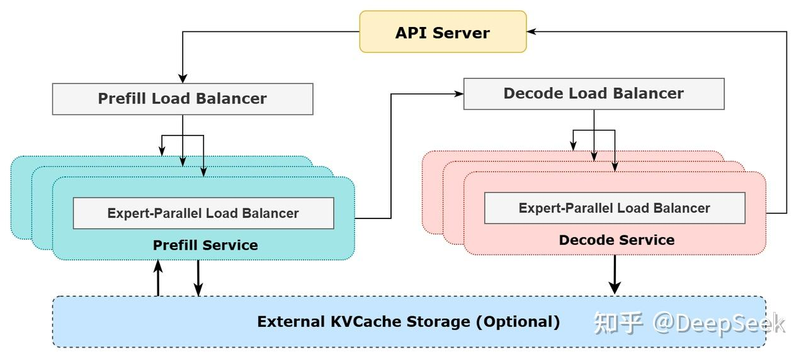
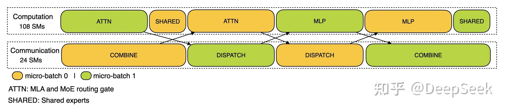
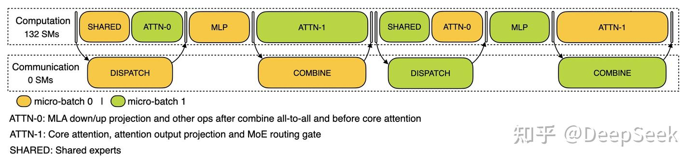

# DeepSeek-V3 架构解析

## 设计哲学：为什么这样做效果好

DeepSeek-V3 的核心思路是：**注意力层的 KV 本身就是低秩的，压缩几乎不损失信息，省下来的资源拿去做更多 expert，整体效果更好。**

### KV 天然低秩

传统 MHA 中 K、V 虽然维度很高（如 128 维），但模型学到的 K、V 向量实际上集中在一个低维子空间中，大部分维度是冗余的。类似 PCA 降维 — 对所有 K 向量做 SVD 分解，奇异值快速衰减，说明信息集中在少数几个主成分上。

```
128 维的 K 向量
  │
  ├── 前几十个维度：方差大，承载了主要信息
  │
  └── 剩余维度：方差极小，接近噪声，去掉影响很小
```

这不是 DeepSeek 的发现。之前的 GQA、MQA 也是基于类似观察 — KV 头数从 32 减到 8 甚至 1，效果损失很小，说明 KV 信息高度冗余。MLA 只是把这个思路推到极致：不只减少头数，直接压缩到一个低维向量。

### 压缩起到正则化作用

压缩相当于信息瓶颈（information bottleneck），迫使模型学到更紧凑、更本质的表示，类似 autoencoder 的效果，反而可能提升泛化能力。

### K 和 V 共享信息

K 和 V 都来自同一个 $h_t$，本身就高度相关。分开存两份是浪费，联合压缩正好捕捉这种共享结构。

### MoE 补偿了容量

注意力层压缩省下的显存和带宽，被 MoE 层利用了。DeepSeek-V3 有 671B 总参数（每次只激活 37B），远超同等计算量的 dense 模型。注意力压缩损失的那点容量，被海量 expert 的知识容量远远补回来了。

### 本质是资源的重新分配

```
传统思路：注意力层用大量显存存 KV Cache → 限制了 batch size 和序列长度
DeepSeek：注意力层压缩 KV → 省出显存 → 更大 batch / 更多 expert → 更好的效果
```

不是"压缩了还能一样好"，而是"压缩注意力 + 放大 expert = 整体更好"。

---

## 并行策略：DP + EP

DeepSeek-V3 打破了业界传统的 TP（Tensor Parallelism）方案，采用 **Attention 用 DP + MoE 用 EP** 的策略。

### 为什么能用 DP

传统 MHA/GQA 的 KV Cache 太大，单卡放不下所有请求的 KV Cache，只能用 TP 把 heads 切到不同卡上。而 MLA 将 KV 压缩到低秩 latent space，KV Cache 压缩 4~14 倍（取决于模型规模），每张卡可以存完整的 KV Cache，因此可以用 DP 让每张卡独立处理不同请求。

### DP + EP 的执行流程

```
Input (DP 分布在各卡上)
    │
    ▼
[MLA Attention] ← DP，每卡独立算，零通信
    │
    ▼
[All-to-All]    ← 把 token 按 expert 路由分发到对应卡
    │
    ▼
[MoE FFN]       ← EP，每卡算自己负责的 experts
    │
    ▼
[All-to-All]    ← 把结果发回各 token 所属的卡
    │
    ▼
Output (回到 DP 分布)
```

### 对比 TP 方案

| | TP | DP + EP |
|---|---|---|
| Attention 通信 | 每层 1 次 all-reduce | 零通信 |
| FFN 通信 | 每层 1 次 all-reduce | 每层 2 次 all-to-all（稀疏） |
| 总通信次数 | 每层 2 次 | 每层 2 次（但 attention 部分为零） |
| Decode 延迟 | 高（all-reduce 固定延迟占比大） | 低 |
| Scalability | 受 all-reduce 限制 | 更好 |

---

## MLA（Multi-head Latent Attention）

核心思想：用一个压缩的 latent vector 代替缓存完整的 K、V 值，推理时只需缓存这个低维向量，需要时再解压恢复出 K、V。

### 与传统 MHA 的对比

**传统 MHA** — 三个独立投影，直接从 $h_t$ 映射出 Q、K、V：

$$q_t = W^Q h_t, \quad k_t = W^K h_t, \quad v_t = W^V h_t$$

**MLA** — 没有独立的 $W^Q$、$W^K$、$W^V$，而是通过压缩-解压两步完成：

```
传统 MHA:  h_t → W^Q → Q       MLA:  h_t → W^DQ  → c^Q  → W^UQ → Q
           h_t → W^K → K             h_t → W^DKV → c^KV → W^UK → K
           h_t → W^V → V                                 → W^UV → V
```

关键区别：K 和 V **共享同一个压缩表示** $c_t^{KV}$，推理时只需缓存这个低维向量而非完整的 K、V。

### 命名约定

- **D = Down projection**（下投影，压缩）：维度从大变小
- **U = Up projection**（上投影，解压）：维度从小变大
- **c = compressed**（压缩后的 latent vector）：$c_t^Q$ 是 Q 的压缩表示，$c_t^{KV}$ 是 KV 的压缩表示
- **$n_h$ = num_heads**（注意力头数量）：DeepSeek-V3 为 128
- **$d_h$ = head_dim**（每个头的维度）：DeepSeek-V3 为 128
- **$n_h \times d_h$**：所有头拼起来的总维度，即完整 K/V 向量长度（DeepSeek-V3 为 $128 \times 128 = 16384$）

```
W^DKV:  d → d_c        Down，压缩
W^UK:   d_c → n_h×d_h  Up，解压
```

### 各模型维度参考

| 模型 | $d$（hidden_size） | $d_c$（压缩维度） | 压缩比 |
|---|---|---|---|
| DeepSeek-V2-Lite | 2048 | 512 | 4x |
| DeepSeek-V2 | 5120 | 512 | 10x |
| DeepSeek-V3 | 7168 | 512 | 14x |

$d_c$ 是论文选定的超参数，DeepSeek 系列统一为 512。模型越大压缩比越高。

### 各方案 KV Cache 对比

```
                  KV Cache per token                        表达能力
MHA    2 × n_h × d_h = 2 × 128 × 128 = 32768 维           最强（每头各自 K、V）
GQA    2 × n_kv × d_h = 2 × 8 × 128 = 2048 维             较强（每组共享 K、V）
MQA    2 × 1 × d_h = 2 × 128 = 256 维                      最弱（所有头共享 K、V）
MLA    d_c + d_R = 512 + 64 = 576 维                        接近 MHA（共享压缩，解压出不同 K、V）
```

MLA 用比 MQA 稍多的存储，换来了远好于 MQA、接近 MHA 的效果。

### KV 联合压缩

目的是**省 KV Cache 显存**。推理时每个 token 都要缓存 K 和 V 用于后续 decode，传统 MHA 需要缓存完整的 K、V 两个向量（$2 \times n_h \times d_h$），MLA 只缓存一个共享的 $c_t^{KV}$（$d_c$）。K 和 V 之所以能联合压缩成一个向量，是因为它们都来自同一个 $h_t$，本身就有信息冗余，用一个低秩表示就能同时恢复两者。

$$c_t^{KV} = W^{DKV} h_t$$

- $h_t$：输入 hidden state（当前层的输入），维度 $d$
- $W^{DKV}$：下投影矩阵（Down），$d \to d_c$（$d_c \ll d$）
- $c_t^{KV}$：KV Cache 中实际存储的内容，维度 $d_c$

### 为什么 $c_t^{KV}$ 是所有头共享的

因为压缩前的 $h_t$ 本身就是所有头共享的。传统 MHA 中，$h_t$ 通过每个头各自的 $W_i^K$、$W_i^V$ 投影出不同的 K、V。MLA 只是在这之前多插了一步压缩：

```
传统 MHA:  h_t(共享) ──→ W_i^K ──→ k_i   (per-head)

MLA:      h_t(共享) ──→ W^{DKV} ──→ c^KV(共享) ──→ W_i^{UK} ──→ k_i (per-head)
```

$c_t^{KV}$ 和 $h_t$ 一样，是一个所有头共享的中间表示，"分头"的工作交给后面的 $W^{UK}$、$W^{UV}$ 来做。缓存时只需存这个共享的低维向量，不需要存每个头各自的 K、V。

### K/V 恢复

$$k_t^C = W^{UK} c_t^{KV}$$
$$v_t^C = W^{UV} c_t^{KV}$$

- $W^{UK}$, $W^{UV}$：上投影矩阵（Up），$d_c \to n_h \times d_h$，每个头解压出不同的 K、V

### Q 的压缩

Q 不需要缓存，压缩的目的不是省存储，而是**省参数量**。传统 MHA 中 $W^Q$ 的参数量为 $d \times n_h d_h$，MLA 拆成两个小矩阵（低秩分解）：

$$c_t^Q = W^{DQ} h_t$$
$$q_t^C = W^{UQ} c_t^Q$$

- $W^{DQ}$：$d \times d_c'$
- $W^{UQ}$：$d_c' \times n_h d_h$
- 参数量：$d \times d_c' + d_c' \times n_h d_h$，当 $d_c' \ll d$ 时远小于原始的 $d \times n_h d_h$

### RoPE 处理

RoPE 是一种旋转位置编码，如果直接作用在整个 K 上，会破坏吸收优化。原因如下：

吸收优化的前提是把两个常量矩阵合并。展开 attention score 的计算：

$$q_t^T k_t^C = (W^{UQ} c_t^Q)^T (W^{UK} c_t^{KV})$$

利用转置性质：两个矩阵相乘的转置等于各自转置后反序相乘，即 $(AB)^T = B^T A^T$。

因为 $q_t = W^{UQ} c_t^Q$，所以：

$$q_t^T = (W^{UQ} c_t^Q)^T = (c_t^Q)^T (W^{UQ})^T$$

代入 attention score：

$$q_t^T k_t^C = (c_t^Q)^T (W^{UQ})^T \cdot W^{UK} c_t^{KV}$$

$c_t^Q$ 和 $c_t^{KV}$ 被拆到两端，中间的 $(W^{UQ})^T W^{UK}$ 都是模型权重（常量），可以预计算合并为 $W^{merged}$：

$$= (c_t^Q)^T W^{merged} c_t^{KV}$$

这样推理时不需要将 $c_t^{KV}$ 乘以 $W^{UK}$ 恢复出完整的 K，直接用低维的 $c_t^Q$ 和 $c_t^{KV}$ 即可算出 attention score。

但如果 RoPE 直接作用在整个 K 上（$k_t = R_t \cdot W^{UK} c_t^{KV}$），就变成：

$$(c_t^Q)^T (W^{UQ})^T \underbrace{R_t}_{\text{每个位置都不同}} W^{UK} c_t^{KV}$$

$R_t$ 是位置相关的旋转矩阵，夹在两个投影矩阵中间，导致无法预计算合并矩阵，吸收优化失效。

因此 MLA 将 RoPE 单独拎出来处理。

### RoPE 原理

RoPE 通过旋转向量来编码位置。对于位置 $t$，将向量的维度两两配对，每对施加一个旋转：

$$R_t = \begin{pmatrix} \cos(t\theta_1) & -\sin(t\theta_1) \\ \sin(t\theta_1) & \cos(t\theta_1) \\ & & \cos(t\theta_2) & -\sin(t\theta_2) \\ & & \sin(t\theta_2) & \cos(t\theta_2) \\ & & & & \ddots \end{pmatrix}$$

每对维度用不同的频率 $\theta_i$，低维度变化慢（捕捉远距离关系），高维度变化快（捕捉近距离关系）。

RoPE 的核心性质 — 点积结果只取决于**相对位置** $s-t$：

$$q_t^T k_s = (R_t q)^T (R_s k) = q^T R_t^T R_s k = q^T R_{s-t} k$$

RoPE 只作用在 Q 和 K 上，不作用在 V 上，因为 V 不参与 attention score 计算。

### MLA 中 RoPE 的具体处理

从压缩表示中投影出 RoPE 专用的维度（$W^{QR}$、$W^{KR}$ 中 R = RoPE）：

```
c_t^Q  ──→ W^{UQ} ──→ q_t^C   (压缩部分，无位置信息)
  │
  └────→ W^{QR} ──→ RoPE() ──→ q_t^R   (RoPE 部分，有位置信息)

c_t^KV ──→ W^{UK} ──→ k_t^C   (K 的压缩部分，无位置信息)
  │
  ├────→ W^{UV} ──→ v_t^C   (V，无位置信息，不需要 RoPE)
  │
  └────→ W^{KR} ──→ RoPE() ──→ k_t^R   (K 的 RoPE 部分，有位置信息)
```

**Q 的 RoPE 部分** — 每个头各自一份：

$$q_{t,i}^R = \text{RoPE}_t(W_i^{QR} \cdot c_t^Q) \quad \text{shape: } (d_R,) \text{ per head，共 } n_h \text{ 个}$$

**K 的 RoPE 部分** — 所有头共享一份（因为 $k_t^R$ 需要缓存，共享进一步省 KV Cache）：

$$k_t^R = \text{RoPE}_t(W^{KR} \cdot c_t^{KV}) \quad \text{shape: } (d_R,) \text{ 只有一份}$$

然后将两部分拼接（concatenate，`;` 表示首尾相连）：

$$q_t = [q_t^C;\; q_t^R] \quad \text{维度: } d_h + d_R = 128 + 64 = 192$$
$$k_t = [k_t^C;\; k_t^R] \quad \text{维度: } d_h + d_R = 128 + 64 = 192$$

### KV Cache 中实际存储的内容

```
每个 token 缓存：
  c^KV    (d_c = 512)     ← K、V 的压缩表示，所有头共享
  k^R     (d_R = 64)      ← K 的 RoPE 部分，所有头共享
  ─────────────────
  总共     576 维

传统 MHA 需要缓存：
  K       (n_h × d_h = 16384)
  V       (n_h × d_h = 16384)
  ─────────────────
  总共     32768 维
```

压缩比：$32768 / 576 \approx 57$ 倍。

### 为什么可以直接拼接

拼接后的 dot product 自然分解为两部分的加和：

每个头内部的 attention score 计算（以单个头为例），$q_t^T k_i$ 的结果是一个**标量**（scalar），表示 token $t$ 对 token $i$ 的注意力分数：

$$q_t^T k_i = \underbrace{[q_t^C;\; q_t^R]^T}_{(d_h + d_R)} \underbrace{[k_i^C;\; k_i^R]}_{(d_h + d_R)} = \underbrace{(q_t^C)^T k_i^C}_{\substack{\text{压缩部分，可被吸收优化} \\ d_h \text{ 维向量点积}}} + \underbrace{(q_t^R)^T k_i^R}_{\substack{\text{RoPE 部分，提供位置信息} \\ d_R \text{ 维向量点积}}}$$

- $q_t^C, k_i^C$：每个头的压缩部分，维度 $d_h$（DeepSeek-V3 中为 128）
- $q_t^R$：每个头各自一份，维度 $d_R$（DeepSeek-V3 中为 64）
- $k_i^R$：所有头共享一份，维度 $d_R$，做 attention 时 broadcast 到每个头
- 共 $n_h = 128$ 个头，各自独立计算

这样既保留了位置编码能力，又不影响压缩部分的吸收优化。

### Attention 计算

$$o_t = \sum_i \text{softmax}\left(\frac{q_t^T k_i}{\sqrt{d_h + d_R}}\right) v_i^C$$

### KV Cache 对比

```
传统 MHA:  缓存 K, V          → 2 × n_h × d_h per token
MLA:      缓存 c^KV 和 k^R   → d_c + d_R per token
```

DeepSeek-V3 具体数值：$d_c = 512$，$d_R = 64$，压缩比约 **4x~14x**（取决于模型规模，见上方维度参考表）。

### 计算量 vs 显存的权衡

MLA 相比传统 MHA 多了一次矩阵乘：

```
传统 MHA:
  计算：1 次矩阵乘（h_t → K, V）
  缓存：大（2 × n_h × d_h per token）

MLA:
  计算：2 次矩阵乘（h_t → c^KV → K, V）
  缓存：小（d_c per token）
```

多了一次计算，但换来了 4x~14x 的显存节省。推理瓶颈主要是**显存带宽**（尤其 decode 阶段要反复读 KV Cache），缓存小了意味着读取快了，整体反而更快。

而且推理时还能通过吸收优化跳过解压步骤，连多出来的那次矩阵乘都省了（见下节）。

### 推理时的吸收优化

推理时可以将 $W^{UK}$ 吸收进 $W^{UQ}$：

$$q_t^T k_t^C = (W^{UQ} c_t^Q)^T W^{UK} c_t^{KV}$$

直接用 $c^{KV}$ 和合并后的投影做 attention，不需要解压回完整的 K、V，连多出来的那次矩阵乘都省了。Prefill 阶段通常仍解压后用标准 flash attention，因为 prefill 的计算量大、是 compute-bound，解压后用 flash attention 更高效。

---

## MoE（Mixture of Experts）

### 基本结构

DeepSeek-V3 使用 256 个 routed experts + 1 个 shared expert，每个 token 激活 8 个 routed experts。

- **Shared expert**：每个 token 都会经过的固定 expert，不参与路由选择，负责捕捉通用知识（如基础语法、常见模式），避免每个 routed expert 重复学习共性能力
- **Routed experts**：通过 gate 动态选出，各自专精不同领域的知识

### MoE 输出

$$y_t = \text{Expert}_{shared}(h_t) + \sum_{i \in \text{TopK}} g_{t,i} \cdot \text{Expert}_i(h_t)$$

- shared expert 的输出直接加入
- 8 个 routed experts 的输出按 gate 权重 $g_{t,i}$ 加权求和
- 输出 $y_t$ 维度与输入 $h_t$ 相同，仍为 $d = 7168$
- 之后接 residual connection + layer norm，进入下一层

### 路由机制

$$g_t = \text{TopK}(\text{softmax}(W^G h_t), K)$$

- $W^G$：gate 权重矩阵，shape 为 $(d, n_e) = (7168, 256)$，将 hidden state 映射为每个 expert 的得分
- $K = 8$：每 token 激活的 expert 数

### Expert 并行（EP）

256 个 experts 分布在不同 GPU 上，通过 all-to-all 通信进行 token dispatch 和 combine：

1. **Dispatch**：每张卡根据路由结果，把 token 发给对应 expert 所在的卡
2. **Compute**：每张卡计算自己负责的 experts
3. **Combine**：计算结果通过 all-to-all 发回 token 所属的卡

### 负载均衡：Auxiliary-Loss-Free

MoE 稀疏架构的核心挑战是**负载不均**：某些 expert 被大量 token 选中，对应 GPU 忙不过来；其他 GPU 闲着等。

传统做法是在训练 loss 里加辅助损失项惩罚不均：$L = L_{main} + \alpha \cdot L_{balance}$。但 $\alpha$ 难调——太大影响模型效果，太小均衡不了。

DeepSeek-V3 不加 auxiliary loss，而是给每个 expert 维护一个 bias 项 $b_i$：

$$\text{路由得分} = \text{softmax}(W^G h_t) + b_i$$

- $b_i$ 不参与梯度，只影响 TopK 选择
- expert 被选太多 → 降低 $b_i$，让它更难被选中
- expert 被选太少 → 提高 $b_i$，让它更容易被选中
- 类似控制论中的反馈控制，不走反向传播，不影响主 loss 的梯度

好处是均衡路由和模型学习完全解耦。

### 推理时的 GPU 利用率

训练时均衡路由的效果会延续到推理，但推理还有额外手段保证利用率：

- **大 batch 摊平波动**：batch 越大，统计上每个 expert 分到的 token 数越接近均值。MLA 省 KV Cache 的间接收益——能跑更大 batch
- **Attention DP 掩盖 MoE 不均衡**：Attention 阶段每卡独立计算（零通信），利用率接近 100%，即使 MoE 阶段有轻微不均衡，整层平均利用率仍然较高
- **通信与计算重叠**：all-to-all dispatch 和 expert 计算可以流水线化，减少 GPU 空等时间
- **EP 均匀分组**：256 个 expert 均匀分布到各 GPU，每卡负责相同数量的 expert，配合均衡路由，每卡接收的 token 数大致相同

### 实际部署配置



Prefill 和 Decode 分离部署，针对各自瓶颈采用不同策略。所有服务使用 H800 GPU，精度与训练一致：

- **FP8**：矩阵计算（MLP/MLA 投影）和 dispatch 传输
- **BF16**：core attention 计算和 combine 传输

推理和训练用相同精度，最大程度保证服务效果。每节点 8 卡。

**Prefill（4 节点 = 32 卡）**— compute-bound，少卡多 expert，榨干算力：

```
256 routed experts + 32 冗余 = 288 份 expert
288 / 32 卡 = 每卡 9 个 routed expert（EP32）
shared expert：每卡各复制一份（DP32）
MLA attention：每卡独立算自己的 batch（DP32）
```

**Decode（18 节点 = 144 卡）**— memory-bandwidth-bound，多卡少 expert，榨干带宽：

```
256 routed experts + 32 冗余 = 288 份 expert
288 / 144 卡 = 每卡 2 个 routed expert（EP144）
shared expert：每卡各复制一份（DP144）
MLA attention：每卡独立算自己的 batch（DP144）
```

| | Prefill | Decode |
|---|---|---|
| 瓶颈 | 计算量（compute-bound） | 显存带宽（memory-bound） |
| 节点数 | 4（32 卡） | 18（144 卡） |
| 每卡 routed expert | 9 个 | 2 个 |
| 策略 | 少卡多 expert，榨干算力 | 多卡少 expert，榨干带宽 |

- **32 个冗余 expert**：热门 expert 被选中频率更高，复制到多张卡上避免单卡成为瓶颈
- **Shared expert 用 DP**：每个 token 都要过 shared expert，用 EP 等于全量通信，直接每卡复制一份，零通信
- **Decode 每卡只放 2 个 expert**：expert 少 → 显存占用小 → 能放更多请求的 KV Cache → 更大 batch → 更高吞吐

### 双 Batch 重叠（Double Batch Overlap）

多机 EP 的 all-to-all 通信有延迟，即使用 RDMA 硬件搬运不占 SM，网络传输本身仍需要时间。为了不让 GPU 空等，将输入拆成两个 micro-batch（mb0、mb1）交替执行，一个算的时候另一个通信。

#### Prefill 阶段

Prefill 一次性处理整个 prompt 的所有 token（几百到几千个），通信数据量大，需要 24 SMs 专门跑通信 kernel，计算用剩余 108 SMs：



- ATTN = MLA attention + MoE routing gate
- SHARED = shared expert 计算（本卡就有，不需要通信）
- MLP = routed expert 计算（需要先 DISPATCH 把 token 发到对应卡）
- COMBINE = 把 routed expert 结果收回来

关键设计：routing gate 算完后要等 DISPATCH 发完才能算 MLP，这段等待时间用 SHARED expert 计算填满。

SM 分区通过 CUDA 的 SM partitioning 实现（H800 原生支持）：计算 kernel 的 block 只调度到 108 个 SM，通信 kernel 的 block 只调度到另外 24 个 SM，物理隔离避免互相抢资源。通信也需要 SM 跑 kernel（打包数据、调用 NCCL/RDMA 接口等），不分区的话会和计算 kernel 互相拖慢。

#### Decode 阶段

Decode 每次只生成 1 个 token，通信数据量小，RDMA 硬件直接搬运不需要 SM 参与（0 SMs），132 SMs 全部给计算。虽然不占 SM，但网络传输仍有延迟，双 batch 用另一个 mb 的计算填满等待时间。

ATTN 拆成两步以便更好地和通信交错：

- ATTN-0：MLA 的 down/up projection，以及 combine all-to-all 之后、core attention 之前的操作
- ATTN-1：core attention + attention output projection + MoE routing gate



#### Prefill vs Decode 对比

| | Prefill | Decode |
|---|---|---|
| 处理 token 数 | 整个 prompt（几百到几千） | 每次 1 个 |
| 通信 SM | 24 SMs（数据量大，需 SM 跑通信 kernel） | 0 SMs（数据量小，RDMA 硬件搬运） |
| 计算 SM | 108 SMs | 132 SMs（全部给计算） |
| ATTN | 一整块 | 拆成 ATTN-0 和 ATTN-1，便于交错 |
| 瓶颈 | compute-bound | memory-bandwidth-bound |

### Prefill 负载均衡

不同 DP 实例上的请求个数、长度不同，导致两个指标不均衡：

- **Core attention 计算量**：与序列长度的平方成正比（$O(n^2)$），一个长请求远重于多个短请求
- **Dispatch 发送量**：与 token 数线性成正比

两者增长方式不同，不能简单按请求数或 token 数均分。双 batch 重叠中计算和通信交错，任何一个不均衡都会让某些 GPU 成为瓶颈。

#### 解决思路

**加权代价 + 贪心分配**：将两个指标合并为一个代价函数，贪心地把请求分给当前负载最轻的 GPU：

$$\text{cost}(\text{请求}) = \alpha \times \text{seq\_len}^2 + \beta \times \text{seq\_len}$$

$\alpha$、$\beta$ 根据实际计算和通信的时间比例调整。

**长短搭配**：先按序列长度排序，长短配对分配（类似田忌赛马）：

```
排序后: [4096, 2048, 1024, 512, 256, ...]

GPU 0: 4096 + 256   → 长请求 attention 重，配短的凑 token 数
GPU 1: 2048 + 512   → 长短搭配
GPU 2: 1024 + 1024  → 中等搭配
```

长请求 attention 代价大但只有一个，短请求 attention 轻但 token 数多，搭配后两个指标都趋于均衡。

实际工程中大概率是两种方法结合：用加权代价评估开销，贪心分配时倾向长短搭配。

### Decode 负载均衡

Decode 每步每个请求只处理 1 个 token，均衡指标和 Prefill 不同：

- **Core attention 计算量** ∝ KV Cache 长度（$O(n)$，1 个 query attend to n 个历史 KV）
- **Dispatch 发送量** ∝ 请求数量（每个请求固定 dispatch 1 个 token）

| | Prefill | Decode |
|---|---|---|
| 均衡指标 1 | attention 计算量（∝ $\text{seq\_len}^2$） | KV Cache 占用量（∝ KV Cache 长度） |
| 均衡指标 2 | token 总数（每个 token 都要 dispatch） | 请求数量（每个请求只 dispatch 1 个 token） |

矛盾点同样存在：少量长上下文请求 KV Cache 大但请求数少，大量短上下文请求 KV Cache 小但请求数多。解决思路类似，加权代价 + 贪心分配，但代价函数变为：

$$\text{cost}(\text{请求}) = \alpha \times \text{kv\_cache\_len} + \beta \times 1$$

### 通信特点

- All-to-all 是稀疏的：256 个 expert 只激活 8 个，大量 token 不需要跨卡传输
- 通信量与激活的 expert 数相关，而非 hidden_size

---

## All-Reduce vs All-to-All

| | All-Reduce | All-to-All |
|---|---|---|
| 语义 | 聚合（reduce） | 重分布（shuffle） |
| 结果 | 每卡拿到**相同**的完整数据 | 每卡拿到**不同**的数据子集 |
| 用在 | TP（合并部分计算结果） | EP（按 expert 路由 token） |

```
All-Reduce:                   All-to-All:
之前:        之后:             之前:              之后:
GPU 0: [A]  [A+B+C+D]        GPU 0: [a0,a1,a2]  [a0,b0,c0]
GPU 1: [B]  [A+B+C+D]        GPU 1: [b0,b1,b2]  [a1,b1,c1]
GPU 2: [C]  [A+B+C+D]        GPU 2: [c0,c1,c2]  [a2,b2,c2]
GPU 3: [D]  [A+B+C+D]
```
