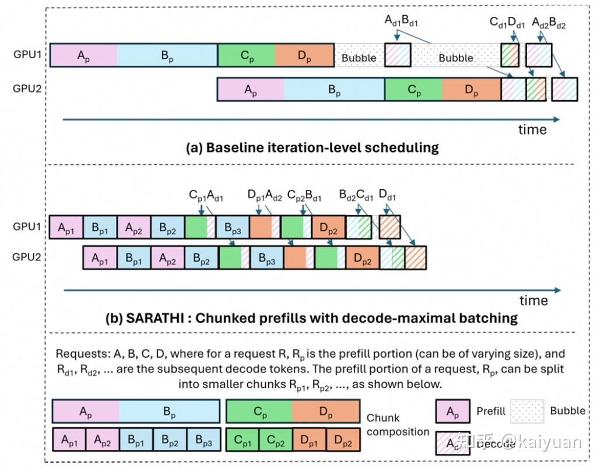

# Continuous Batching 与调度策略

---

## 1. Continuous Batching 核心思想

传统 static batching 需要等一个 batch 中所有序列都生成完毕才能处理新请求。Continuous batching 打破这个限制：**每个 iteration 都重新调度，谁完了谁走，有空位就补新的进来**。

| | Static Batching | Continuous Batching |
|---|---|---|
| 序列结束 | pad 到最长序列结束，浪费算力 | 立即移除，batch size 动态缩小 |
| 新请求 | 等整个 batch 跑完才能加入 | 下一个 iteration 就能 prefill 加入 |

每个 iteration（decode 阶段）每个序列产生一个 token。Prefill 阶段一个 iteration 处理完整个 prompt，但也只产出一个 token（第一个 completion token）。

---

## 2. nano-vllm 的调度实现

### 核心数据结构

调度器维护两个队列：
- **`waiting`**: 等待 prefill 的新请求
- **`running`**: 正在 decode 的序列

### schedule() 逻辑

```python
def schedule(self) -> tuple[list[Sequence], bool]:
    # prefill（优先）
    scheduled_seqs = []
    while self.waiting and num_seqs < self.max_num_seqs:
        seq = self.waiting[0]
        if num_batched_tokens + len(seq) > self.max_num_batched_tokens \
           or not self.block_manager.can_allocate(seq):
            break
        self.block_manager.allocate(seq)
        self.waiting.popleft()
        self.running.append(seq)
        scheduled_seqs.append(seq)
    if scheduled_seqs:
        return scheduled_seqs, True      # 有 prefill 就直接返回

    # decode（只有 waiting 为空时才走）
    while self.running and num_seqs < self.max_num_seqs:
        seq = self.running.popleft()
        while not self.block_manager.can_append(seq):
            if self.running:
                self.preempt(self.running.pop())  # 踢掉队尾
            else:
                self.preempt(seq)
                break
        else:
            self.block_manager.may_append(seq)
            scheduled_seqs.append(seq)
    return scheduled_seqs, False
```

### 主循环

```python
def step(self):
    seqs, is_prefill = self.scheduler.schedule()   # 每一步重新调度
    token_ids = self.model_runner.call("run", seqs, is_prefill)
    self.scheduler.postprocess(seqs, token_ids)    # 判断是否结束，EOS 则移除
```

---

## 3. Prefill 准入条件

```python
if num_batched_tokens + len(seq) > self.max_num_batched_tokens \
   or not self.block_manager.can_allocate(seq):
    break
```

两个条件卡不同维度：

| 条件 | 维度 | 含义 |
|------|------|------|
| `num_batched_tokens + len(seq) > max_num_batched_tokens` | 算力 | 单次 prefill 计算量不能太大 |
| `not block_manager.can_allocate(seq)` | 显存 | 全局空闲 block 不够存这个序列的 KV cache |

两者独立、不冗余：
- `num_batched_tokens` 只看本次 iteration 的计算量
- `can_allocate` 看全局剩余 block，受所有 running 序列长期占用影响

准入时**不预留 decode 阶段的 block**（乐观策略），decode 时 block 不够再通过 preempt 兜底。预留 `max_tokens` 会导致显存利用率太低。

---

## 4. Preemption（抢占）

当 decode 阶段 KV cache 不够追加新 token 时触发：

```python
def preempt(self, seq: Sequence):
    seq.status = SequenceStatus.WAITING
    self.block_manager.deallocate(seq)   # 释放所有 block
    self.waiting.appendleft(seq)         # 插到 waiting 队头
```

三个动作：
1. 状态改回 WAITING
2. 释放全部 KV cache block（已算过的 KV 全没了）
3. 插到 waiting 队头，下次优先重新 prefill

**代价**：下次需要从头重新 prefill 整个序列（prompt + 已生成的 token）。这是最简单的 **recompute** 策略。标准 vLLM 还支持 **swap**（KV cache 换到 CPU 内存），避免重复计算。

抢占策略是 LIFO：踢掉 `self.running.pop()`（最晚加入的），保护已经跑了很久的序列。

---

## 5. Prefill 绝对优先

nano-vllm 的 `schedule()` 只要 waiting 有请求能调度，就直接返回 prefill batch，不走 decode 分支。

**原因**：nano-vllm 只有离线 `generate()` 接口，所有请求一次性全部提交：
- 尽快把 waiting 清空，让序列进入 running 产出 token，整体吞吐更高
- 不需要考虑延迟 SLA（没有在线用户等首 token）
- 实现简单，prefill 和 decode 用不同 attention 实现，分开处理代码清晰

**在线场景不能这样做**：请求持续到达时，prefill 绝对优先会饿死正在 decode 的序列，用户看到输出卡住。

---

## 6. Chunked Prefill

### 解决的问题

在线服务场景，一个超长 prefill（如 16k token）一次算完可能要几百毫秒，这段时间所有 decode 序列没输出，用户感觉卡住。

### 做法

把长 prefill 切成小块（如每次 2048 token），每个 iteration 混合 prefill chunk 和 decode token：

```
iteration 1: [A chunk1 (0-2048)]    + [B decode] + [C decode]
iteration 2: [A chunk2 (2048-4096)] + [B decode] + [C decode]
iteration 3: [A chunk3 (4096-6144)] + [B decode] + [C decode]
iteration 4: [A chunk4 (6144-8192)] + [B decode] + [C decode]
```

### 具体实现

将 prefill chunk 和 decode token 拼在一起，用同一个 varlen attention kernel 处理：

```python
input_ids = [A的第1-2048个token, B的last_token, C的last_token]

cu_seqlens_q = [0, 2048, 2049, 2050]  # 每个序列本次的 query 长度
cu_seqlens_k = [0, 2048, 5001, 3201]  # 每个序列的 KV 总长度（含历史）
```

kernel 层面没区别——varlen attention 不关心你是 prefill chunk 还是 decode，只看 `cu_seqlens_q` 和 `cu_seqlens_k`。差异全在调度和数据准备层。

每个 chunk 算完的 KV 写入 PagedAttention 的 block 中，下一个 chunk 通过 block_table 读取前面 chunk 的 KV 作为 context。

### vLLM 中的使用

```bash
--enable-chunked-prefill          # 开启
--max-num-batched-tokens 2048     # 每个 iteration 中 prefill chunk + decode token 的总上限
```

- vLLM v0.5.5+ 对在线服务**默认开启**
- 离线批处理默认关闭

### Trade-off

| | 不 chunk | Chunked |
|---|---|---|
| Prefill 吞吐 | 高（大矩阵高效） | 低（小 chunk GPU 利用率下降） |
| TTFT | 低（如果不排队） | 高（分多次算完） |
| Decode 延迟抖动 | 大（被长 prefill 阻塞） | 小（稳定） |
| 额外 KV 读取 | 无 | 有（第 N 个 chunk 要 attend 前 N-1 个 chunk 的 KV） |
| 实现复杂度 | 低 | 高（跟踪 prefill 进度，混合构造 batch） |
| 适用场景 | 离线 / 批处理 | 在线服务 |

chunk_size 选择也是权衡：太小 → prefill 效率差；太大 → decode 延迟抖动又回来。

### nano-vllm 为什么做不了

`schedule()` 返回一个 `is_prefill` 布尔值，整个 batch 要么全是 prefill 要么全是 decode。要支持 chunked prefill 需要：
1. 序列级别区分 prefill/decode（不是 batch 级别）
2. 跟踪每个 prefill 序列算到哪了
3. attention 准备阶段混合两种模式构造 `cu_seqlens_q/k`

---

## 7. SARATHI：Chunked Prefill + Pipeline Parallel

### 背景

Pipeline Parallel（PP）将模型按层切分到不同 GPU：

```
GPU1: Layer 0-15（前半）
GPU2: Layer 16-31（后半）
```

GPU1 算完交给 GPU2 后空闲，产生 **pipeline bubble**。Prefill 块大小不一致时 bubble 更大。

### 对比图



### Baseline 问题（图 a）

- A、B、C、D 四个请求各自 prefill 大小不一
- GPU1 和 GPU2 之间有明显错位（PP 的先后关系）
- 所有 prefill 做完才开始 decode，中间大量 bubble
- A、B 先 decode，再 C、D decode（按 micro-batch 分组）

### SARATHI 的优化（图 b）

- 长 prefill 被切成等大 chunk（如 A_p1, A_p2, B_p1, B_p2, B_p3）
- Decode token 塞到 prefill chunk 的空隙中（如 C_p1+A_d1 在同一个 iteration）
- 每个 micro-batch 计算量接近等大，GPU 负载均衡，bubble 大幅减少
- Decode 序列每个 iteration 都能产出 token，不再空等

**核心优化**：
1. **Chunked prefill**：把长 prefill 切成等大的 chunk，流水线负载均衡，消除 bubble
2. **Decode-maximal batching**：decode token 塞到 prefill chunk 的空隙中，decode 不再空等

### 在不同并行策略下的收益

| SARATHI 的收益 | PP 下 | TP 下 |
|---|---|---|
| 消除 pipeline bubble | 有 | 不适用（TP 无 bubble） |
| Decode 不被长 prefill 阻塞 | 有 | 有 |

---

## 8. Batch vs Micro-batch（Pipeline Parallel 语境）

| | Batch | Micro-batch |
|---|---|---|
| 定义 | 本次 iteration 要处理的所有请求 | 把 batch 拆成小份依次灌入流水线 |
| 层面 | 同一层内一起并行计算 | 流水线上错开的单位 |
| 作用 | 层内并行 | 层间流水 |

拆成 micro-batch 让流水线"流"起来，减少 bubble：

```
不拆：
GPU1: [ABCD 前半层]  [空闲等GPU2]         ← 50% 空闲
GPU2: [空闲等GPU1]   [ABCD 后半层]

拆成 2 个 micro-batch：
GPU1: [AB 前半层] [CD 前半层] [空闲]       ← 空闲减少
GPU2: [空闲]      [AB 后半层] [CD 后半层]
```

---

## 9. 并行策略选择：TP / PP / EP

### Tensor Parallel (TP)

- 模型同一层按 head/维度切分到多卡，所有 GPU 同时算同一个 batch
- 每层 all-reduce 通信，需要高带宽互连（NVLink）
- 适合：单机多卡

### Pipeline Parallel (PP)

- 模型按层切分到不同 GPU，只在层边界通信一次
- 带宽要求低，但有 bubble
- 适合：跨机部署

### Expert Parallel (EP)

- MoE 模型中，expert 分布到不同 GPU
- token 通过 all-to-all 路由到对应 GPU
- 适合：MoE 模型，通常机内（all-to-all 通信带宽要求高）

### 选择原则

| 因素 | 选择 |
|------|------|
| 单机 NVLink 多卡 | TP 优先 |
| 跨机、带宽低 | PP |
| MoE 模型 | EP（常与 DP 组合） |
| 追求低延迟 | TP（无 bubble） |
| 追求吞吐 | PP + TP 组合 |

### MoE 模型（如 DeepSeek-V3）更适合 DP + EP

MoE 模型的 attention 层参数相对小，expert 多但稀疏激活。TP 的每层 all-reduce 开销不划算：

```
每个 GPU：
- Attention 层：完整副本（DP，各自算各自的请求）
- MoE 层：只放部分 expert（EP），token 通过 all-to-all 路由
```

好处：避免 TP 每层 all-reduce，DP 天然提高吞吐，attention 层参数不大冗余存一份可接受。

### nano-vllm 的并行策略

使用 **Tensor Parallel**：

```python
dist.init_process_group("nccl", ...)
num_kv_heads = hf_config.num_key_value_heads // self.world_size  # 按卡均分
```

所有 GPU 同时算同一个 batch，通过 all-reduce 同步。没有 PP，不存在 pipeline bubble。

---

## 10. 标准 vLLM 的额外调度逻辑

### 跳过机制（skipped_reqs）

标准 vLLM 调度器在以下情况跳过请求：

**1. 等待 FSM 编译**：structured output（JSON schema 约束生成）需要编译 FSM，异步编译未完成时跳过。

**2. 超过最大 LoRA 数量**：一个 batch 能同时激活的 LoRA adapter 数有上限（显存限制），超标时跳过。

处理方式：跳过的请求塞回 waiting 队头，下次 iteration 重试（FSM 可能编译好了，或有序列 EOS 退出使 LoRA 数量减少）。

### 与 nano-vllm 的对比

nano-vllm 没有 structured output、没有 LoRA，调度器只关心 token 数和 block 数。标准 vLLM 还需要处理：
- Chunked prefill 混合调度
- LoRA adapter 数量限制
- FSM 编译状态
- Swap（KV cache 换到 CPU）
- Priority / fairness 策略
